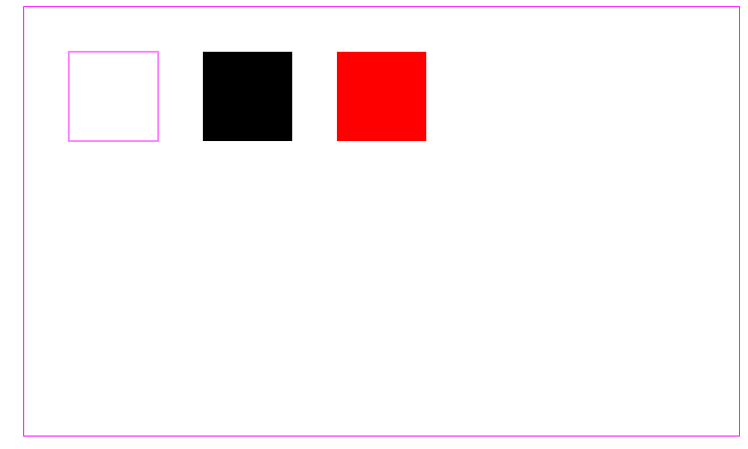
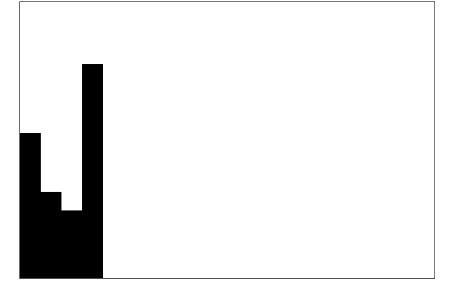
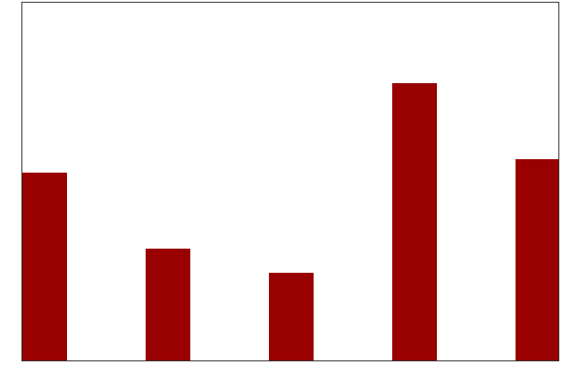
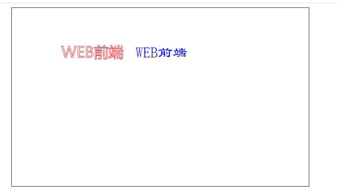

# H5 新特性 
[[toc]]
### 全屏
```html
<!DOCTYPE html>
<html lang="en">
<head>
  <meta charset="UTF-8">
  <meta name="viewport" content="width=device-width, initial-scale=1.0">
  <title>Document</title>
  <style>
    #container{
      width:100px;
      height: 100px;
      background-color: #f00;
    }
  </style>
</head>
<body>
  <p>1111</p>
  <p>1111</p>
  <p>1111</p>
  <p>1111</p>
  <div id="container">
      <button onclick="enterFullscreen()">进入全屏模式</button>
      <button onclick="exitFullscreen()">退出全屏模式</button>
  </div>
  <p>222</p>
  <p>222</p>
  <p>222</p>
  <p>222</p>
  <p>222</p>
  <p>222</p>
  <script>
    function enterFullscreen(){
        //获取DIV元素
        let divEle = document.getElementById('container');
        divEle.requestFullscreen();
    }
    function exitFullscreen(){
      
    }
  </script>
</body>
</html>
```

###  canvas
```html
<!DOCTYPE html>
<html lang="en">
<head>
  <meta charset="UTF-8">
  <meta name="viewport" content="width=device-width, initial-scale=1.0">
  <title>Document</title>
  <style>
    #canvas{
      display: block;
      margin: 0 auto;
      border:1px solid #333;
    }
  </style>
</head>
<body>
  <canvas id="canvas"></canvas>  
  <script>
    //获取HTMLCanvasElement元素
    let canvasEle = document.getElementById('canvas');
    //设置宽度及高度
    canvasEle.width = 800;
    canvasEle.height = 480;
  </script>
</body>
</html>
```


```html
<!DOCTYPE html>
<html lang="en">
<head>
  <meta charset="UTF-8">
  <meta name="viewport" content="width=device-width, initial-scale=1.0">
  <title>Document</title>
  <style>
    #canvas{
      display: block;
      margin: 0 auto;
      border:1px solid #f0f;
    }
  </style>
</head>
<body>
  <canvas id="canvas"></canvas>  
  <script>
    //获取HTMLCanvasElement元素
    let canvasEle = document.getElementById('canvas');
    //设置宽度及高度
    canvasEle.width = 800;
    canvasEle.height = 480;
    //将返回CanvasRenderingContext2D的对象
    let ctx = canvasEle.getContext('2d');   
    //绘制描边矩形
    // ctx.strokeRect(x,y,width,height);
    ctx.strokeStyle="#f0f";
    ctx.strokeRect(50,50,100,100);
    ctx.fillRect(200,50,100,100)
    ctx.fillStyle="red"
    ctx.fillRect(350,50,100,100)
  </script>
  <script>
  </script>
</body>
</html>
```


```html
<!DOCTYPE html>
<html lang="en">
<head>
  <meta charset="UTF-8">
  <meta name="viewport" content="width=device-width, initial-scale=1.0">
  <title>Document</title>
  <style>
    #canvas{
      display: block;
      margin: 0 auto;
      border:1px solid #333;
    }
  </style>
</head>
<body>
  <canvas id="canvas" width="600" height="400"></canvas>
  <script>
      let dataset = [
          {
            text:'家电用器',
            sales:210
          },
          {
            text:'音像制品',
            sales:125
          },
          {
            text:'手机通讯',
            sales:98
          },
          {
            text:'服装服饰',
            sales:310
          }
      ];
      //获取HTMLCanvasElement对象
      let canvasEle = document.getElementById('canvas');
      //获取CanvasRenderingContext2D对象
      let ctx = canvasEle.getContext('2d');
      //用于存储柱子的宽度
      let width = 30;
      //通过循环结构来绘制柱形图
      dataset.forEach((item,index)=>{
          //console.log(item.text + '--' + item.sales);
          //绘制填充矩形
          ctx.fillRect(index * width,canvasEle.height-item.sales,width,item.sales);        
      });
  </script>
</body>
</html>
```



```html
<!DOCTYPE html>
<html lang="en">
<head>
  <meta charset="UTF-8">
  <meta name="viewport" content="width=device-width, initial-scale=1.0">
  <title>Document</title>
  <style>
    #canvas{
      display: block;
      margin: 0 auto;
      border:1px solid #333;
    }
  </style>
</head>
<body>
  <canvas id="canvas" width="600" height="400"></canvas>
  <script>
      let dataset = [
          {
            text:'家电用器',
            sales:210
          },
          {
            text:'音像制品',
            sales:125
          },
          {
            text:'手机通讯',
            sales:98
          },
          {
            text:'服装服饰',
            sales:310
          },
          {
            text:'家居家具',
            sales:225
          }

      ];
      //获取HTMLCanvasElement对象
      let canvasEle = document.getElementById('canvas');
      //获取CanvasRenderingContext2D对象
      let ctx = canvasEle.getContext('2d');
      //用于存储柱子的宽度
      let width = 50;
      //计算间隔的数量
      let spacerNum = dataset.length - 1;
      //计算间隔的距离
      let spacerWidth = Math.ceil((canvasEle.width - dataset.length * width ) / spacerNum);
      //设置填充颜色
      ctx.fillStyle = '#900';
      //通过循环结构来绘制柱形图
      dataset.forEach((item,index)=>{
          //console.log(item.text + '--' + item.sales);
          //绘制填充矩形
          ctx.fillRect(index * (spacerWidth + width),canvasEle.height-item.sales,width,item.sales);        
      });
  </script>
</body>
</html>
```


```html
<!DOCTYPE html>
<html lang="en">
<head>
  <meta charset="UTF-8">
  <meta name="viewport" content="width=device-width, initial-scale=1.0">
  <title>Document</title>
  <style>
    #canvas{
      display: block;
      margin: 0 auto;
      border:1px solid #333;
    }
  </style>
</head>
<body>
  <canvas id="canvas" width="600" height="360"></canvas>
  <script>
      let canvasEle = document.getElementById('canvas');
      let ctx = canvasEle.getContext('2d');
      //设置描边颜色
      ctx.strokeStyle = '#f00';
      //设置文本样式
      ctx.font = '30px Microsoft Yahei';
      //绘制描边文本
      ctx.strokeText('WEB前端',100,100);

      //设置填充颜色
      ctx.fillStyle = '#00f';
      //设置文本样式
      ctx.font = '30px 隶书';
      //绘制填充文本
      ctx.fillText('WEB前端',250,100);
  </script>
</body>
</html>
```