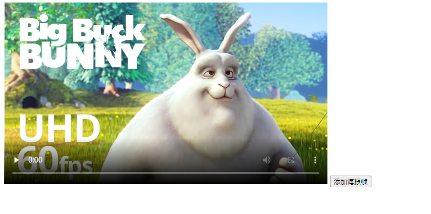

# H5 新特性 
[[toc]]

### audio && video
```html
<!DOCTYPE html>
<html lang="en">
<head>
  <meta charset="UTF-8">
  <meta name="viewport" content="width=device-width, initial-scale=1.0">
  <title>Document</title>
</head>
<body>
  <video src="video/video.mp4" width="640" height="360" controls id="video"></video>
  <audio src="audio/bad.mp3" id="audio" controls></audio>
  <script>
    let videoEle = document.getElementById('video');
    let audioEle = document.getElementById('audio');
    window.alert(videoEle);
    window.alert(audioEle);
  </script>
</body>
</html>
```
### 海报帧

```html
<!DOCTYPE html>
<html lang="en">
<head>
  <meta charset="UTF-8">
  <meta name="viewport" content="width=device-width, initial-scale=1.0">
  <title>Document</title>
</head>
<body>
  <video src="video/video.mp4" id="video" width="640" height="360" controls preload="none"></video>
  <button onclick="addPoster()">添加海报帧</button>
  <script>
    //获取HTMLVideoElement对象
    let videoEle = document.getElementById('video');
    //输出宽度和高度(必须保证<video>标签存在width和height属性)
    console.log(videoEle.width);
    console.log(videoEle.height);
    //输出视频的原始宽度和高度
    videoEle.addEventListener('loadeddata',()=>{
        console.log(videoEle.videoWidth);
        console.log(videoEle.videoHeight);
    });
    
    function addPoster(){
      videoEle.poster = 'poster/poster.jpg';
      console.log(videoEle.poster);
    }

  </script>
</body>
</html>
```
###  动态的创建音频对象
```html
<!DOCTYPE html>
<html>
<head>
  <meta charset="UTF-8">
  <meta name="viewport" content="width=device-width, initial-scale=1.0">
  <title>Document</title>
</head>
<body>
  <button onclick="createAudio()">单击我，动态的创建音频对象</button>
  <script>
    function createAudio(){
      //创建HTMLAudioElement对象
      let audioEle = new Audio();
      //设置音频对象的src属性
      audioEle.src = 'audio/stronger.mp3';
      //设置音频对象的控件属性(HTMLMediaElement)
      audioEle.controls = true;
      document.body.appendChild(audioEle);
    }
  </script>
</body>
</html>
```

### 设置媒体属性
```html
<!DOCTYPE html>
<html lang="en">
<head>
  <meta charset="UTF-8">
  <meta name="viewport" content="width=device-width, initial-scale=1.0">
  <title>Document</title>
</head>
<body>
  <video id="video"></video>
  <p>
    <button onclick="changeProperty()">设置媒体属性</button>
  </p>
  <script>
     function changeProperty(){
       //获取HTMLVideoElement
       let videoEle = document.getElementById('video');
       //设置src属性
       videoEle.src = 'video/video.mp4';
       //设置width及height属性
       videoEle.width = 640;
       videoEle.height = 360;
       //设置显示播放控件
       videoEle.controls = true;
       //设置自动播放
       videoEle.autoplay = false;
       //设置静音播放
       videoEle.muted = true;
       //设置循环播放
       videoEle.loop=false;
     }
  </script>
</body>
</html>
```

### video 自定义开发广告等

```html
<!DOCTYPE html>
<html lang="en">

<head>
  <meta charset="UTF-8">
  <meta name="viewport" content="width=device-width, initial-scale=1.0">
  <title>Document</title>
  <style>
    html,body,div,h1,h2,h3,h4,h5,h6,ul,ol,li,dl,dt,dd,form{
      margin: 0;
      padding: 0;
    }
    ul,li{
      list-style: none;
    }
    #container{
      position: relative;
      width:640px;
      margin: 0 auto;
    }
    #ad{
      position: absolute;
      left: 50%;
      top:50%;
      width: 400px;
      height: 300px;
      margin-left: -200px;
      margin-top: -180px;
      z-index: 999;
    }
  </style>
</head>

<body>
  <div id="container">    
    <div id="ad">
        
    </div>
    <video src="video/video.mp4" class="video" width="640" height="360" controls></video>
    <p>
        <span id="currentTime"></span>/<span id="duration"></span>
      <button onclick="playOrPause()">播放/暂停</button>
      <button onclick="incVol()">增大音量</button>
      <button onclick="decVol()">减少音量</button>
      <button onclick="playrate('0.5')">0.5倍速</button>
      <button onclick="playrate('1.0')">1.0倍速</button>
      <button onclick="playrate('1.5')">1.5倍速</button>
      <button onclick="playrate('2.0')">2.0倍速</button>
    </p>
  </div>
  <script>

    //用于存储广告图像名称
    let array = [
      '0D0100005E0DB3591241923143384738.jpg',
      '0D0100005E2EF493395059357930375A.jpg',
      '0D0100005E4DDCB31126293290574D55.jpg',
      '0D0100005E40CB833950593579383235.jpg',
      '0D0100005E254C951831383513533435.jpg',
      '0D0100005E4149B13950593579363944.jpg',
      '0D0100005E42288F9115223570333345.jpg',
      '0D0100005E588109395059360246315A.jpg',
    ];
    //获取HTMLVideoElement对象
    let videoEle = document.querySelector('.video');
    //获取广告位(HTMLDivElement)元素
    let adEle = document.getElementById('ad');

    //监听媒体对象的play事件
    videoEle.addEventListener('play',()=>{
        adEle.style.display = 'none';
    });

    //监听媒体对象的pause事件
    videoEle.onpause = ()=>{
      let image = array[Math.floor(Math.random() * array.length)];
      adEle.getElementsByTagName('img')[0].src = 'ad/' + image;
      adEle.style.display = 'block';
    };
       //监听媒体对象的第一帧加载完成的loadeddata事件
       videoEle.onloadeddata = ()=>{
      //获取媒体的当前的播放时间
      document.getElementById('currentTime').innerText = videoEle.currentTime;
      //获取媒体的总时长
      document.getElementById('duration').innerText = parseInt(videoEle.duration);
      
    }
     //监听媒体对象的currentTime发生变化的timeupdate事件
     videoEle.ontimeupdate = ()=>{
      document.getElementById('currentTime').innerText = parseInt(videoEle.currentTime);
    }


    //播放或暂停
    function playOrPause() {
      //获取HTMLVideoElement对象
      let videoEle = document.querySelector('.video');
      if(videoEle.paused || videoEle.ended){
          //媒体播放
          videoEle.play();
      } else {
          //媒体暂停 
          videoEle.pause();
      }
    }
    //调整播放速率
    function playrate(val) {
      //获取HTMLVideoElement对象
      let videoEle = document.querySelector('.video');
      //将字符串转换成浮点数
      val = parseFloat(val);
      //设置播放速率
      videoEle.playbackRate = val;
    }
    //增大音量
    function incVol() {
      //获取HTMLVideoElement对象
      let videoEle = document.querySelector('.video');
      //设置音量
      videoEle.volume = Math.min(1, videoEle.volume + 0.1);
    }
    //减少音量
    function decVol() {
      //获取HTMLVideoElement对象
      let videoEle = document.querySelector('.video');
      //设置音量
      videoEle.volume = Math.max(0, videoEle.volume - 0.1);
    }
  </script>
</body>

</html>
```

### video 自定义开发修改 进度条等
```html
<!DOCTYPE html>
<html lang="en">

<head>
  <meta charset="UTF-8">
  <meta name="viewport" content="width=device-width, initial-scale=1.0">
  <meta http-equiv="X-UA-Compatible" content="ie=edge">
  <title>Custom HTML5 Video Player</title>
  <link rel="stylesheet" href="styles/style.css" type="text/css">
  <style>
    #mask{
      z-index: 50;
      position: absolute;
      left: 0;
      top: 0;
      right: 0;
      bottom: 0;
      width: 100%;
      height: 100%;
  }
  </style>
</head>


<body>
  <div class="container">
    <div class="video-container" id="video-container">
      <div id="mask"></div>
      <!-- 视频元素开始 -->
      <video class="video" id="video" preload="metadata" poster="poster/poster.jpg">
        <source src="video/video.mp4" type="video/mp4">
        </source>
      </video>
      <!-- 视频元素结束 -->
      <!-- 视频控制按钮开始 -->
      <div class="video-controls" id="video-controls">
        <div class="video-progress">
          <progress id="progress-bar" value="0" min="0"></progress>
          <input class="seek" id="seek" value="0" min="0" type="range" step="1">
        </div>
        <div class="bottom-controls">
          <div class="left-controls">
            <button id="control-button">
              
            </button>
            <div class="volume-controls">
              <button id="volume-button">
                
              </button>
              <input class="volume" id="volume" data-volume="0.5" value="0.5" type="range" max="1" min="0" step="0.01">
            </div>
            <div class="time">
              <time id="time-elapsed">00:00</time>
              <span> / </span>
              <time id="duration">00:00</time>
            </div>
          </div>
          <div class="right-controls">
            <button id="fullscreen-button">
              
            </button>
          </div>
        </div>
      </div>
      <!-- 视频控制按钮结束 -->
    </div>
  </div>
  <script src="scripts/video.js"></script>
</body>

</html>
```