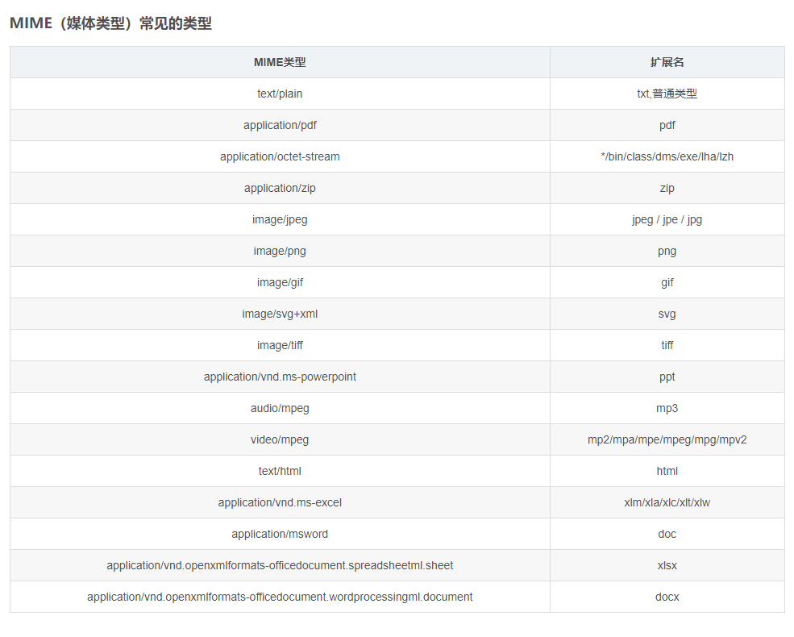

# Blob

在一般的 Web 开发中，很少会用到 Blob，但 Blob 可以满足一些场景下的特殊需求。Blob，Binary Large Object 的缩写，代表二进制类型的大对象。Blob 的概念在一些数据库中有使用到，例如，MYSQL 中的 BLOB 类型就表示二进制数据的容器。在 Web 中，Blob 类型的对象表示不可变的类似文件对象的原始数据，通俗点说，就是 Blob 对象是二进制数据，但它是类似文件对象的二进制数据，因此可以像操作 File 对象一样操作 Blob 对象，实际上，File 继承自 Blob。

### MIME（媒体类型）常见的类型


### Blob 基本用法

```js
// 可以通过Blob的构造函数创建Blob对象：
Blob(blobParts[, options])
```

::: tip
参数说明：
blobParts：数组类型，数组中的每一项连接起来构成 Blob 对象的数据，数组中的每项元素可以是 ArrayBuffer, ArrayBufferView, Blob, DOMString <br/>

options：可选项，字典格式类型，可以指定如下两个属性： <br/>

type，默认值为 ""，它代表了将会被放入到 blob 中的数组内容的 MIME 类型。 <br/>

endings，默认值为"transparent"，用于指定包含行结束符\n 的字符串如何被写入。 它是以下两个值中的一个： "native"，表示行结束符会被更改为适合宿主操作系统文件系统的换行符； "transparent"，表示会保持 blob 中保存的结束符不变。 <br/>

例如：

```js
var data1 = "a";
var data2 = "b";
var data3 = "<div style='color:red;'>This is a blob</div>";
var data4 = { name: "abc" };

var blob1 = new Blob([data1]);
var blob2 = new Blob([data1, data2]);
var blob3 = new Blob([data3]);
var blob4 = new Blob([JSON.stringify(data4)]);
var blob5 = new Blob([data4]);
var blob6 = new Blob([data3, data4]);

console.log(blob1); //输出：Blob {size: 1, type: ""}
console.log(blob2); //输出：Blob {size: 2, type: ""}
console.log(blob3); //输出：Blob {size: 44, type: ""}
console.log(blob4); //输出：Blob {size: 14, type: ""}
console.log(blob5); //输出：Blob {size: 15, type: ""}
console.log(blob6); //输出：Blob {size: 59, type: ""}
```

size 代表 Blob 对象中所包含数据的字节数。这里要注意，使用字符串和普通对象创建 Blob 时的不同，blob4 使用通过 JSON.stringify 把 data4 对象转换成 json 字符串，blob5 则直接使用 data4 创建，两个对象的 size 分别为 14 和 15。blob4 的 size 等于 14 很容易理解，因为 JSON.stringify(data4)的结果为："{"name":"abc"}"，正好 14 个字节(不包含最外层的引号)。blob5 的 size 等于 15 是如何计算而来的呢？实际上，当使用普通对象创建 Blob 对象时，相当于调用了普通对象的 toString()方法得到字符串数据，然后再创建 Blob 对象。所以，blob5 保存的数据是"[object Object]"，是 15 个字节(不包含最外层的引号)。

:::

### slice 方法

Blob 对象有一个 slice 方法，返回一个新的 Blob 对象，包含了源 Blob 对象中指定范围内的数据。 <br/>
slice([start[, end[, contentType]]]) <br/>
参数说明： <br/>
start： 可选，代表 Blob 里的下标，表示第一个会被会被拷贝进新的 Blob 的字节的起始位置。如果传入的是一个负数，那么这个偏移量将会从数据的末尾从后到前开始计算。 <br/>
end： 可选，代表的是 Blob 的一个下标，这个下标-1 的对应的字节将会是被拷贝进新的 Blob 的最后一个字节。如果你传入了一个负数，那么这个偏移量将会从数据的末尾从后到前开始计算。 <br/>
contentType： 可选，给新的 Blob 赋予一个新的文档类型。这将会把它的 type 属性设为被传入的值。它的默认值是一个空的字符串。 <br/>
例如：

```js
var data = "abcdef";
var blob1 = new Blob([data]);
var blob2 = blob1.slice(0, 3);

console.log(blob1); //输出：Blob {size: 6, type: ""}
console.log(blob2); //输出：Blob {size: 3, type: ""}
```

通过 slice 方法，从 blob1 中创建出一个新的 blob 对象，size 等于 3。

# Blob 使用场景

::: tip
分片上传
前面已经说过，File 继承自 Blob，因此我们可以调用 slice 方法对大文件进行分片长传。代码如下：

```js
function uploadFile(file) {
  var chunkSize = 1024 * 1024; // 每片1M大小
  var totalSize = file.size;
  var chunkQuantity = Math.ceil(totalSize / chunkSize); //分片总数
  var offset = 0; // 偏移量

  var reader = new FileReader();
  reader.onload = function (e) {
    var xhr = new XMLHttpRequest();
    xhr.open("POST", "http://xxxx/upload?fileName=" + file.name);
    xhr.overrideMimeType("application/octet-stream");

    xhr.onreadystatechange = function () {
      if (xhr.readyState === XMLHttpRequest.DONE && xhr.status === 200) {
        ++offset;
        if (offset === chunkQuantity) {
          alert("上传完成");
        } else if (offset === chunkQuantity - 1) {
          blob = file.slice(offset * chunkSize, totalSize); // 上传最后一片
          reader.readAsBinaryString(blob);
        } else {
          blob = file.slice(offset * chunkSize, (offset + 1) * chunkSize);
          reader.readAsBinaryString(blob);
        }
      } else {
        alert("上传出错");
      }
    };

    if (xhr.sendAsBinary) {
      xhr.sendAsBinary(e.target.result); // e.target.result是此次读取的分片二进制数据
    } else {
      xhr.send(e.target.result);
    }
  };
  var blob = file.slice(0, chunkSize);
  reader.readAsBinaryString(blob);
}
```

这段代码还可以进一步丰富，比如显示当前的上传进度，使用多个 XMLHttpRequest 对象并行上传对象（需要传递分片数据的位置参数给服务器端）等。
:::

### Blob URL

Blob URL 是 blob 协议的 URL，它的格式如下：<br/>
blob:http://XXX<br/>
Blob URL 可以通过 URL.createObjectURL(blob)创建。在绝大部分场景下，我们可以像使用 Http 协议的 URL 一样，使用 Blob URL。常见的场景有：作为文件的下载地址和作为图片资源地址。<br/>

文件下载地址<br/>

```html
<!DOCTYPE html>
<html lang="en">
  <head>
    <meta charset="UTF-8" />
    <title>Blob Test</title>
    <script>
      function createDownloadFile() {
        var content = "Blob Data";
        var blob = new Blob([content]);
        var link = document.getElementsByTagName("a")[0];
        link.download = "file";
        link.href = URL.createObjectURL(blob);
      }
      window.onload = createDownloadFile;
    </script>
  </head>

  <body>
    <a>下载</a>
  </body>
</html>
```

### 图片资源地址

为图片文件创建一个 Blob URL，赋值给标签：

```html
<!DOCTYPE html>
<html lang="en">
  <head>
    <meta charset="UTF-8" />
    <title>Blob Test</title>
    <script>
      function handleFile(e) {
        var file = e.files[0];
        var fileReader = new FileReader();
        var img = document.getElementsByTagName("img")[0];
        fileReader.onload = function (e) {
          img.src = e.target.result;
        };
        fileReader.readAsDataURL(file);
      }
    </script>
  </head>

  <body>
    <input type="file" accept="image/*" onchange="handleFile(this)" />
    <br />
    
  </body>
</html>
```

Data URL 对大家来说应该并不陌生，Web 性能优化中有一项措施：把小图片用 base64 编码直接嵌入到 HTML 文件中，实际上就是利用了 Data URL 来获取嵌入的图片数据。
那么 Blob URL 和 Data URL 有什么区别呢？

1. Blob URL 的长度一般比较短，但 Data URL 因为直接存储图片 base64 编码后的数据，往往很长，如上图所示，浏览器在显示 Data URL 时使用了省略号（…）。当显式大图片时，使用 Blob URL 能获取更好的可能性。
2. Blob URL 可以方便的使用 XMLHttpRequest 获取源数据，例如：

```js
var blobUrl = URL.createObjectURL(new Blob(["Test"], { type: "text/plain" }));
var x = new XMLHttpRequest();
// 如果设置x.responseType = 'blob'，将返回一个Blob对象，而不是文本:
// x.responseType = 'blob';
x.onload = function () {
  alert(x.responseText); // 输出 Test
};
x.open("get", blobUrl);
x.send();
```

对于 Data URL，并不是所有浏览器都支持通过 XMLHttpRequest 获取源数据的。 3. Blob URL 只能在当前应用内部使用，把 Blob URL 复制到浏览器的地址栏中，是无法获取数据的。Data URL 相比之下，就有很好的移植性，你可以在任意浏览器中使用。
除了可以用作图片资源的网络地址，Blob URL 也可以用作其他资源的网络地址，例如 html 文件、json 文件等，为了保证浏览器能正确的解析 Blob URL 返回的文件类型，需要在创建 Blob 对象时指定相应的 type：

```js
// 创建HTML文件的Blob URL
var data = "<div style='color:red;'>This is a blob</div>";
var blob = new Blob([data], { type: "text/html" });
var blobURL = URL.createObjectURL(blob);

// 创建JSON文件的Blob URL
var data = { name: "abc" };
var blob = new Blob([JSON.stringify(data)], { type: "application/json" });
var blobURL = URL.createObjectURL(blob);
```

### MDN 资料

Blob 对象表示一个不可变、原始数据的类文件对象。它的数据可以按文本或二进制的格式进行读取，也可以转换成 ReadableStream 来用于数据操作。

Blob 表示的不一定是 JavaScript 原生格式的数据。File 接口基于 Blob，继承了 blob 的功能并将其扩展使其支持用户系统上的文件。

要从其他非 blob 对象和数据构造一个 Blob，请使用 Blob() 构造函数。要创建一个 blob 数据的子集 blob，请使用 slice() 方法。要获取用户文件系统上的文件对应的 Blob 对象，请参阅 File 文档。

接受 Blob 对象的 API 也被列在 File 文档中。

::: warning
注意：slice() 方法原本接受 length 作为第二个参数，以表示复制到新 Blob 对象的字节数。如果设置的参数使 start + length 超出了源 Blob 对象的大小，则返回从开始到结尾的所有数据。
:::
::: warning
注意：slice() 方法在某些浏览器和版本上带有浏览器引擎前缀：比如 Firefox 12 及更早版本的 blob.mozSlice() 和 Safari 中的 blob.webkitSlice()。没有浏览器引擎前缀的老版本 slice() 方法有不同的语义，并且已过时。Firefox 30 取消了对 blob.mozSlice() 的支持。
:::

### 构造函数

```js
Blob(blobParts[, options])
```

返回一个新创建的 Blob 对象，其内容由参数中给定的数组串联组成。<br/>
属性<br/>
Blob.size 只读<br/>
Blob 对象中所包含数据的大小（字节）。<br/>
Blob.type 只读<br/>
一个字符串，表明该 Blob 对象所包含数据的 MIME 类型。如果类型未知，则该值为空字符串。<br/>

### 方法

```js
Blob.slice([start[, end[, contentType]]])
```

返回一个新的 Blob 对象，包含了源 Blob 对象中指定范围内的数据。<br/>
Blob.stream()<br/>
返回一个能读取 blob 内容的 ReadableStream。<br/>
Blob.text()<br/>
返回一个 promise 且包含 blob 所有内容的 UTF-8 格式的 USVString。<br/>
Blob.arrayBuffer()<br/>
返回一个 promise 且包含 blob 所有内容的二进制格式的 ArrayBuffer<br/>
示例<br/>
Blob 构造函数用法举例<br/>
Blob() 构造函数允许通过其它对象创建 Blob 对象。比如，用字符串构建一个 blob：<br/>

```js
var debug = { hello: "world" };
var blob = new Blob([jsON.stringify(debug, null, 2)], {
  type: "application/json",
});
```

::: danger
BlobBuilder 接口提供了另外一种创建 Blob 对象的方式，但该方式现在已经废弃，不应继续使用：

```js
var builder = new BlobBuilder();
var fileParts = ['<a id="a"><b id="b">hey!</b></a>'];
builder.append(fileParts[0]);
var myBlob = builder.getBlob("text/xml");
```

:::

#### 示例：使用 Blob 创建一个指向类型化数组的 URL

参考下面的代码：

```js
var typedArray = GetTheTypedArraySomehow();
var blob = new Blob([typedArray.buffer], { type: "application/octet-stream" }); // 传入一个合适的 MIME 类型
var url = URL.createObjectURL(blob);
// 会产生一个类似 blob:d3958f5c-0777-0845-9dcf-2cb28783acaf 这样的 URL 字符串
// 你可以像使用普通 URL 那样使用它，比如用在 img.src 上。
```

### 示例：从 Blob 中提取数据

一种从 Blob 中读取内容的方法是使用 FileReader。以下代码将 Blob 的内容作为类型数组读取：

```js
var reader = new FileReader();
reader.addEventListener("loadend", function () {
  // reader.result 包含被转化为类型数组 typed array 的 blob
});
reader.readAsArrayBuffer(blob);
```

另一种读取 Blob 中内容的方式是使用 Response 对象。下述代码将 Blob 中的内容读取为文本：

```js
var text = await new Response(blob).text();
```

通过使用 FileReader 的其它方法可以把 Blob 读取为字符串或者数据 URL。
