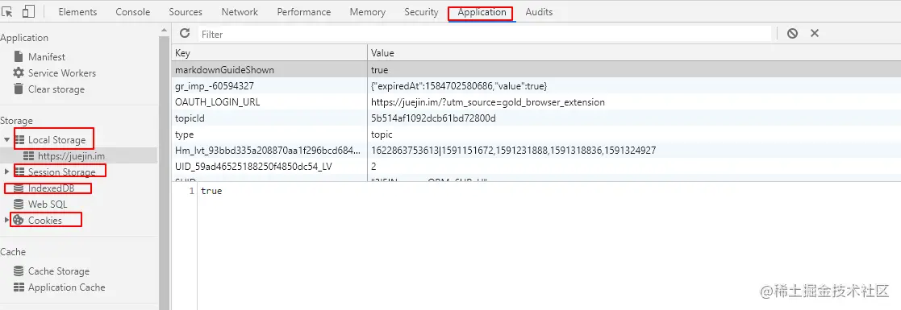

# 浏览器数据持久化

|特性 |cookie |localStorage |sessionStorage |indexDB|
| :---:  |   :---:    |  :---:  | :---:| :---:    |
| 数据生命周期 | 一般由服务器生成，可以设置过期时间；前端采用和js-cookie等组件也可以生成 | 除非被清理，否则一直存在；浏览器关闭还会保存在本地，但是不支持跨浏览器 |页面关闭就清理刷新依然存在，不支持跨 | 页面交互 |除非被清理，否则一直存在 |
|数据存储大小 |4K |5M |5M| 不限制大小 |
|与服务端通信 |每次都会携带在请求的header 中，对于请求性能有影响；同时由于请求中都带有，所以也容易出现安全问题 |不参与 |不参与|不参与|
|特点|字符串键值对在本地存储数据|字符串键值对在本地存储数据|字符串键值对在本地存储数据| IndexedDB 是一个非关系型数据库（不支持通过 SQL 语句操作）。可以存储大量数据，提供接口来查询，还可以建立索引，这些都是其他存储方案无法提供的能力。|

### 浏览器可以直接查看本地存储的数据
如下图：

cookie 不建议用于存储业务数据，因为前端接口请求的时候请求头都会携带cookie，浪费带宽资源，一般只用于存储登录状态信息；
对于不怎么改变的数据尽量使用 localStorage 存储，否则可以用 sessionStorage 存储。
###### 注意点：
* HTML5本地存储只能存字符串，任何格式存储的时候都会被自动转为字符串，所以读取的时候，需要自己进行类型的转换。
* 要注意在前端操作的存储和后端数据库存储一样都是异步的，即取的时候有可能会出现还没存好的可能。
###### 介绍：
Web Storage实际上由两部分组成：sessionStorage与localStorage。
Web Storage带来的好处：
1. 减少网络流量：一旦数据保存在本地后，就可以避免再向服务器请求数据，减少不必要的数据请求，且减少数据在浏览器和服务器间不必要地来回传递。
2. 快速显示数据：性能好，从本地读数据比通过网络从服务器获得数据快得多，本地数据可以即时获得。再加上网页本身也可以有缓存，因此整个页面和数据都在本地的话，可以立即显示。 
3. 存储空间更大：IE8下每个独立的存储空间为10M，其他浏览器实现略有不同，但都比Cookie要大很多。
4. 存储内容不会发送到服务器：当设置了Cookie后，Cookie的内容会随着请求一并发送的服务器，这对于本地存储的数据是一种带宽浪费。而Web Storage中的数据则仅仅是存在本地，不会与服务器发生任何交互。
5. 更多丰富易用的接口：Web Storage提供了一套更为丰富的接口，使得数据操作更为简便（如：getItem\setItem）。
6. 独立的存储空间：每个域（包括子域）有独立的存储空间，各个存储空间是完全独立的，因此不会造成数据混乱。

### localStorage
单个localStorage的大小受限，可以用多个iframe方式使用多个域名来突破单个页面下localStorage存储数据的最大限制。

特别说明：浏览器多个标签页打开同个域名时，localStorage内容一般是共享的。其位置这可以监听事件“storage”来做一致性操作响应处理。这样会导致如下现象：

标签页一：通过某行为修改localStorage中某个属性值，然后数据接口依赖该属性值；

标签页二：由于localStorage标签页间共享，导致标签页二数据不准确！
```js
localStorage.setItem("type","1")  // 使浏览器在其localStorage内存中存储一个叫type的属性 ，其值为1；
localStorage.getItem("type")       // 获取localStorage中相应属性
```
### sessionStorage
和localStorage功能类似，但是sessionStorage在浏览器关闭时会自动清空。

sessionStorage、localStorage、cookie都是在浏览器端存储的数据，其中sessionStorage的概念很特别，引入了一个“浏览器窗口”的概念。

sessionStorage是在同源的同窗口（或tab）中，始终存在的数据。也就是说只要这个浏览器窗口没有关闭，即使刷新页面或进入同源另一页面，数据仍然存在。关闭窗口后，sessionStorage即被销毁。同时“独立”打开的不同窗口，即使是同一页面，sessionStorage对象也是不同的。

临时存储：很多时候数据只需要在用户浏览一组页面期间使用，关闭窗口后数据就可以丢弃了，这种情况使用sessionStorage非常方便。

使用方法
```js
//存储
window.sessionStorage.setItem("token","adfasfasfasfd")
//取出
sessionStroage.getItem("mykey")
sessionStroage.mykey
//清除
sessionStroage.clear()
```

### Cookie
Cookie为了辨别用户身份或Session跟踪而存储在用户浏览器端的数据。Cookie一般会通过HTTP请求发送给服务器端。 
cookie过期等配置

Cookie分为：Session Cookie和持久型Cookie。Cookie设置中有个HttpOnly参数，前端浏览器使用document.cookie是读取不到HttpOnly类型的Cookie的，被设置为HttpOnly的Cookie记录只能通过HTTP请求头发送到服务器端进行读写操作，这样就避免了服务器的Cookie记录被前端javascript修改，保证了服务器验证Cookie的安全性。

cookie的内容主要包括：名字，值，过期时间，路径和域。路径与域一起构成cookie的作用范围。若不设置过期时间，则表示这个cookie的生命期为浏览器会话期间，关闭浏览器窗口，cookie就消失。

这种生命期为浏览器会话期的cookie被称为会话cookie。会话cookie一般不存储在硬盘上而是保存在内存里。若设置了过期时间，浏览器就会把cookie保存到硬盘上，关闭后再次打开浏览器，这些cookie仍然有效直到超过设定的过期时间。存储在硬盘上的cookie可以在不同的浏览器进程间共享，比如两个IE窗口。而对于保存在内存里的cookie，不同的浏览器有不同的处理方式。
### session
session机制是一种服务器端的机制，服务器使用一种类似于散列表的结构（也可能就是使用散列表）来保存信息。当程序需要为某个客户端的请求创建一个session时，服务器首先检查这个客户端的请求里是否已包含了一个session标识（称为session id），如果已包含则说明以前已经为此客户端创建过session，服务器就按照session id把这个session检索出来使用（检索不到，会新建一个），如果客户端请求不包含session id，则为此客户端创建一个session并且生成一个与此session相关联的session id，session id的值应该是一个既不会重复，又不容易被找到规律以仿造的字符串，这个session id将被在本次响应中返回给客户端保存。

### 其他存储方式（了解）
WebSQL：二维表的形成存储大量数据到客户端，但目前只有Chrome浏览器有。

IndexDB：在客户端存储大量结构化数据并且在这些数据上使用索引进行高性能检索的一套API，类似于NoSQL。

Application Cache：
通过manifest配置文件在本地有选择性地存储javascript、css、图片等静态资源文件的文件缓存机制，已废弃。

cacheStorage：在ServiceWorker规范中定义的，用于保存每个ServiceWorker（后续博文会单独介绍）声明的Cache对象，未来可能替代Application Cache的离线方案。

Flash缓存：主要基于Flash，具有读写浏览器本地目录的功能。

### sessionStorage 、localStorage 和 cookie 比较
共同点：都是保存在浏览器端，且同源的。
区别：

* 是否随请求传递

cookie数据始终在同源的http请求中携带（即使不需要），即cookie在浏览器和服务器间来回传递。

而sessionStorage和localStorage不会自动把数据发给服务器，仅在本地保存。

cookie数据还有路径（path）的概念，可以限制cookie只属于某个路径下。

* 存储大小限制不同

cookie数据不能超过4k，同时因为每次http请求都会携带cookie，所以cookie只适合保存很小的数据，如会话标识。

sessionStorage和localStorage 虽然也有存储大小的限制，但比cookie大得多，可以达到5M或更大。

* 数据有效期不同

sessionStorage：仅在当前浏览器窗口关闭前有效，自然也就不可能持久保持；

localStorage：始终有效，窗口或浏览器关闭也一直保存，因此用作持久数据；

但是只保存在当前这个浏览器中，换了浏览器，数据就会是另一个浏览器打开时保存的数据，因为这些数据都是存储在浏览器中的；

cookie只在设置的cookie过期时间之前一直有效，即使窗口或浏览器关闭。

* 作用域不同

sessionStorage不在不同的浏览器窗口中共享，即使是同一个页面；

localStorage 在所有同源窗口中都是共享的；

cookie也是在所有同源窗口中都是共享的。
### cookie 和session比较
区别：
1. cookie数据存放在客户的浏览器上，session数据放在服务器上。
2. cookie不是很安全，别人可以分析存放在本地的COOKIE并进行COOKIE欺骗
3. session会在一定时间内保存在服务器上。当访问增多，会比较占用你服务器的性能
4. 单个cookie保存的数据不能超过4K，很多浏览器都限制一个站点最多保存20个cookie。
5. 所以个人建议：

   将登陆信息等重要信息存放为SESSION

   其他信息如果需要在每个请求中携带，可以放在COOKIE中

   其他本地化的缓存数据存储在Web Storage


