# Canvas 使用

Canvas 最早是由 Apple 引入 WebKit，用于 Mac OS X 的 Dashboard，随后被各个浏览器实现。如今除一些过时的浏览器不支持 Canvas 元素外，所有的新版本主流浏览器都支持它。
Canvas 元素的学习需要具备一些基本的 HTML 和 JavaScript 知识。

[[toc]]

### 基本用法

下面我们来简单创建一个例子，看看 canvas 究竟如何使用。

```html
<!DOCTYPE html>
<html lang="en">
  <head>
    <meta charset="UTF-8" />
    <meta http-equiv="X-UA-Compatible" content="IE=edge" />
    <meta name="viewport" content="width=device-width, initial-scale=1.0" />
    <title>canvas 基本使用</title>
  </head>
  <body>
    <canvas width="200" height="200">
      当前浏览器不支持canvas元素，请升级或更换浏览器！
    </canvas>
  </body>
</html>
```

上面代码就是一个基本的使用 Canvas 标签的例子。可以看到我们为它设置了宽和高，还在 Canvas 标签内部给出一个提示文案。在这里需要说明一下：

> Canvas 标签的默认大小为：300 x 150 (像素)，而这里咱们设置为了：200 x 200（像素）。<br/>
> Canvas 标签中的文字是在不支持 Canvas 标签的浏览器中使用的，因为支持 Canvas 标签的浏览器会忽略容器中包含的内容正常渲染 Canvas 标签，而不支持 Canvas 标签的浏览器则相反，浏览器会忽略容器而显示其中的内容。

可以看一下上面代码在浏览器上的展示样式：
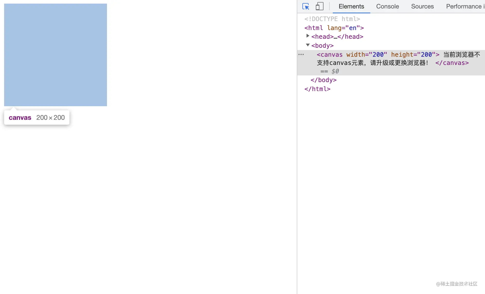

这里需要注意一点，getContext 方法是有一个接收参数，它是绘图上下文的类型，可能的参数有：

> `2d`：建立一个二维渲染上下文。这种情况可以用 `CanvasRenderingContext2D()`来替换`getContext('2d')`。<br/> > `webgl`（或 experimental-webgl）： 创建一个 WebGLRenderingContext 三维渲染上下文对象。只在实现 WebGL 版本 1(OpenGL ES 2.0)的浏览器上可用。<br/> > `webgl2`（或 experimental-webgl2）：创建一个 WebGL2RenderingContext 三维渲染上下文对象。只在实现 WebGL 版本 2 (OpenGL ES 3.0)的浏览器上可用。<br/>
> bitmaprenderer：创建一个只提供将 canvas 内容替换为指定 ImageBitmap 功能的 ImageBitmapRenderingContext。<br/>

## 绘制形状

在我们获得绘制上下文以后，就可以根据绘制上下文开始绘制一些基本的形状，比如：直线、三角形、矩形、圆弧和圆。接下来咱们具体实现一下。

### 直线

绘制直线咱们需要了解三个函数：<br/>
`moveTo(x, y)`<br/>
设置初始位置，参数为初始位置 x 和 y 的坐标点<br/>
`lineTo(x, y)`<br/>
绘制一条从初始位置到指定位置的直线，参数为指定位置 x 和 y 的坐标点<br/>
`stroke()`<br/>
通过线条来绘制图形轮廓<br/>

接下里咱们应用上面的三个函数来试着绘制一条直线，代码如下：

```html
<!DOCTYPE html>
<html lang="en">
  <head>
    <meta charset="UTF-8" />
    <meta http-equiv="X-UA-Compatible" content="IE=edge" />
    <meta name="viewport" content="width=device-width, initial-scale=1.0" />
    <title>canvas - 绘制直线</title>
    <style>
      /* 给画布增加一个阴影和圆角的样式 */
      canvas {
        box-shadow: 0px 0px 5px #ccc;
        border-radius: 8px;
      }
    </style>
  </head>
  <body>
    <canvas id="canvas" width="500" height="500">
      当前浏览器不支持canvas元素，请升级或更换浏览器！
    </canvas>
    <script>
      // 获取 canvas 元素
      var canvas = document.getElementById("canvas");
      // 通过判断getContext方法是否存在来判断浏览器的支持性
      if (canvas.getContext) {
        // 获取绘图上下文
        var ctx = canvas.getContext("2d");
        // 绘制一条从起点（x: 50, y:50）到 另一个点（x: 200, y:200）的直线
        ctx.moveTo(50, 50);
        ctx.lineTo(200, 200);
        ctx.stroke();
      }
    </script>
  </body>
</html>
```

为了展示的效果好一点，这里我调整了一下画布的大小：500 x 500，还给画布添加了一个阴影和圆角。得到的直线如图：


### 三角形

知道了如何绘制一条直线，那么绘制三角形也就不难了，咱们只需要画三条直线拼在一起就是一个三角形了，代码如下：

```html
<!DOCTYPE html>
<html lang="en">
  <head>
    <meta charset="UTF-8" />
    <meta http-equiv="X-UA-Compatible" content="IE=edge" />
    <meta name="viewport" content="width=device-width, initial-scale=1.0" />
    <title>canvas - 绘制三角形</title>
    <style>
      /* 给画布增加一个阴影和圆角的样式 */
      canvas {
        box-shadow: 0px 0px 5px #ccc;
        border-radius: 8px;
      }
    </style>
  </head>
  <body>
    <canvas id="canvas" width="500" height="500">
      当前浏览器不支持canvas元素，请升级或更换浏览器！
    </canvas>
    <script>
      // 获取 canvas 元素
      var canvas = document.getElementById("canvas");
      // 通过判断getContext方法是否存在来判断浏览器的支持性
      if (canvas.getContext) {
        // 获取绘图上下文
        var ctx = canvas.getContext("2d");
        // 绘制一个三角形
        ctx.moveTo(50, 50);
        ctx.lineTo(200, 200);
        ctx.lineTo(200, 50);
        ctx.lineTo(50, 50);
        ctx.stroke();
      }
    </script>
  </body>
</html>
```

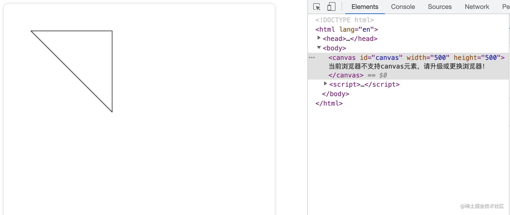

### 矩形

知道了三角形的绘制，那么矩形的绘制是不是也用直线来拼凑呢？答案是否定的，矩形虽然可以用四条直线来拼凑成，但那样太复杂了，Canvas API 给提供了三种绘制矩形的方法：

`strokeRect(x, y, width, height)` 绘制一个矩形的边框<br/>
`fillRect(x, y, width, height)` 绘制一个填充的矩形<br/>
`clearRect(x, y, width, height)` 清除指定矩形区域，让清除部分完全透明。<br/>

下面我们依次看一下他们有什么异同。
strokeRect

`strokeRect(x, y, width, height)` 是用来绘制一个矩形的边框，x 和 y 是矩形的起点坐标，width 和 height 是矩形的宽高。举个例子，代码如下：

```html
<!DOCTYPE html>
<html lang="en">
  <head>
    <meta charset="UTF-8" />
    <meta http-equiv="X-UA-Compatible" content="IE=edge" />
    <meta name="viewport" content="width=device-width, initial-scale=1.0" />
    <title>canvas - 绘制矩形</title>
    <style>
      /* 给画布增加一个阴影和圆角的样式 */
      canvas {
        box-shadow: 0px 0px 5px #ccc;
        border-radius: 8px;
      }
    </style>
  </head>
  <body>
    <canvas id="canvas" width="500" height="500">
      当前浏览器不支持canvas元素，请升级或更换浏览器！
    </canvas>
    <script>
      // 获取 canvas 元素
      var canvas = document.getElementById("canvas");
      // 通过判断getContext方法是否存在来判断浏览器的支持性
      if (canvas.getContext) {
        // 获取绘图上下文
        var ctx = canvas.getContext("2d");
        // 绘制一个矩形边框
        ctx.strokeRect(50, 50, 200, 100);
      }
    </script>
  </body>
</html>
```

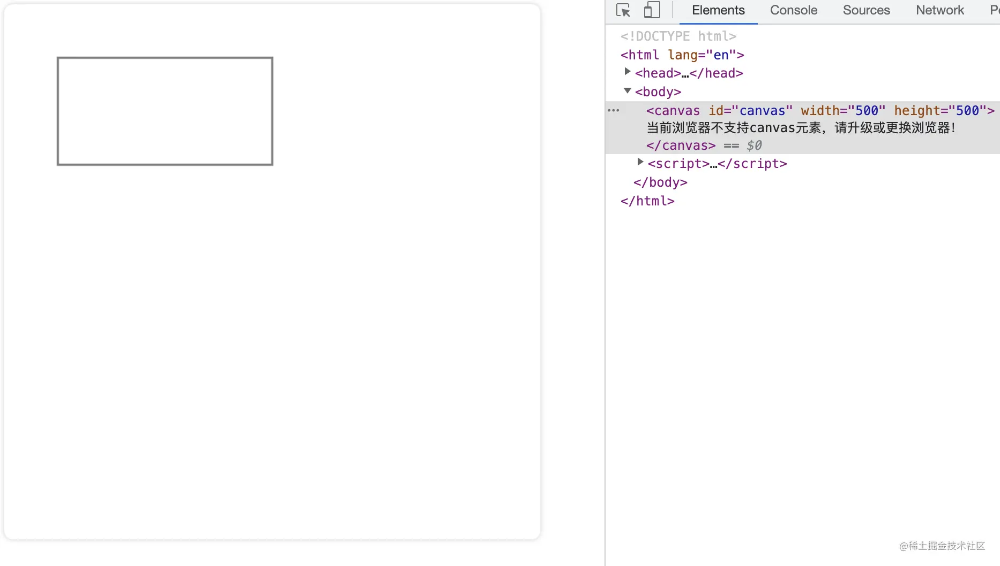

### fillRect

fillRect(x, y, width, height) 绘制一个填充的矩形，x 和 y 是矩形的起点坐标，width 和 height 是矩形的宽高。举个例子，代码如下：

```html
<!DOCTYPE html>
<html lang="en">
  <head>
    <meta charset="UTF-8" />
    <meta http-equiv="X-UA-Compatible" content="IE=edge" />
    <meta name="viewport" content="width=device-width, initial-scale=1.0" />
    <title>canvas - 绘制矩形</title>
    <style>
      /* 给画布增加一个阴影和圆角的样式 */
      canvas {
        box-shadow: 0px 0px 5px #ccc;
        border-radius: 8px;
      }
    </style>
  </head>
  <body>
    <canvas id="canvas" width="500" height="500">
      当前浏览器不支持canvas元素，请升级或更换浏览器！
    </canvas>
    <script>
      // 获取 canvas 元素
      var canvas = document.getElementById("canvas");
      // 通过判断getContext方法是否存在来判断浏览器的支持性
      if (canvas.getContext) {
        // 获取绘图上下文
        var ctx = canvas.getContext("2d");
        // 绘制一个填充矩形
        ctx.fillRect(100, 100, 200, 100);
      }
    </script>
  </body>
</html>
```

如下图，fillRect 方法实现的是填充了一个矩形：
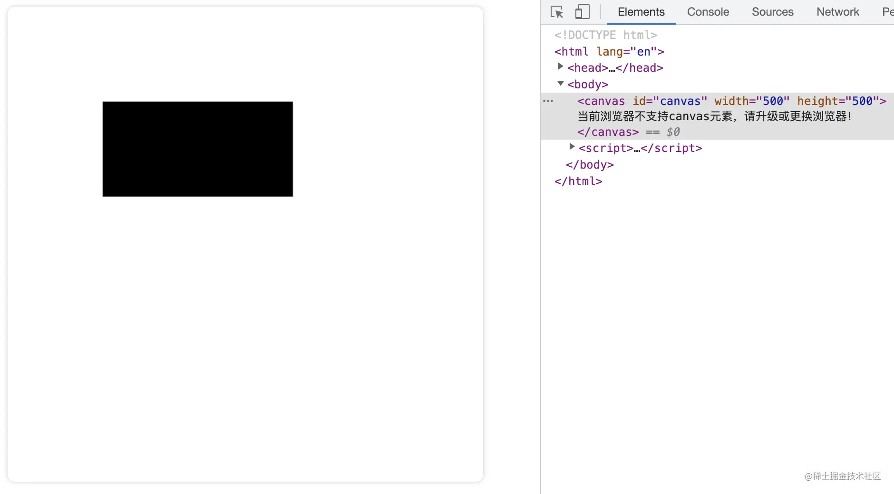

### clearRect

clearRect(x, y, width, height) 清除指定矩形区域，让清除部分完全透明，x 和 y 是矩形的起点坐标，width 和 height 是矩形的宽高。这里需要结合结合另外两种画法来对比一下，才能看出具体的效果，代码如下：

```html
<!DOCTYPE html>
<html lang="en">
  <head>
    <meta charset="UTF-8" />
    <meta http-equiv="X-UA-Compatible" content="IE=edge" />
    <meta name="viewport" content="width=device-width, initial-scale=1.0" />
    <title>canvas - 绘制矩形</title>
    <style>
      /* 给画布增加一个阴影和圆角的样式 */
      canvas {
        box-shadow: 0px 0px 5px #ccc;
        border-radius: 8px;
      }
    </style>
  </head>
  <body>
    <canvas id="canvas" width="500" height="500">
      当前浏览器不支持canvas元素，请升级或更换浏览器！
    </canvas>
    <script>
      // 获取 canvas 元素
      var canvas = document.getElementById("canvas");
      // 通过判断getContext方法是否存在来判断浏览器的支持性
      if (canvas.getContext) {
        // 获取绘图上下文
        var ctx = canvas.getContext("2d");
        // 绘制一个填充矩形
        ctx.fillRect(100, 100, 200, 100);
        ctx.fillRect(50, 50, 200, 100);
        ctx.clearRect(75, 75, 100, 70);
      }
    </script>
  </body>
</html>
```

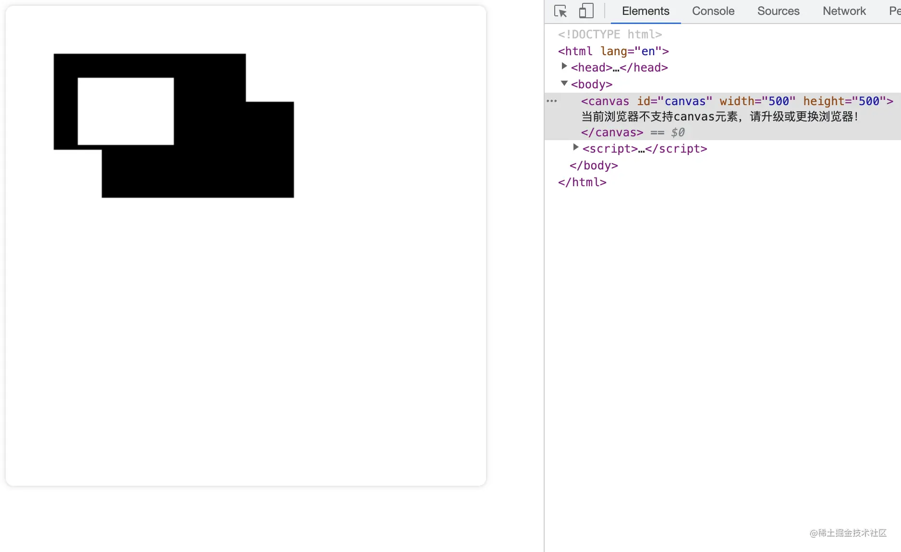

### 圆弧和圆

绘制圆弧或者圆，使用的方法是：`arc(x, y, radius, startAngle, endAngle, anticlockwise)。`x 和 Y 为圆心的坐标，radius 为半径，startAngle 为圆弧或圆的开始位置，endAngle 为圆弧或圆的结束位置，anticlockwise 是绘制的方向（不写默认为 false，从顺时针方向）。
下面画一个半圆弧看看效果，代码如下：

```html
<!DOCTYPE html>
<html lang="en">
  <head>
    <meta charset="UTF-8" />
    <meta http-equiv="X-UA-Compatible" content="IE=edge" />
    <meta name="viewport" content="width=device-width, initial-scale=1.0" />
    <title>canvas - 绘制圆弧</title>
    <style>
      /* 给画布增加一个阴影和圆角的样式 */
      canvas {
        box-shadow: 0px 0px 5px #ccc;
        border-radius: 8px;
      }
    </style>
  </head>
  <body>
    <canvas id="canvas" width="500" height="500">
      当前浏览器不支持canvas元素，请升级或更换浏览器！
    </canvas>
    <script>
      // 获取 canvas 元素
      var canvas = document.getElementById("canvas");
      // 通过判断getContext方法是否存在来判断浏览器的支持性
      if (canvas.getContext) {
        // 获取绘图上下文
        var ctx = canvas.getContext("2d");
        // 绘制一段圆弧
        ctx.arc(60, 60, 50, 0, Math.PI, false);
        ctx.stroke();
      }
    </script>
  </body>
</html>
```

效果如下图：
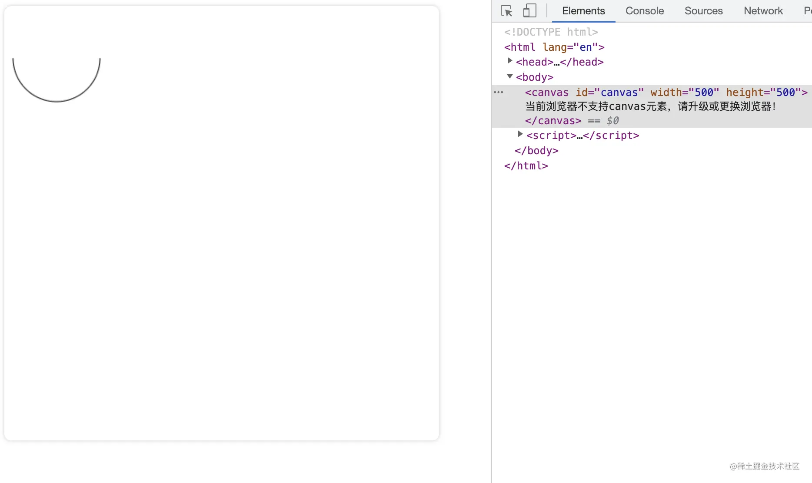

这里需要注意的是：在画弧的时候，arc()函数中角的单位是弧度而不是角度。角度换算为弧度的表达式为：弧度=(Math.PI/180)\*角度。

所以想要画一个圆的弧度就是：Math.PI\*2，咱们继续画一个圆弧看一下，代码如下：

```html
<!DOCTYPE html>
<html lang="en">
  <head>
    <meta charset="UTF-8" />
    <meta http-equiv="X-UA-Compatible" content="IE=edge" />
    <meta name="viewport" content="width=device-width, initial-scale=1.0" />
    <title>canvas - 绘制圆弧</title>
    <style>
      /* 给画布增加一个阴影和圆角的样式 */
      canvas {
        box-shadow: 0px 0px 5px #ccc;
        border-radius: 8px;
      }
    </style>
  </head>
  <body>
    <canvas id="canvas" width="500" height="500">
      当前浏览器不支持canvas元素，请升级或更换浏览器！
    </canvas>
    <script>
      // 获取 canvas 元素
      var canvas = document.getElementById("canvas");
      // 通过判断getContext方法是否存在来判断浏览器的支持性
      if (canvas.getContext) {
        // 获取绘图上下文
        var ctx = canvas.getContext("2d");
        // 绘制一段圆弧
        ctx.arc(60, 60, 50, 0, Math.PI, false);
        ctx.stroke();
        // 绘制一个圆弧
        ctx.arc(200, 60, 50, 0, Math.PI * 2, false);
        ctx.stroke();
      }
    </script>
  </body>
</html>
```

但效果似乎不想我们想象的一样，如下图：
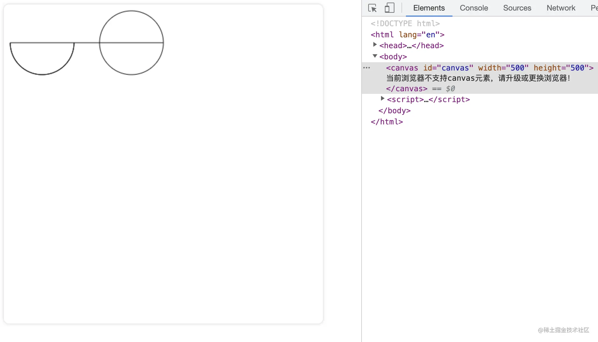

如上图所示，先画的半圆弧和后画的圆弧被连在了一起，其实这是因为在咱们每次新建路径的时候都需要开启和闭合路径，这样不同路径之间才不会相互干扰。下面咱们就来介绍一下如何开启和闭合路径。

### beginPath

新建一条路径，生成之后，图形绘制命令被指向到路径上。

### closePath

闭合路径之后图形绘制命令又重新指向到上下文中。
具体怎么使用这两个函数呢？下面咱们介绍一下，直接上代码：

```html
<!DOCTYPE html>
<html lang="en">
  <head>
    <meta charset="UTF-8" />
    <meta http-equiv="X-UA-Compatible" content="IE=edge" />
    <meta name="viewport" content="width=device-width, initial-scale=1.0" />
    <title>canvas - 绘制圆弧</title>
    <style>
      /* 给画布增加一个阴影和圆角的样式 */
      canvas {
        box-shadow: 0px 0px 5px #ccc;
        border-radius: 8px;
      }
    </style>
  </head>
  <body>
    <canvas id="canvas" width="500" height="500">
      当前浏览器不支持canvas元素，请升级或更换浏览器！
    </canvas>
    <script>
      // 获取 canvas 元素
      var canvas = document.getElementById("canvas");
      // 通过判断getContext方法是否存在来判断浏览器的支持性
      if (canvas.getContext) {
        // 获取绘图上下文
        var ctx = canvas.getContext("2d");
        // 绘制一段圆弧
        ctx.beginPath(); // 开启路径
        ctx.arc(60, 60, 50, 0, Math.PI, false);
        ctx.stroke();
        ctx.closePath(); // 闭合路径
        // 绘制一个圆弧
        ctx.beginPath(); // 开启路径
        ctx.arc(200, 60, 50, 0, Math.PI * 2, false);
        ctx.stroke();
        ctx.closePath(); // 闭合路径
      }
    </script>
  </body>
</html>
```

如上代码，咱们为每一条路径都设置了开启和闭合。那么看一下效果如何
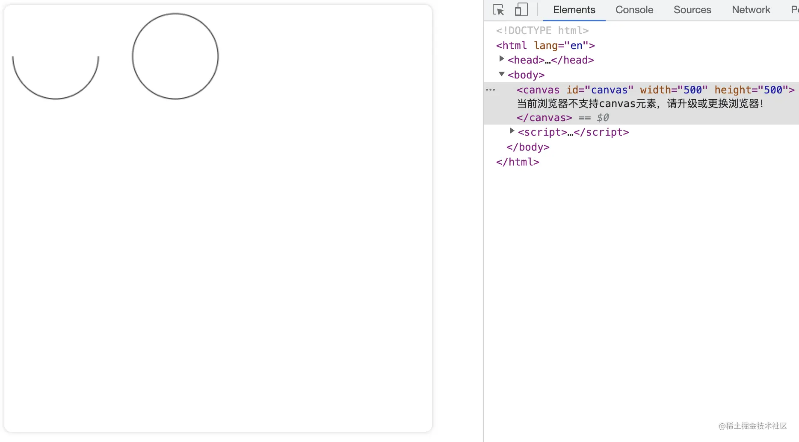
这里有一点需要说明一下，其实在咱们开启和关闭路径的时候，关闭路径其实并不是必须的，对于新路径其实每次都开启新路径就 ok。

以上其实都是通过 stroke 方法来做描边，那么如果想填充有没有对应的方法呢？

### fill

stroke 方法是通过线条来绘制图形轮廓，而 fill 方法则是通过填充路径的内容区域生成实心的图形。

具体如何使用举个例子看一下。代码如下

```html
<!DOCTYPE html>
<html lang="en">
  <head>
    <meta charset="UTF-8" />
    <meta http-equiv="X-UA-Compatible" content="IE=edge" />
    <meta name="viewport" content="width=device-width, initial-scale=1.0" />
    <title>canvas - 填充</title>
    <style>
      /* 给画布增加一个阴影和圆角的样式 */
      canvas {
        box-shadow: 0px 0px 5px #ccc;
        border-radius: 8px;
      }
    </style>
  </head>
  <body>
    <canvas id="canvas" width="500" height="500">
      当前浏览器不支持canvas元素，请升级或更换浏览器！
    </canvas>
    <script>
      // 获取 canvas 元素
      var canvas = document.getElementById("canvas");
      // 通过判断getContext方法是否存在来判断浏览器的支持性
      if (canvas.getContext) {
        // 获取绘图上下文
        var ctx = canvas.getContext("2d");
        // 绘制一段圆弧
        ctx.beginPath(); // 开启路径
        ctx.arc(60, 60, 50, 0, Math.PI, false);
        ctx.stroke();
        // 绘制一个圆弧
        ctx.beginPath(); // 开启路径
        ctx.arc(200, 60, 50, 0, Math.PI * 2, false);
        ctx.stroke();
        // 填充一个四分之一圆弧
        ctx.beginPath(); // 开启路径
        ctx.arc(60, 200, 50, 0, Math.PI / 2, false);
        ctx.fill();
        // 填充一个半圆弧
        ctx.beginPath(); // 开启路径
        ctx.arc(200, 200, 50, 0, Math.PI, false);
        ctx.fill();
        // 填充一个圆弧
        ctx.beginPath(); // 开启路径
        ctx.arc(350, 200, 50, 0, Math.PI * 2, false);
        ctx.fill();
      }
    </script>
  </body>
</html>
```

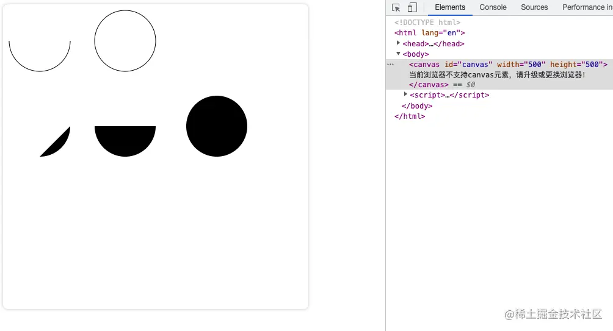

### 椭圆

添加椭圆路径。
语法：`ellipse(x, y, radiusX, radiusY, rotation, startAngle, endAngle, anticlockwise)`

`x、y`：椭圆的圆心位置<br/>
`radiusX、radiusY`：x 轴和 y 轴的半径<br/>
`rotation`：椭圆的旋转角度，以弧度表示<br/>
`startAngle`：开始绘制点<br/>
`endAngle`：结束绘制点<br/>
`anticlockwise`：绘制的方向（默认顺时针），可选参数。`

举个例子看一下：

```html
<!DOCTYPE html>
<html lang="en">
  <head>
    <meta charset="UTF-8" />
    <meta http-equiv="X-UA-Compatible" content="IE=edge" />
    <meta name="viewport" content="width=device-width, initial-scale=1.0" />
    <title>canvas - 裁剪</title>
    <style>
      /* 给画布增加一个阴影和圆角的样式 */
      canvas {
        box-shadow: 0px 0px 5px #ccc;
        border-radius: 8px;
      }
    </style>
  </head>
  <body>
    <canvas id="canvas" width="500" height="500">
      当前浏览器不支持canvas元素，请升级或更换浏览器！
    </canvas>
    <script>
      // 获取 canvas 元素
      var canvas = document.getElementById("canvas");
      // 通过判断getContext方法是否存在来判断浏览器的支持性
      if (canvas.getContext) {
        // 获取绘图上下文
        var ctx = canvas.getContext("2d");
        ctx.beginPath();
        ctx.ellipse(100, 150, 50, 100, 0, 0, 2 * Math.PI);
        ctx.stroke();
        ctx.beginPath();
        ctx.ellipse(400, 150, 50, 100, 0, 0, 2 * Math.PI);
        ctx.stroke();
        ctx.beginPath();
        ctx.ellipse(250, 350, 50, 100, Math.PI / 2, 0, 2 * Math.PI); // 旋转90°
        ctx.fill();
      }
    </script>
  </body>
</html>
```

效果如下：


### 贝塞尔曲线

贝塞尔曲线一般用来绘制复杂有规律的图形，在 Canvas 中也是一个十分有用的路径类型。

二次贝塞尔曲线
语法：`quadraticCurveTo(cp1x, cp1y, x, y)，`其中 cp1x 和 cp1y 为一个控制点，x 和 y 为结束点。
举个例子，代码如下：

```html
<!DOCTYPE html>
<html lang="en">
  <head>
    <meta charset="UTF-8" />
    <meta http-equiv="X-UA-Compatible" content="IE=edge" />
    <meta name="viewport" content="width=device-width, initial-scale=1.0" />
    <title>canvas - 绘制二次贝塞尔曲线</title>
    <style>
      /* 给画布增加一个阴影和圆角的样式 */
      canvas {
        box-shadow: 0px 0px 5px #ccc;
        border-radius: 8px;
      }
    </style>
  </head>
  <body>
    <canvas id="canvas" width="500" height="500">
      当前浏览器不支持canvas元素，请升级或更换浏览器！
    </canvas>
    <script>
      // 获取 canvas 元素
      var canvas = document.getElementById("canvas");
      // 通过判断getContext方法是否存在来判断浏览器的支持性
      if (canvas.getContext) {
        // 获取绘图上下文
        var ctx = canvas.getContext("2d");
        // 绘制一段二次贝塞尔曲线
        ctx.moveTo(50, 50);
        ctx.quadraticCurveTo(200, 200, 350, 50);
        // 绘制
        ctx.stroke();
      }
    </script>
  </body>
</html>
```

得到的效果图如下：


如上图，一段二次贝塞尔曲线是通过一个起点、终点和结束点来控制的。下面通过控制点的变化来看一下二次贝塞尔曲线的变化。
把控制点往左移 100 像素点，代码如下：

```html
<!DOCTYPE html>
<html lang="en">
  <head>
    <meta charset="UTF-8" />
    <meta http-equiv="X-UA-Compatible" content="IE=edge" />
    <meta name="viewport" content="width=device-width, initial-scale=1.0" />
    <title>canvas - 绘制二次贝塞尔曲线</title>
    <style>
      /* 给画布增加一个阴影和圆角的样式 */
      canvas {
        box-shadow: 0px 0px 5px #ccc;
        border-radius: 8px;
      }
    </style>
  </head>
  <body>
    <canvas id="canvas" width="500" height="500">
      当前浏览器不支持canvas元素，请升级或更换浏览器！
    </canvas>
    <script>
      // 获取 canvas 元素
      var canvas = document.getElementById("canvas");
      // 通过判断getContext方法是否存在来判断浏览器的支持性
      if (canvas.getContext) {
        // 获取绘图上下文
        var ctx = canvas.getContext("2d");
        // 绘制一段二次贝塞尔曲线
        ctx.beginPath(); // 开启路径
        ctx.moveTo(50, 50);
        ctx.quadraticCurveTo(200, 200, 350, 50);
        // 绘制
        ctx.stroke();
        // 绘制一段二次贝塞尔曲线
        ctx.beginPath(); // 开启路径
        ctx.moveTo(50, 250);
        ctx.quadraticCurveTo(100, 400, 350, 250);
        // 绘制
        ctx.stroke();
      }
    </script>
  </body>
</html>
```

效果如下：


### 三次贝塞尔曲线

和二次贝塞尔曲线不同的是三次贝塞尔曲线有两个控制点。
语法：`ctx.bezierCurveTo(cp1x,cp1y, cp2x,cp2y, x, y)`，其中 cp1x 和 cp1y 为一个控制点，cp2x 和 cp2y 为第二个控制点，x 和 y 为结束点。
举个例子，代码如下：

```html
<!DOCTYPE html>
<html lang="en">
  <head>
    <meta charset="UTF-8" />
    <meta http-equiv="X-UA-Compatible" content="IE=edge" />
    <meta name="viewport" content="width=device-width, initial-scale=1.0" />
    <title>canvas - 绘制三次贝塞尔曲线</title>
    <style>
      /* 给画布增加一个阴影和圆角的样式 */
      canvas {
        box-shadow: 0px 0px 5px #ccc;
        border-radius: 8px;
      }
    </style>
  </head>
  <body>
    <canvas id="canvas" width="500" height="500">
      当前浏览器不支持canvas元素，请升级或更换浏览器！
    </canvas>
    <script>
      // 获取 canvas 元素
      var canvas = document.getElementById("canvas");
      // 通过判断getContext方法是否存在来判断浏览器的支持性
      if (canvas.getContext) {
        // 获取绘图上下文
        var ctx = canvas.getContext("2d");
        // 绘制一段三次贝塞尔曲线
        ctx.beginPath(); // 开启路径
        ctx.moveTo(50, 200);
        ctx.bezierCurveTo(150, 50, 250, 350, 350, 200);
        // 绘制
        ctx.stroke();
      }
    </script>
  </body>
</html>
```


## 绘制样式

### 线条的样式

线条的样式可以通过下面一系列属性来设置。

### lineWidth

`lineWidth` 设置当前绘线的粗细。属性值必须为正数。默认值是 1.0。

```html
<!DOCTYPE html>
<html lang="en">
  <head>
    <meta charset="UTF-8" />
    <meta http-equiv="X-UA-Compatible" content="IE=edge" />
    <meta name="viewport" content="width=device-width, initial-scale=1.0" />
    <title>canvas - 绘制样式</title>
    <style>
      /* 给画布增加一个阴影和圆角的样式 */
      canvas {
        box-shadow: 0px 0px 5px #ccc;
        border-radius: 8px;
      }
    </style>
  </head>
  <body>
    <canvas id="canvas" width="300" height="300">
      当前浏览器不支持canvas元素，请升级或更换浏览器！
    </canvas>
    <script>
      // 获取 canvas 元素
      var canvas = document.getElementById("canvas");
      // 通过判断getContext方法是否存在来判断浏览器的支持性
      if (canvas.getContext) {
        // 获取绘图上下文
        var ctx = canvas.getContext("2d");
        // 绘制一条宽度为10的直线
        ctx.beginPath();
        ctx.lineWidth = 10;
        ctx.moveTo(50, 20);
        ctx.lineTo(250, 20);
        ctx.stroke();
        ctx.closePath();
        // 绘制一条宽度为20的直线
        ctx.beginPath();
        ctx.lineWidth = 20;
        ctx.moveTo(50, 50);
        ctx.lineTo(250, 50);
        ctx.stroke();
        ctx.closePath();
      }
    </script>
  </body>
</html>
```

效果如下：


### lineCap

lineCap 设置线段端点显示的样子。可选值为：butt，round 和 square。默认是 butt。

```html
<!DOCTYPE html>
<html lang="en">
  <head>
    <meta charset="UTF-8" />
    <meta http-equiv="X-UA-Compatible" content="IE=edge" />
    <meta name="viewport" content="width=device-width, initial-scale=1.0" />
    <title>canvas - 绘制样式</title>
    <style>
      /* 给画布增加一个阴影和圆角的样式 */
      canvas {
        box-shadow: 0px 0px 5px #ccc;
        border-radius: 8px;
      }
    </style>
  </head>
  <body>
    <canvas id="canvas" width="300" height="300">
      当前浏览器不支持canvas元素，请升级或更换浏览器！
    </canvas>
    <script>
      // 获取 canvas 元素
      var canvas = document.getElementById("canvas");
      // 通过判断getContext方法是否存在来判断浏览器的支持性
      if (canvas.getContext) {
        // 获取绘图上下文
        var ctx = canvas.getContext("2d");
        // lineCap 值为 butt
        ctx.beginPath();
        ctx.lineWidth = 10;
        ctx.lineCap = "butt";
        ctx.moveTo(50, 20);
        ctx.lineTo(250, 20);
        ctx.stroke();
        ctx.closePath();
        // lineCap 值为 round
        ctx.beginPath();
        ctx.lineWidth = 10;
        ctx.lineCap = "round";
        ctx.moveTo(50, 50);
        ctx.lineTo(250, 50);
        ctx.stroke();
        ctx.closePath();
        // lineCap 值为 square
        ctx.beginPath();
        ctx.lineWidth = 10;
        ctx.lineCap = "square";
        ctx.moveTo(50, 80);
        ctx.lineTo(250, 80);
        ctx.stroke();
        ctx.closePath();
      }
    </script>
  </body>
</html>
```

效果如下：


### lineJoin

`lineJoin` 该属性可以设置两线段连接处所显示的样子。可选值为：round, bevel 和 miter。默认是 miter。

```html
<!DOCTYPE html>
<html lang="en">
  <head>
    <meta charset="UTF-8" />
    <meta http-equiv="X-UA-Compatible" content="IE=edge" />
    <meta name="viewport" content="width=device-width, initial-scale=1.0" />
    <title>canvas - 绘制样式</title>
    <style>
      /* 给画布增加一个阴影和圆角的样式 */
      canvas {
        box-shadow: 0px 0px 5px #ccc;
        border-radius: 8px;
      }
    </style>
  </head>
  <body>
    <canvas id="canvas" width="300" height="300">
      当前浏览器不支持canvas元素，请升级或更换浏览器！
    </canvas>
    <script>
      // 获取 canvas 元素
      var canvas = document.getElementById("canvas");
      // 通过判断getContext方法是否存在来判断浏览器的支持性
      if (canvas.getContext) {
        // 获取绘图上下文
        var ctx = canvas.getContext("2d");
        // lineJoin 值为 miter
        ctx.beginPath();
        ctx.lineWidth = 10;
        ctx.lineJoin = "miter";
        ctx.moveTo(50, 20);
        ctx.lineTo(100, 60);
        ctx.lineTo(150, 20);
        ctx.lineTo(200, 60);
        ctx.lineTo(250, 20);
        ctx.stroke();
        ctx.closePath();
        // lineJoin 值为 round
        ctx.beginPath();
        ctx.lineWidth = 10;
        ctx.lineJoin = "round";
        ctx.moveTo(50, 100);
        ctx.lineTo(100, 140);
        ctx.lineTo(150, 100);
        ctx.lineTo(200, 140);
        ctx.lineTo(250, 100);
        ctx.stroke();
        ctx.closePath();
        // lineJoin 值为 bevel
        ctx.beginPath();
        ctx.lineWidth = 10;
        ctx.lineJoin = "bevel";
        ctx.moveTo(50, 180);
        ctx.lineTo(100, 220);
        ctx.lineTo(150, 180);
        ctx.lineTo(200, 220);
        ctx.lineTo(250, 180);
        ctx.stroke();
        ctx.closePath();
      }
    </script>
  </body>
</html>
```

效果为：


### miterLimit

miterLimit 限制当两条线相交时交接处最大长度；所谓交接处长度（斜接长度）是指线条交接处内角顶点到外角顶点的长度。

线段之间夹角比较大时，交点不会太远，但随着夹角变小，交点距离会呈指数级增大。

如果交点距离大于 miterLimit 值，连接效果会变成了 lineJoin = bevel 的效果。
举个例子看一下

```html
<!DOCTYPE html>
<html lang="en">
  <head>
    <meta charset="UTF-8" />
    <meta http-equiv="X-UA-Compatible" content="IE=edge" />
    <meta name="viewport" content="width=device-width, initial-scale=1.0" />
    <title>canvas - 绘制样式</title>
    <style>
      /* 给画布增加一个阴影和圆角的样式 */
      canvas {
        box-shadow: 0px 0px 5px #ccc;
        border-radius: 8px;
      }
    </style>
  </head>
  <body>
    <canvas id="canvas" width="300" height="300">
      当前浏览器不支持canvas元素，请升级或更换浏览器！
    </canvas>
    <script>
      // 获取 canvas 元素
      var canvas = document.getElementById("canvas");
      // 通过判断getContext方法是否存在来判断浏览器的支持性
      if (canvas.getContext) {
        // 获取绘图上下文
        var ctx = canvas.getContext("2d");
        // miterLimit为定值，角度越大
        ctx.beginPath();
        ctx.lineWidth = 5;
        ctx.lineJoin = "miter";
        ctx.miterLimit = 10;
        ctx.moveTo(0, 100);
        for (i = 0; i < 30; i++) {
          var dy = i % 2 == 0 ? 200 : 100;
          ctx.lineTo(Math.pow(i, 1.5) * 2, dy);
        }
        ctx.stroke();
        ctx.closePath();
      }
    </script>
  </body>
</html>
```

效果为：


### setLineDash/getLineDash

`setLineDash`可以设置当前虚线样式。
`getLineDash` 则是返回当前虚线设置的样式，长度为非负偶数的数组。
举个例子看一下

```html
<!DOCTYPE html>
<html lang="en">
  <head>
    <meta charset="UTF-8" />
    <meta http-equiv="X-UA-Compatible" content="IE=edge" />
    <meta name="viewport" content="width=device-width, initial-scale=1.0" />
    <title>canvas - 绘制虚线</title>
    <style>
      /* 给画布增加一个阴影和圆角的样式 */
      canvas {
        box-shadow: 0px 0px 5px #ccc;
        border-radius: 8px;
      }
    </style>
  </head>
  <body>
    <canvas id="canvas" width="500" height="500">
      当前浏览器不支持canvas元素，请升级或更换浏览器！
    </canvas>
    <script>
      // 获取 canvas 元素
      var canvas = document.getElementById("canvas");
      // 通过判断getContext方法是否存在来判断浏览器的支持性
      if (canvas.getContext) {
        // 获取绘图上下文
        var ctx = canvas.getContext("2d");
        // 绘制一条虚线
        ctx.setLineDash([5, 10, 20]);
        console.log(ctx.getLineDash()); // [5, 10, 20, 5, 10, 20]
        ctx.beginPath();
        ctx.moveTo(0, 100);
        ctx.lineTo(400, 100);
        ctx.stroke();
        // 再绘制一条虚线
        ctx.setLineDash([5, 10, 20, 40]);
        console.log(ctx.getLineDash()); // [5, 10, 20, 40]
        ctx.beginPath();
        ctx.moveTo(0, 200);
        ctx.lineTo(400, 200);
        ctx.stroke();
      }
    </script>
  </body>
</html>
```

先看效果再讲解，效果如下：


> 首先这里画两条虚线是想对比一下传参为奇数数组和偶数数组的区别，在我们设置虚线的时候，如果传参为奇数，例如：ctx.setLineDash([5, 10, 20])，那么 setLineDash 会复制一份数组补全为偶数，相当于我们设置的是：ctx.setLineDash([5, 10, 20, 5, 10, 20])。所以这也就是为什么上图中我们设置的是 [5, 10, 20]，结果打印出来是 [5, 10, 20, 5, 10, 20]

### lineDashOffset

lineDashOffset 设置虚线样式的起始偏移量。
这里咱们再画第三条虚线来对比一下

```html
<!DOCTYPE html>
<html lang="en">
  <head>
    <meta charset="UTF-8" />
    <meta http-equiv="X-UA-Compatible" content="IE=edge" />
    <meta name="viewport" content="width=device-width, initial-scale=1.0" />
    <title>canvas - 绘制虚线</title>
    <style>
      /* 给画布增加一个阴影和圆角的样式 */
      canvas {
        box-shadow: 0px 0px 5px #ccc;
        border-radius: 8px;
      }
    </style>
  </head>
  <body>
    <canvas id="canvas" width="500" height="500">
      当前浏览器不支持canvas元素，请升级或更换浏览器！
    </canvas>
    <script>
      // 获取 canvas 元素
      var canvas = document.getElementById("canvas");
      // 通过判断getContext方法是否存在来判断浏览器的支持性
      if (canvas.getContext) {
        // 获取绘图上下文
        var ctx = canvas.getContext("2d");
        // 绘制一段圆弧
        ctx.setLineDash([5, 10, 20]);
        console.log(ctx.getLineDash()); // [5, 10, 20, 5, 10, 20]
        ctx.beginPath();
        ctx.moveTo(0, 100);
        ctx.lineTo(400, 100);
        ctx.stroke();
        ctx.setLineDash([5, 10, 20, 40]);
        console.log(ctx.getLineDash()); // [5, 10, 20, 40]
        ctx.beginPath();
        ctx.moveTo(0, 200);
        ctx.lineTo(400, 200);
        ctx.stroke();
        ctx.setLineDash([5, 10, 20, 40]);
        ctx.lineDashOffset = 3;
        ctx.beginPath();
        ctx.moveTo(0, 300);
        ctx.lineTo(400, 300);
        ctx.stroke();
      }
    </script>
  </body>
</html>
```

效果为：


### 透明度

除了绘制实色的图形，还可以绘制有透明度的图形。通过设置 globalAlpha 属性或者使用有透明度的样式作为轮廓或填充都可以实现
举个例子看一下：

```html
<!DOCTYPE html>
<html lang="en">
  <head>
    <meta charset="UTF-8" />
    <meta http-equiv="X-UA-Compatible" content="IE=edge" />
    <meta name="viewport" content="width=device-width, initial-scale=1.0" />
    <title>canvas - 设置透明度</title>
    <style>
      /* 给画布增加一个阴影和圆角的样式 */
      canvas {
        box-shadow: 0px 0px 5px #ccc;
        border-radius: 8px;
      }
    </style>
  </head>
  <body>
    <canvas id="canvas" width="500" height="500">
      当前浏览器不支持canvas元素，请升级或更换浏览器！
    </canvas>
    <script>
      // 获取 canvas 元素
      var canvas = document.getElementById("canvas");
      // 通过判断getContext方法是否存在来判断浏览器的支持性
      if (canvas.getContext) {
        // 获取绘图上下文
        var ctx = canvas.getContext("2d");
        // 绘制一个矩形
        ctx.beginPath();
        // 指定透明度的填充样式
        ctx.fillStyle = "rgba(0, 255, 0, 0.2)";
        ctx.fillRect(10, 10, 300, 100);
        // 绘制一个矩形边框
        ctx.beginPath();
        // 指定透明度的描边样式
        ctx.strokeStyle = "rgba(255, 0, 0, 0.7)";
        ctx.strokeRect(10, 90, 100, 300);
        // 绘制一个圆
        ctx.beginPath();
        ctx.fillStyle = "rgba(255, 255, 0, 1)";
        // 设置透明度值
        ctx.globalAlpha = 0.5;
        ctx.arc(200, 200, 100, 0, Math.PI * 2, true);
        ctx.fill();
      }
    </script>
  </body>
</html>
```

效果如下：


### 渐变

渐变分为两种，分别是线性渐变和径向渐变，在绘图中我们可以用线性或者径向的渐变来填充或描边。

### 线性渐变

语法： `createLinearGradient(x1, y1, x2, y2)`，参数分别为 起点的坐标和终点的坐标。
在渐变的设置中还需要一个方法来添加渐变的颜色，语法为：`gradient.addColorStop(offset, color)`，其中 color 就是颜色，offset 则是颜色的偏移值，只为 0 到 1 之间的数。
举个例子看一下：

```html
<!DOCTYPE html>
<html lang="en">
  <head>
    <meta charset="UTF-8" />
    <meta http-equiv="X-UA-Compatible" content="IE=edge" />
    <meta name="viewport" content="width=device-width, initial-scale=1.0" />
    <title>canvas - 渐变</title>
    <style>
      /* 给画布增加一个阴影和圆角的样式 */
      canvas {
        box-shadow: 0px 0px 5px #ccc;
        border-radius: 8px;
      }
    </style>
  </head>
  <body>
    <canvas id="canvas" width="500" height="500">
      当前浏览器不支持canvas元素，请升级或更换浏览器！
    </canvas>
    <script>
      // 获取 canvas 元素
      var canvas = document.getElementById("canvas");
      // 通过判断getContext方法是否存在来判断浏览器的支持性
      if (canvas.getContext) {
        // 获取绘图上下文
        var ctx = canvas.getContext("2d");
        // 创建渐变
        var gradient1 = ctx.createLinearGradient(10, 10, 400, 10);
        gradient1.addColorStop(0, "#00ff00");
        gradient1.addColorStop(1, "#ff0000");
        var gradient2 = ctx.createLinearGradient(10, 10, 400, 10);
        // 从0.5的位置才开始渐变
        gradient2.addColorStop(0.5, "#00ff00");
        gradient2.addColorStop(1, "#ff0000");
        ctx.beginPath();
        ctx.fillStyle = gradient1;
        ctx.fillRect(10, 10, 400, 100);
        ctx.beginPath();
        ctx.fillStyle = gradient2;
        ctx.fillRect(10, 150, 400, 100);
      }
    </script>
  </body>
</html>
```

效果如下：


### 径向渐变

语法：`ctx.createRadialGradient(x0, y0, r0, x1, y1, r1)`，参数分别为开始圆的坐标和半径以及结束圆的坐标和半径。
举个例子看一下：

```html
<!DOCTYPE html>
<html lang="en">
  <head>
    <meta charset="UTF-8" />
    <meta http-equiv="X-UA-Compatible" content="IE=edge" />
    <meta name="viewport" content="width=device-width, initial-scale=1.0" />
    <title>canvas - 渐变</title>
    <style>
      /* 给画布增加一个阴影和圆角的样式 */
      canvas {
        box-shadow: 0px 0px 5px #ccc;
        border-radius: 8px;
      }
    </style>
  </head>
  <body>
    <canvas id="canvas" width="500" height="500">
      当前浏览器不支持canvas元素，请升级或更换浏览器！
    </canvas>
    <script>
      // 获取 canvas 元素
      var canvas = document.getElementById("canvas");
      // 通过判断getContext方法是否存在来判断浏览器的支持性
      if (canvas.getContext) {
        // 获取绘图上下文
        var ctx = canvas.getContext("2d");
        // 创建渐变
        // 结束坐标为点
        var gradient1 = ctx.createRadialGradient(100, 100, 100, 100, 100, 0);
        gradient1.addColorStop(0, "#ff770f");
        gradient1.addColorStop(1, "#ffffff");
        // 结束坐标为半径30的圆
        var gradient2 = ctx.createRadialGradient(320, 100, 100, 320, 100, 30);
        gradient2.addColorStop(0, "#ff770f");
        gradient2.addColorStop(1, "#ffffff");
        // 从0.5的位置才开始渲染
        var gradient3 = ctx.createRadialGradient(100, 320, 100, 100, 320, 0);
        gradient3.addColorStop(0.5, "#ff770f");
        gradient3.addColorStop(1, "#ffffff");
        // 开始坐标和结束坐标不一样
        var gradient4 = ctx.createRadialGradient(320, 320, 100, 250, 250, 0);
        gradient4.addColorStop(0, "#ff770f");
        gradient4.addColorStop(1, "#ffffff");
        ctx.beginPath();
        ctx.fillStyle = gradient1;
        ctx.fillRect(10, 10, 200, 200);
        ctx.beginPath();
        ctx.fillStyle = gradient2;
        ctx.fillRect(220, 10, 200, 200);
        ctx.beginPath();
        ctx.fillStyle = gradient3;
        ctx.fillRect(10, 220, 200, 200);
        ctx.beginPath();
        ctx.fillStyle = gradient4;
        ctx.fillRect(220, 220, 200, 200);
      }
    </script>
  </body>
</html>
```
效果如下：


### 图案样式
Canvas中想绘制图案效果，需要用 `createPattern` 方法来实现。

语法：`createPattern(image, type)`，参数分别为：Image 参数可以是一个 Image 对象，也可以是一个 canvas 对象，Type 为图案绘制的类型，可用的类型分别有：repeat，repeat-x，repeat-y 和 no-repeat。
首先先看一下如何应用 Image 对象来绘制图案。
举个例子看一下：
```html
<!DOCTYPE html>
<html lang="en">
<head>
  <meta charset="UTF-8">
  <meta http-equiv="X-UA-Compatible" content="IE=edge">
  <meta name="viewport" content="width=device-width, initial-scale=1.0">
  <title>canvas - 绘制图案</title>
  <style>
    /* 给画布增加一个阴影和圆角的样式 */
    canvas {
      box-shadow: 0px 0px 5px #ccc;
      border-radius: 8px;
    }
  </style>
</head>
<body>
  <canvas id="canvas" width="500" height="500">
    当前浏览器不支持canvas元素，请升级或更换浏览器！
  </canvas>
  <script>
    // 获取 canvas 元素
    var canvas = document.getElementById('canvas');
    // 通过判断getContext方法是否存在来判断浏览器的支持性
    if(canvas.getContext) {
      // 获取绘图上下文
      var ctx = canvas.getContext('2d');
      // 创建一个 image对象
      var img = new Image();
      img.src = "./image.png";
      img.onload = function() {
        // 图片加载完以后
        // 创建图案
        var ptrn = ctx.createPattern(img, 'no-repeat');
        ctx.fillStyle = ptrn;
        ctx.fillRect(0, 0, 500, 500);
      }
    }
  </script>
</body>
</html>
```
上面是一个用image对象绘制的例子，效果如下：


从上面的代码我们可以看出，本来我们想填充的是一个500*500的长方形，但是因为咱们绘制的类型设置为不平铺（no-repeat）所以看到的效果不能让我们满意，那么咱们分别看看这四个类型分别是什么效果。
```html
<!DOCTYPE html>
<html lang="en">
<head>
  <meta charset="UTF-8">
  <meta http-equiv="X-UA-Compatible" content="IE=edge">
  <meta name="viewport" content="width=device-width, initial-scale=1.0">
  <title>canvas - 绘制图案</title>
  <style>
    /* 给画布增加一个阴影和圆角的样式 */
    canvas {
      box-shadow: 0px 0px 5px #ccc;
      border-radius: 8px;
    }
  </style>
</head>
<body>
  <canvas id="canvas" width="500" height="500">
    当前浏览器不支持canvas元素，请升级或更换浏览器！
  </canvas>
  <script>
    // 获取 canvas 元素
    var canvas = document.getElementById('canvas');
    // 通过判断getContext方法是否存在来判断浏览器的支持性
    if(canvas.getContext) {
      // 获取绘图上下文
      var ctx = canvas.getContext('2d');
      // 创建一个 image对象
      var img = new Image();
      img.src = "./image.png";
      img.onload = function() {
        // 图片加载完以后
        // 创建图案
        var ptrn = ctx.createPattern(img, 'repeat');
        ctx.fillStyle = ptrn;
        ctx.fillRect(0, 0, 500, 500);
      }
    }
  </script>
</body>
</html>
```
设置为平铺（repeat），效果如下：


这其实才是我们想要的效果，那么咱们再看看沿X轴平铺（repeat-x）和沿Y轴平铺（repeat-y）

效果分别是：


 最后看一下如何应用 canvas 对象来绘制图案。 举个例子看一下：
 ```html
<!DOCTYPE html>
<html lang="en">
<head>
  <meta charset="UTF-8">
  <meta http-equiv="X-UA-Compatible" content="IE=edge">
  <meta name="viewport" content="width=device-width, initial-scale=1.0">
  <title>canvas - 绘制图案</title>
  <style>
    /* 给画布增加一个阴影和圆角的样式 */
    canvas {
      box-shadow: 0px 0px 5px #ccc;
      border-radius: 8px;
      margin-right: 50px;
    }
  </style>
</head>
<body>
  <canvas id="canvas" width="200" height="200">
    当前浏览器不支持canvas元素，请升级或更换浏览器！
  </canvas>
  <canvas id="canvas2" width="500" height="500">
    当前浏览器不支持canvas元素，请升级或更换浏览器！
  </canvas>
  <script>
    // 获取 canvas 元素
    var canvas = document.getElementById('canvas');
    var canvas2 = document.getElementById('canvas2');
    // 通过判断getContext方法是否存在来判断浏览器的支持性
    if(canvas.getContext && canvas2.getContext) {
      // 获取绘图上下文
      var ctx = canvas.getContext('2d');
      var ctx2 = canvas2.getContext('2d');
      // 创建一个 canvas对象
      var img = new Image();
      img.src = "./image.png";
      img.onload = function() {
        // 图片加载完以后
        // 创建图案
        var ptrn = ctx.createPattern(img, 'repeat');
        ctx.fillStyle = ptrn;
        ctx.fillRect(0, 0, 200, 200);
        // 用canvas来绘制canvas2
        var ptrn2 = ctx2.createPattern(canvas, 'repeat');
        ctx2.fillStyle = ptrn2;
        ctx2.fillRect(0, 0, 500, 500);
      }
    }
  </script>
</body>
</html>
```
效果如下：


### 绘制文本
canvas 中依旧提供了两种方法来渲染文本，一种是描边一种是填充。
`strokeText`（描边）
语法：`ctx.strokeText(text, x, y, maxWidth)`参数分别为：

`text`：绘制的文案
`x、y`：文本的起始位置
`maxWidth`：可选参数，最大宽度。需要注意的是当文案大于最大宽度时不是裁剪或者换行，而是缩小字体。

举个例子看一下：
```html
<!DOCTYPE html>
<html lang="en">
<head>
  <meta charset="UTF-8">
  <meta http-equiv="X-UA-Compatible" content="IE=edge">
  <meta name="viewport" content="width=device-width, initial-scale=1.0">
  <title>canvas - 绘制文本</title>
  <style>
    /* 给画布增加一个阴影和圆角的样式 */
    canvas {
      box-shadow: 0px 0px 5px #ccc;
      border-radius: 8px;
    }
  </style>
</head>
<body>
  <canvas id="canvas" width="500" height="500">
    当前浏览器不支持canvas元素，请升级或更换浏览器！
  </canvas>
  <script>
    // 获取 canvas 元素
    var canvas = document.getElementById('canvas');
    // 通过判断getContext方法是否存在来判断浏览器的支持性
    if(canvas.getContext) {
      // 获取绘图上下文
      var ctx = canvas.getContext('2d');
      ctx.font = "50px serif"; // 设置文案大小和字体
      ctx.strokeText("Canvas 详解", 50, 50);
    }
  </script>
</body>
</html>
```
看一下效果：


### fillText（填充）
语法：``ctx.fillText(text, x, y, maxWidth)`参数分别为：

text：绘制的文案
x、y：文本的起始位置
maxWidth：可选参数，最大宽度。需要注意的是当文案大于最大宽度时不是裁剪或者换行，而是缩小字体。

举个例子看一下：
```html
<!DOCTYPE html>
<html lang="en">
<head>
  <meta charset="UTF-8">
  <meta http-equiv="X-UA-Compatible" content="IE=edge">
  <meta name="viewport" content="width=device-width, initial-scale=1.0">
  <title>canvas - 绘制文本</title>
  <style>
    /* 给画布增加一个阴影和圆角的样式 */
    canvas {
      box-shadow: 0px 0px 5px #ccc;
      border-radius: 8px;
    }
  </style>
</head>
<body>
  <canvas id="canvas" width="500" height="500">
    当前浏览器不支持canvas元素，请升级或更换浏览器！
  </canvas>
  <script>
    // 获取 canvas 元素
    var canvas = document.getElementById('canvas');
    // 通过判断getContext方法是否存在来判断浏览器的支持性
    if(canvas.getContext) {
      // 获取绘图上下文
      var ctx = canvas.getContext('2d');
      ctx.font = "50px serif"; // 设置文案大小和字体
      ctx.fillText("Canvas 详解", 50, 50);
    }
  </script>
</body>
</html>
```

### 文本样式
文本也是可以添加样式的，下面看一下可以设置那些样式
`font`
用于绘制文本的样式。默认的字体是 10px sans-serif。

`textAlign`
文本对齐的方式。可选值为：left、right、center、start和end。默认值是 start。

`direction`
文本的方向。可选值为：ltr（文本方向从左向右）、rtl（文本方向从右向左）、inherit（根据情况继承 Canvas元素或者 Document 。）。默认值是 inherit。

需要注意的是 direction 属性会对 textAlign 属性产生影响。如果 direction 属性设置为 ltr，则textAlign属性的 left 和 start 的效果相同，right 和 end 的效果相同，如果 direction 属性设置为 rtl，则 textAlign属性的 left 和 end 的效果相同，right 和 start 的效果相同。
```html
<!DOCTYPE html>
<html lang="en">
<head>
  <meta charset="UTF-8">
  <meta http-equiv="X-UA-Compatible" content="IE=edge">
  <meta name="viewport" content="width=device-width, initial-scale=1.0">
  <title>canvas - 绘制图案</title>
  <style>
    /* 给画布增加一个阴影和圆角的样式 */
    canvas {
      box-shadow: 0px 0px 5px #ccc;
      border-radius: 8px;
      margin-right: 50px;
    }
  </style>
</head>
<body>
  <canvas id="canvas" width="500" height="700">
    当前浏览器不支持canvas元素，请升级或更换浏览器！
  </canvas>
  <script>
    // 获取 canvas 元素
    var canvas = document.getElementById('canvas');
    // 通过判断getContext方法是否存在来判断浏览器的支持性
    if(canvas.getContext) {
      // 获取绘图上下文
      var ctx = canvas.getContext('2d');
      ctx.font = "30px serif"; // 设置文案大小和字体
      ctx.direction = "ltr"; // 文本方向从左向右
      ctx.textAlign = "left"; // 左对齐
      ctx.strokeText("Hi Canvas !", 150, 100);
      ctx.direction = "ltr"; // 文本方向从左向右
      ctx.textAlign = "center"; // 右对齐
      ctx.strokeText("Hi Canvas !", 150, 200);
      ctx.direction = "ltr"; // 文本方向从左向右
      ctx.textAlign = "right"; // 右对齐
      ctx.strokeText("Hi Canvas !", 150, 300);
      ctx.direction = "rtl"; // 文本方向从左向右
      ctx.textAlign = "left"; // 左对齐
      ctx.strokeText("Hi Canvas !", 150, 400);
      ctx.direction = "rtl"; // 文本方向从左向右
      ctx.textAlign = "center"; // 右对齐
      ctx.strokeText("Hi Canvas !", 150, 500);
      ctx.direction = "rtl"; // 文本方向从左向右
      ctx.textAlign = "right"; // 右对齐
      ctx.strokeText("Hi Canvas !", 150, 600);
    }
  </script>
</body>
</html>
```
效果如下：
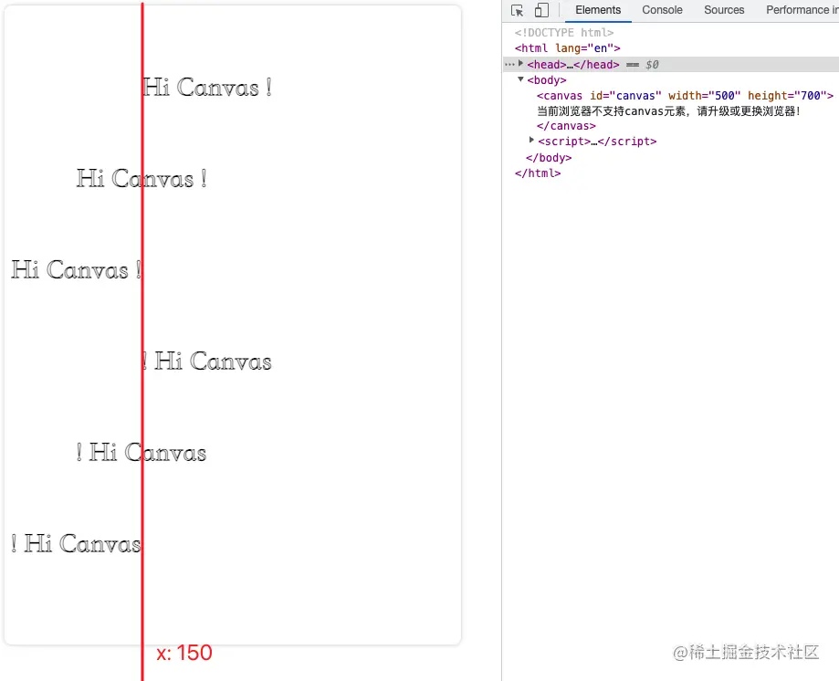

### textBaseline
基线对齐选项，决定文字垂直方向的对齐方式。可选值为：top、hanging、middle、alphabetic、ideographic和bottom。默认值是 alphabetic。
举个例子看一下：
```html
<!DOCTYPE html>
<html lang="en">
<head>
  <meta charset="UTF-8">
  <meta http-equiv="X-UA-Compatible" content="IE=edge">
  <meta name="viewport" content="width=device-width, initial-scale=1.0">
  <title>canvas - 绘制图案</title>
  <style>
    /* 给画布增加一个阴影和圆角的样式 */
    canvas {
      box-shadow: 0px 0px 5px #ccc;
      border-radius: 8px;
      margin-right: 50px;
    }
  </style>
</head>
<body>
  <canvas id="canvas" width="500" height="500">
    当前浏览器不支持canvas元素，请升级或更换浏览器！
  </canvas>
  <script>
    // 获取 canvas 元素
    var canvas = document.getElementById('canvas');
    // 通过判断getContext方法是否存在来判断浏览器的支持性
    if(canvas.getContext) {
      // 获取绘图上下文
      var ctx = canvas.getContext('2d');
      ctx.font = "25px serif"; // 设置文案大小和字体
      ctx.strokeStyle = 'red';
      const baselines = ['top', 'hanging', 'middle', 'alphabetic', 'ideographic', 'bottom'];
      baselines.forEach(function (baseline, index) {
        ctx.textBaseline = baseline;
        let y = 60 + index * 60;
        ctx.beginPath();
        ctx.moveTo(10, y + 0.5);
        ctx.lineTo(500, y + 0.5);
        ctx.stroke();
        ctx.fillText('Hi Canvas, Welcome to my world! (' + baseline + ')', 10, y);
      });
    }
  </script>
</body>
</html>
```
效果如下：
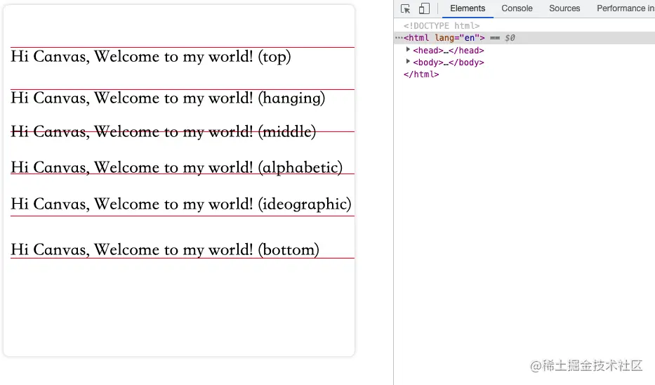

### measureText
测量文本，返回一个 TextMetrics对象。
```html
<!DOCTYPE html>
<html lang="en">
<head>
  <meta charset="UTF-8">
  <meta http-equiv="X-UA-Compatible" content="IE=edge">
  <meta name="viewport" content="width=device-width, initial-scale=1.0">
  <title>canvas - 绘制图案</title>
  <style>
    /* 给画布增加一个阴影和圆角的样式 */
    canvas {
      box-shadow: 0px 0px 5px #ccc;
      border-radius: 8px;
      margin-right: 50px;
    }
  </style>
</head>
<body>
  <canvas id="canvas" width="500" height="500">
    当前浏览器不支持canvas元素，请升级或更换浏览器！
  </canvas>
  <script>
    // 获取 canvas 元素
    var canvas = document.getElementById('canvas');
    // 通过判断getContext方法是否存在来判断浏览器的支持性
    if(canvas.getContext) {
      // 获取绘图上下文
      var ctx = canvas.getContext('2d');
      ctx.font = "30px serif"; // 设置文案大小和字体
      ctx.beginPath();
      ctx.strokeText("Hi Canvas !", 150, 100);
      var text = ctx.measureText("Hi Canvas !");
      console.log("🚀 ~ 文案宽度：", text.width)
      ctx.beginPath();
      // 设置了文案最大宽度
      ctx.strokeText("Hi Canvas !", 150, 200, 100);
      var text1 = ctx.measureText("Hi Canvas !");
      console.log("🚀 ~ 文案宽度：", text1.width)
    }
  </script>
</body>
</html>
```
效果如下：
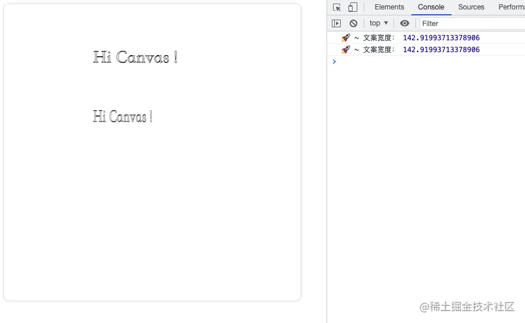
如上面的效果可以看出，返回的 TextMetrics对象不受最大宽度等外界因素所影响。

那么TextMetrics对象具体有哪些属性？打印看一下：
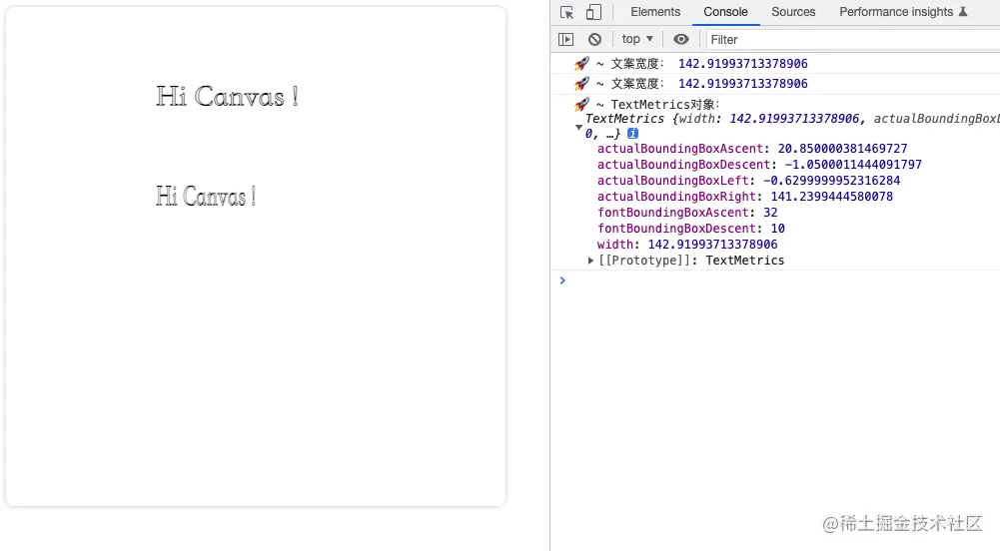

属性解析：
```js
TextMetrics.width：基于当前上下文字体，计算内联字符串的宽度。
TextMetrics.actualBoundingBoxLeft：从 textAlign 属性确定的对齐点到文本矩形边界左侧的距离，使用 CSS 像素计算；正值表示文本矩形边界左侧在该对齐点的左侧。
TextMetrics.actualBoundingBoxRight：从 textAlign 属性确定的对齐点到文本矩形边界右侧的距离。
TextMetrics.fontBoundingBoxAscent：从 textBaseline 属性标明的水平线到渲染文本的所有字体的矩形最高边界顶部的距离。
TextMetrics.fontBoundingBoxDescent：从 textBaseline 属性标明的水平线到渲染文本的所有字体的矩形边界最底部的距离。
TextMetrics.actualBoundingBoxAscent：从 textBaseline 属性标明的水平线到渲染文本的矩形边界顶部的距离。
TextMetrics.actualBoundingBoxDescent：从 textBaseline 属性标明的水平线到渲染文本的矩形边界底部的距离。
TextMetrics.emHeightAscent：从 textBaseline 属性标明的水平线到线框中 em 方块顶部的距离。
TextMetrics.emHeightDescent：从 textBaseline 属性标明的水平线到线框中 em 方块底部的距离。
TextMetrics.hangingBaseline：从 textBaseline 属性标明的水平线到线框的 hanging 基线的距离。
TextMetrics.alphabeticBaseline：从 textBaseline 属性标明的水平线到线框的 alphabetic 基线的距离。
TextMetrics.ideographicBaseline：从 textBaseline 属性标明的水平线到线框的 ideographic 基线的距离。
```
PS：以上所有属性都是使用 CSS 像素计算的，并且都是只读。

### 阴影
`shadowOffsetX、shadowOffsetY`
shadowOffsetX 和 shadowOffsetY 用来设定阴影在 X 和 Y 轴的延伸距离，它们是不受变换矩阵所影响的。负值表示阴影会往上或左延伸，正值则表示会往下或右延伸，它们默认都为 0。

`shadowBlur`
shadowBlur 用于设定阴影的模糊程度，其数值并不跟像素数量挂钩，也不受变换矩阵的影响，默认为 0。

`shadowColor`
shadowColor 是标准的 CSS 颜色值，用于设定阴影颜色效果，默认是全透明的黑色。
举个例子看一下：
```html
<!DOCTYPE html>
<html lang="en">
<head>
  <meta charset="UTF-8">
  <meta http-equiv="X-UA-Compatible" content="IE=edge">
  <meta name="viewport" content="width=device-width, initial-scale=1.0">
  <title>canvas - 阴影</title>
  <style>
    /* 给画布增加一个阴影和圆角的样式 */
    canvas {
      box-shadow: 0px 0px 5px #ccc;
      border-radius: 8px;
    }
  </style>
</head>
<body>
  <canvas id="canvas" width="500" height="500">
    当前浏览器不支持canvas元素，请升级或更换浏览器！
  </canvas>
  <script>
    // 获取 canvas 元素
    var canvas = document.getElementById('canvas');
    // 通过判断getContext方法是否存在来判断浏览器的支持性
    if(canvas.getContext) {
      // 获取绘图上下文
      var ctx = canvas.getContext('2d');
      ctx.font = "50px serif"; // 设置文案大小和字体
      ctx.shadowColor = "#cccccc"; //  设置阴影颜色
      ctx.fillStyle = "#ee7934"; //  设置填充颜色
      ctx.shadowOffsetX = 10; // X轴上的阴影
      ctx.shadowOffsetY = 10; // Y轴上的阴影
      ctx.shadowBlur = 5; // 阴影的模糊程度
      ctx.fillText("Hi Canvas !", 100, 50);
      ctx.fillRect(100, 100, 200, 100);
      ctx.shadowOffsetX = -10;
      ctx.shadowOffsetY = -10;
      ctx.shadowBlur = 5;
      ctx.fillText("Hi Canvas !", 100, 300);
      ctx.fillRect(100, 350, 200, 100);
    }
  </script>
</body>
</html>
```
效果如下：
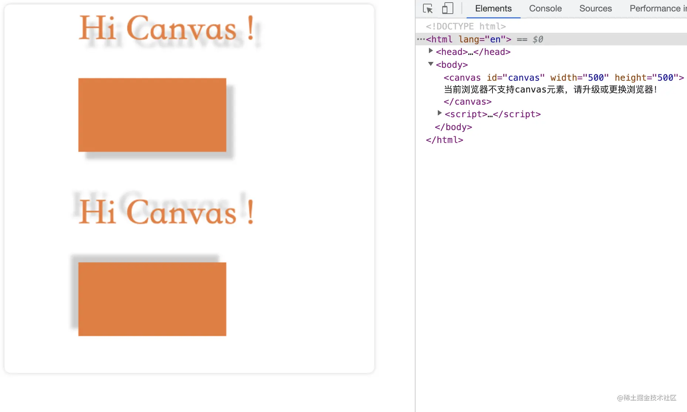

### 绘制图片
绘制图片和上面的图案样式绘制基本大同小异，不同的是所用方式不一样，绘制图片是使用 drawImage 方法将它渲染到 canvas 里。
`drawImage`
这里咱们主要要说的就是drawImage方法的使用，他的用法有三种，是根据不同的传参实现不同的功能。先看看都有哪些参数：

image：绘制到上下文的元素。
sx、sy：裁剪框的左上角X轴坐标和Y轴坐标。
sWidth、sHeight：裁剪框的宽度和高度。
dx、dy：绘制到上下文的元素，在上下文中左上角的X轴坐标和Y轴坐标。
dWidth、dHeight：绘制到上下文的元素，在上下文中绘制的宽度和高度。如果不说明，在绘制时image宽度和高度不会缩放。

### 绘制
·drawImage(image, dx, dy)：·只有单纯的绘制功能，可以绘制图片、视频和别的Canvas对象等。
```html
举个例子看一下：
<!DOCTYPE html>
<html lang="en">
<head>
  <meta charset="UTF-8">
  <meta http-equiv="X-UA-Compatible" content="IE=edge">
  <meta name="viewport" content="width=device-width, initial-scale=1.0">
  <title>canvas - 绘制 - drawImage</title>
  <style>
    /* 给画布增加一个阴影和圆角的样式 */
    canvas {
      box-shadow: 0px 0px 5px #ccc;
      border-radius: 8px;
    }
  </style>
</head>
<body>
  <canvas id="canvas" width="500" height="500">
    当前浏览器不支持canvas元素，请升级或更换浏览器！
  </canvas>
  <script>
    // 获取 canvas 元素
    var canvas = document.getElementById('canvas');
    // 通过判断getContext方法是否存在来判断浏览器的支持性
    if(canvas.getContext) {
      // 获取绘图上下文
      var ctx = canvas.getContext('2d');
        var img = new Image();
        img.src = 'https://gimg2.baidu.com/image_search/src=http%3A%2F%2F5b0988e595225.cdn.sohucs.com%2Fimages%2F20191212%2F556cc408058d4c64a46468761406afe6.png&refer=http%3A%2F%2F5b0988e595225.cdn.sohucs.com&app=2002&size=f9999,10000&q=a80&n=0&g=0n&fmt=auto?sec=1660103116&t=8dd0c641e1e1890fa65ee80dfa428d34';
        img.onload = function(){
          ctx.drawImage(img, 0, 0);
        }
    }
  </script>
</body>
</html>
```
效果如下：


