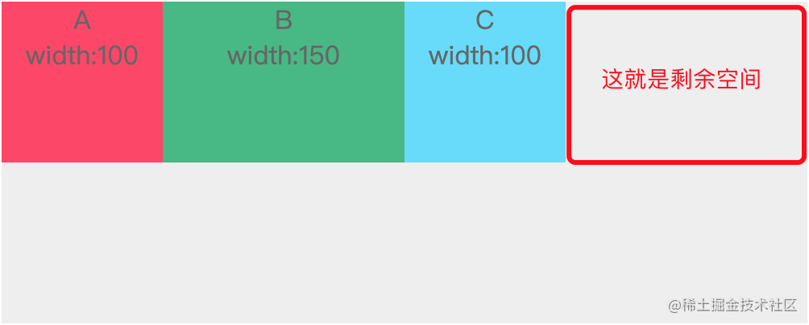
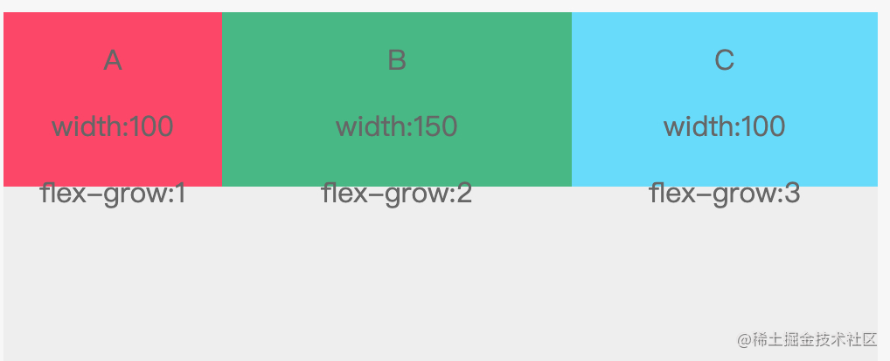
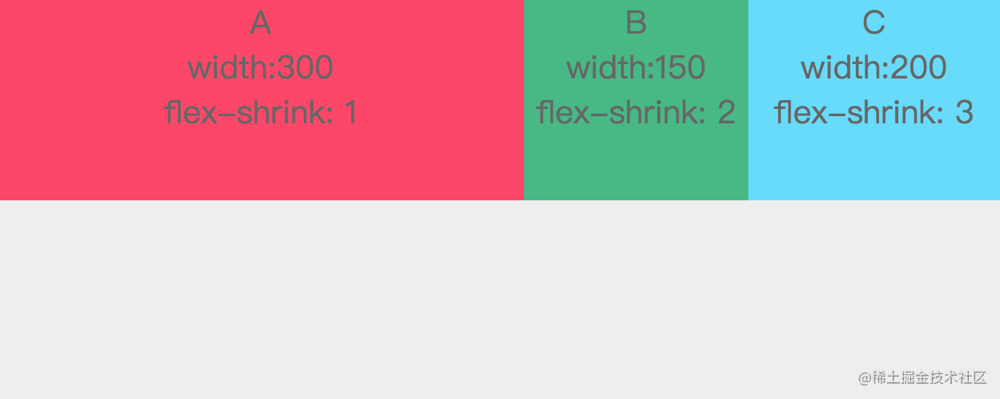
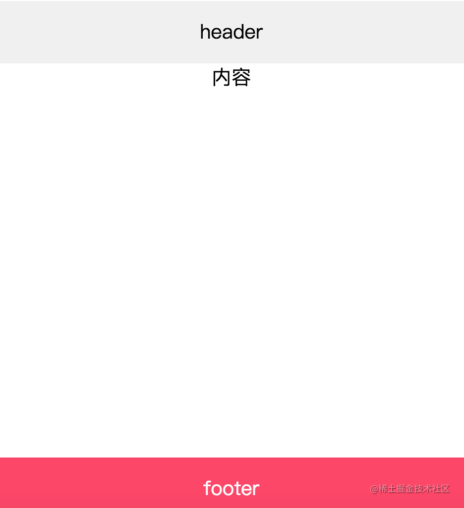

# 你不知道的 flex flex-grow、flex-shrink、flex-basis

[[toc]]

### 1. Flex 布局

::: tip
Flex 是 Flexible Box 的缩写，意为"弹性布局"，用来为盒状模型提供最大的灵活性<br/>
flex 属性是 flex-grow, flex-shrink 和 flex-basis 的简写，默认值为 0 1 auto
:::
任何一个容器都可以用 Flex 进行布局(如果不会 flex 布局的可见阮老师的 Flex 布局教程)，而且 Flex 是发生在父容器和子容器之间的布局关系的，那么父容器与子容器的关系是怎么样子的，又是怎么计算子容器所占用的空间的呢，怎么进行弹性布局的呢？<br/>

欲要解决上面的问题，首先得了解 flex-grow 和 flex-shrink 是怎么计算的？flex-basis 和 width 又有什么关系和区别？<br/>

接下来，我们先提出两个概念：剩余空间和溢出空间，具体是什么意思我们后面慢慢解释。<br/>

### 2. flex-grow

flex-grow 属性在 MDN 上的定义是：

`定义弹性盒子项（flex-item）的拉伸因子，默认值0”`

传统的布局是子容器在父容器中从左到右进行布局，应用 flex 进行布局，那么父容器一定设置 display: flex，子容器要“占有”并且“瓜分”父容器的空间，如何占有、瓜分的策略就是弹性布局的策略。这里就要解释到“剩余空间”的概念：

`子容器在父容器的“主轴”上还有多少空间可以“瓜分”，这个可以被“瓜分”的空间就叫做剩余空间。`

文字总是很抽象，举个例子就能理解剩余空间了，现在有如下的代码：

```html
<div class="container">
  <div class="item a">
    <p>A</p>
    <p>width:100</p>
  </div>
  <div class="item b">
    <p>B</p>
    <p>width:150</p>
  </div>
  <div class="item c">
    <p>C</p>
    <p>width:100</p>
  </div>
</div>
```

```css
.container {
  margin: 10px;
  display: flex;
  width: 500px;
  height: 200px;
  background-color: #eee;
  color: #666;
  text-align: center;
}
.item {
  height: 100px;
}
.item p {
  margin: 0;
}
.a {
  width: 100px;
  background-color: #ff4466;
}
.b {
  width: 150px;
  background-color: #42b983;
}
.c {
  width: 100px;
  background-color: #61dafb;
}
```

展示的效果如下(最后那个框是截图的时候的标注，不是展示出来的效果)：


一图胜千言，看到这个图应该就明白什么是剩余空间了。

父容器的主轴还有这么多剩余空间，子容器有什么办法将这些剩余空间瓜分来实现弹性的效果呢？

这就需要用到 flex-grow 属性了，flex-grow 定义子容器的瓜分剩余空间的比例，默认为 0，即如果存在剩余空间，也不会去瓜分。

flex-grow 例子，将上面的例子改成如下代码：

HTML 代码(代码只增加了 flex-grow 的说明，没有其他结构的变动)：

```html
<div class="container">
  <div class="item a">
    <p>A</p>
    <p>width:100</p>
    <p>flex-grow:1</p>
  </div>
  <div class="item b">
    <p>B</p>
    <p>width:150</p>
    <p>flex-grow:2</p>
  </div>
  <div class="item c">
    <p>C</p>
    <p>width:100</p>
    <p>flex-grow:3</p>
  </div>
</div>
```

CSS 代码（给每个子容器增加了 flex-grow）：

```css
.container {
  margin: 10px;
  display: flex;
  width: 500px;
  height: 200px;
  background-color: #eee;
  color: #666;
  text-align: center;
}
.item {
  height: 100px;
  p {
    margin: 0;
  }
}
.a {
  width: 100px;
  flex-grow: 1;
  background-color: #ff4466;
}
.b {
  width: 150px;
  flex-grow: 2;
  background-color: #42b983;
}
.c {
  width: 100px;
  flex-grow: 3;
  background-color: #61dafb;
}
```

结果如下：


最初，我们发现，子容器的宽度总和只有 350px，父容器宽度为 500px，那么剩余空间就出现了，为 150px。当设置了 flex-grow 之后， A，B，C 三个子容器会根据自身的 flex-grow 去“瓜分”剩余空间。

在这里我们总结为 flex-grow 属性决定了子容器要占用父容器多少剩余空间。

`计算方式如下：`

- 剩余空间：x
- 假设有三个 flex item 元素，flex-grow 的值分别为 a, b, c
- 每个元素可以分配的剩余空间为： a/(a+b+c) _ x，b/(a+b+c) _ x，c/(a+b+c) * x
  `以 A 为例子进行说明： A 占比剩余空间：1/(1+2+3) = 1/6，那么 A “瓜分”到的 150*1/6=25，实际宽度为 100+25=125。`
  考虑是否可以把 flex-grow 设置的值小于 1，而且 flex-grow 的和也小于 1 呢？只要把上面公式的分母（flex-grow 的和）设置为 1 就好啦！

### 3. flex-shrink

`说完 flex-grow，我们知道了子容器设置了 flex-grow 有可能会被拉伸。那么什么情况下子容器被压缩呢？考虑一种情况：如果子容器宽度超过父容器宽度，即使是设置了 flex-grow，但是由于没有剩余空间，就分配不到剩余空间了。这时候有两个办法：换行和压缩。由于 flex 默认不换行，那么压缩的话，怎么压缩呢，压缩多少？此时就需要用到 flex-shrink 属性了。`

flex-shrink 属性在 MDN 上的定义是：

> 指定了 flex 元素的收缩规则，默认值是 1

此时，剩余空间的概念就转化成了“溢出空间”
`计算方式：`

- 三个 flex item 元素的 width: w1, w2, w3
- 三个 flex item 元素的 flex-shrink：a, b, c
- 计算总压缩权重：
- sum = a _ w1 + b _ w2 + c \* w3
  `计算每个元素压缩率：`
- S1 = a _ w1 / sum，S2 =b _ w2 / sum，S3 =c \* w3 / sum
- 计算每个元素宽度：width - 压缩率 \* 溢出空间

`举例说明：`

```html
<div class="container">
  <div class="item a">
    <p>A</p>
    <p>width:300</p>
    <p>flex-shrink: 1</p>
  </div>
  <div class="item b">
    <p>B</p>
    <p>width:150</p>
    <p>flex-shrink: 2</p>
  </div>
  <div class="item c">
    <p>C</p>
    <p>width:200</p>
    <p>flex-shrink: 3</p>
  </div>
</div>
```

```css
.container {
  margin: 10px;
  display: flex;
  width: 500px;
  height: 200px;
  background-color: #eee;
  color: #666;
  text-align: center;
}
.item {
  height: 100px;
}
.item p {
  margin: 0;
}
.a {
  width: 300px;
  flex-grow: 1;
  flex-shrink: 1;
  background-color: #ff4466;
}
.b {
  width: 150px;
  flex-shrink: 2;
  background-color: #42b983;
}
.c {
  width: 200px;
  flex-shrink: 3;
  background-color: #61dafb;
}
```

> 子容器宽度总和为 650，溢出空间为 150<br/>
> 总压缩：300 _ 1 + 150 _ 2 + 200 * 3 = 1200<br/>
> A 的压缩率：300*1 / 1200 = 0.25<br/>
> A 的压缩值：150 \* 0.25 = 37.5<br/>
> A 的实际宽度：300 - 37.5 = 262.5<br/>

结果如下：


`同样，如果出现flex-shrink总和小于1？那么计算溢出空间（收缩总和）的结果有所变化。 比如：shrink设置为0.1, 0.2, 0.3， 原溢出空间为200，实际溢出空间：200 * （0.1 + 0.2 + 0.3）/ 1 = 120。`

`注意：如果子容器没有超出父容器，设置 flex-shrink 无效`

### 4. flex-basis

> MDN 定义：指定了 flex 元素在主轴方向上的初始大小

一旦 flex item 放进 flex 容器，并不能保证能够按照 flex-basis 设置的大小展示。浏览器会根据 flex-basis 计算主轴是否有剩余空间。既然是跟宽度相关，那么 max-width，min-width，width 和 box 的大小优先级是怎么样的。

举例说明：

```html
<div class="container">
  <div class="item a">A</div>
  <div class="item b">B</div>
  <div class="item c">C</div>
</div>
```

```css
.container {
  margin: 10px;
  display: flex;
  width: 500px;
  height: 200px;
  background-color: #eee;
  text-align: center;
  line-height: 100px;
  color: #666;
}
.item {
  width: 100px;
  height: 100px;
}
.a {
  flex-basis: 200px;
  background-color: #ff4466;
}
.b {
  max-width: 50px;
  flex-basis: 150px;
  background-color: #42b983;
}
.c {
  background-color: #61dafb;
}
```

结果如下：


上面的例子可以通过最终元素的宽度看出几个属性的优先级关系：

`max-width/min-width > flex-basis > width > box`

### 5. 应用场景

1.  一种很常见的布局：当内容区域高度不够的时候，footer 仍然需要固定在底部。这时候，我们可以给 main 使用 flex-grow: 1，使它自动填满剩余空间。
    
2.  在我们开发一种常见的表单组件的时候，使用 flex 布局，可以使输入框占满剩余空间
    
    而大部分场景下我们不希望元素被压缩，所以 flex-shrink 通常设置为 0。

### 6. 总结

最后，我们需要注意的是：

* flex items 总和超出 flex 容器，会根据 flex-shrink 的设置进行压缩
* 如果有剩余空间，如果设置 flex-grow，子容器的实际宽度跟 flex-grow 的设置相关。如果没有设置 flex-grow，则按照 flex-basis 展示实际宽度
