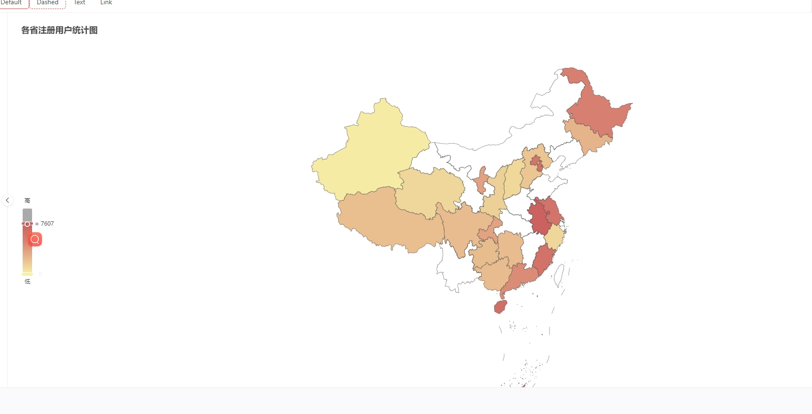

# echarts 中国地图  


支持各省XXX人数统计
从高到低过滤 等等



```vue  
<script setup lang="ts">
import { ref, onMounted } from "vue";
import * as echarts from 'echarts';


/**
 * 重点 geojson.cn/ 把中国地图数据下载下来放到本地 用fetch读取数据 
 * vue 要放在public目录下不然读取不了
 * 中国地图数据（GeoJSON 及 TopoJSON 数据）
 * 
*/
 const  CHAINA_PROVINCE = ref ([
    {
      value: 6039,
      name: "北京市",
    },
    {
      value: 6194,
      name: "天津市",
    },
    {
      value: 1864,
      name: "河北省",
    },
    {
      value: 1068,
      name: "山西省",
    },
    {
      value: 8389,
      name: "内蒙古自治区",
    },
    {
      value: 9836,
      name: "辽宁省",
    },
    {
      value: 2709,
      name: "吉林省",
    },
    {
      value: 5168,
      name: "黑龙江省",
    },
    {
      value: 8092,
      name: "上海市",
    },
    {
      value:6133,
      name: "江苏省",
    },
    {
      value: 1135,
      name: "浙江省",
    },
    {
      value: 7612,
      name: "安徽省",
    },
    {
      value: 6278,
      name: "福建省",
    },
    {
      value: 8607,
      name: "江西省",
    },
    {
      value: 7898,
      name: "山东省",
    },
    {
      value: 11789,
      name: "河南省",
    },
    {
      value: 46456,
      name: "湖北省",
    },
    {
      value: 2342,
      name: "湖南省",
    },
    {
      value: 4564,
      name: "广东省",
      ProSort: 20,
      ProRemark: "省份",
    },
    {
      value: 6564,
      name: "海南省",
    },
    {
      value: 2341,
      name: "广西壮族自治区",
    },
    {
      value: 345345,
      name: "甘肃省",
    },
    {
      value: 1432,
      name: "陕西省",
    },
    {
      value: 178,
      name: "新疆维吾尔自治区",
    },
    {
      value: 1112,
      name: "青海省",
    },
    {
      value: 3567,
      name: "宁夏回族自治区",
    },
    {
      value: 3489,
      name: "重庆市",
    },
    {
      value: 2342,
      name: "四川省",
    },
    {
      value: 2314,
      name: "贵州省",
    },
    {
      value: 9234,
      name: "云南省",
    },
    {
      value: 2222,
      name: "西藏自治区",
    },
    {
      value: 23224,
      name: "台湾省",
    },
    {
      value: 76431,
      name: "澳门特别行政区",
    },
    {
      value: 676711,
      name: "香港特别行政区",
    },
  ]);

const  initEcahrtMap = async ()=>{
    const myEcharts:any= echarts.init(document.getElementById('geo'));
    myEcharts.showLoading();
    const resp = await fetch('../../public/map.json').then(resp=>resp.json())
    console.log(resp,'resp')
   
    //注册地图数据
    echarts.registerMap('China',resp)
    myEcharts.setOption({
        title:{
            text:"各省注册用户统计图"
        },
        tooltip:{
            trigger: 'item', 
            formatter:`{b} 人数为 {c} 人`,
        },
        visualMap:{
            left:"left",
            top:"center",
            min:0,
            max:10000,
            text:['高','低'],
            calculable:true,
            
        },
        series:[
            {
                type:'map',
                map:'China',
                roam:true,
                scaleLimit:{
                    max:3,
                    min:0.7
                },
                data:CHAINA_PROVINCE.value
            }
        ]
    })
    myEcharts.hideLoading()
}

onMounted(() => {
    initEcahrtMap()
})

</script>

<template>
  <div id="geo"></div>
</template>

<style>
#geo{
    width: 100%;
    height: 100%;
    position: fixed;
    left: 0;
    top: 0;
}
</style>

```