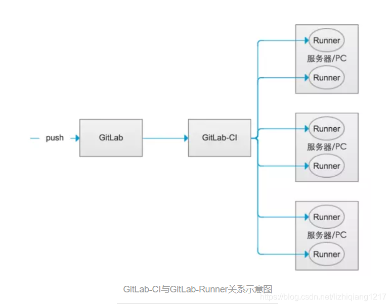
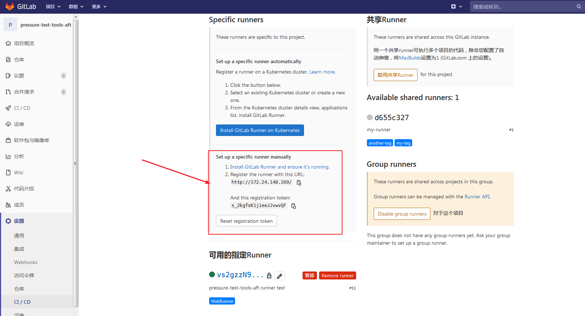
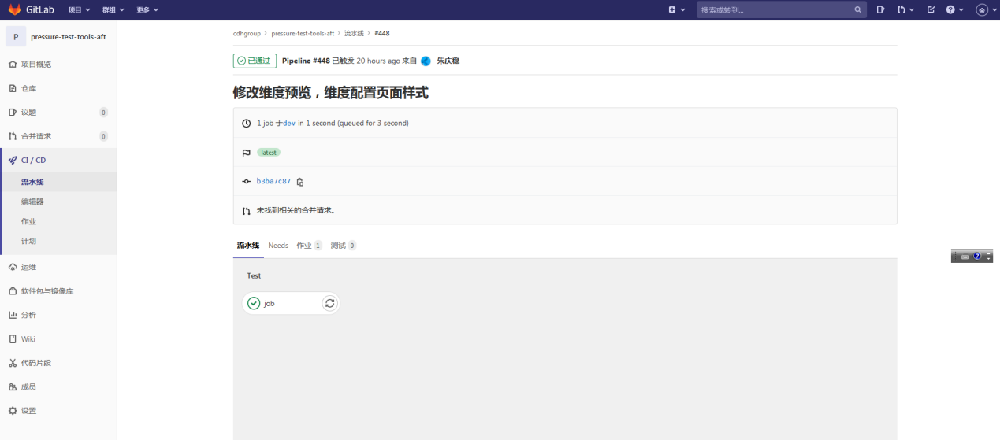
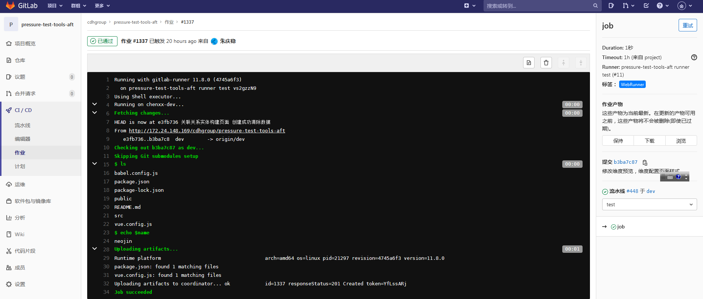
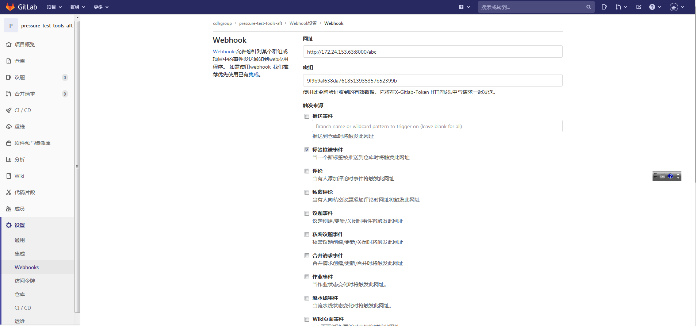
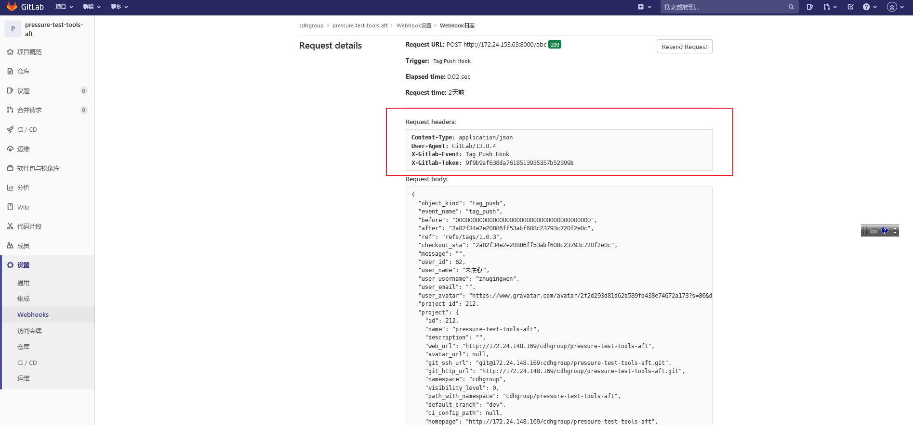

# gitlab 自动化构建

### 1.1.概念

- CI 主要是用来做构建任务的，如打包、编译、代码测试、代码覆盖率测试。
- 一般来说构建任务会占用很多系统资源，gitlab 服务上有多个不同的构建任务，所以不能将所有的任务放在 gitlab 服务上来执行。
- GITLAB CI 在服务端，用作来管理各个项目的构建状态，具体执行构建的交给 GITLAB RUNNER 来处理，所以 RUNNER 可以安装到不同的机器，通过注册来绑定构建任务，执行时由 CI 来分发。
  

### 2.安装、注册

#### 2.1 安装

```js
	 yum install gitlab-ci-multi-runner (需要更新yum源)
	//  或者从官网直接下载二进制包
	 以下runner重命名为gitlab-runner
```

#### 2.2 注册

##### 2.2.1 获取 gitlab url 和 token

    从gitlab项目 中打开页面 http://172.24.148.169/cdhgroup/pressure-test-tools-aft/-/settings/ci_cd



##### 2.2.2 服务器上注册 runner


### 3.配置、执行 CI

#### 3.1 项目根目录下配置 yaml

修改.gitlab-ci.yml， 下面列出基本的配置，详情请查询官方文档


#### 3.2 查看流水线任务信息





### 4.配置 webhooks

    webhooks 可以在git事件有一个hook触发我们配置的链接，我们可以自定义钩子来对触发事件做一些业务。

    如果选择推送事件，当有推送时，gitlab服务器会发送一个POST请求到我们配置的网址上，我们将有一个服务来处理钩子事件。POST数据如图。Webhooks支持测试、日志查询、重试。




### 5.测试脚本

```py
# coding: utf-8
"""Simple HTTP Server.

This module builds on BaseHTTPServer by implementing the standard GET
and HEAD requests in a fairly straightforward manner.

"""


__version__ = "0.6"

__all__ = ["SimpleHTTPRequestHandler"]

import os
import posixpath
import BaseHTTPServer
import urllib
import cgi
import sys
import shutil
import mimetypes
import SocketServer
import urlparse
import json
try:
    from cStringIO import StringIO
except ImportError:
    from StringIO import StringIO

GIT_TOKEN = "9f9b9af638da7618513935357b52399b"

class TagHandler(object):
    def __init__(self, data, header):
        self.data = data
        self.header = header

    def get_ref(self):
        return self.data.get("ref").split('/')[-1]

    def get_kind(self):
        return self.header.get("X-Gitlab-Event")

    def is_tag_push(self):
        return self.get_kind() == "Tag Push Hook"

    def get_token(self):
        return self.header.get("X-Gitlab-Token")

    def is_gitlab_token(self):
        return self.get_token() == GIT_TOKEN

    def check(self):
        if all([self.is_gitlab_token(), self.is_tag_push(), self.get_ref()]):
            return True
        return False

    def run(self):
        if self.check():
            # os.system("nohup sh /opt/webBuild/web_build.sh %s >> /tmp/aa.log &" % self.get_ref())
            print("日志记录在/tmp/aa.log里")


class HTTPSeverHandler(BaseHTTPServer.BaseHTTPRequestHandler):
    def do_GET(self):
        self._do(self.path)

    def do_POST(self):
        if self.path == "/gitlab":
            handle = TagHandler(self.getBody(), self.headers)
            handle.run()
            data = {"code": 0, "message": ""}
        else:
            header = {}
            for (i, j) in self.headers.items():
                header[i] = j
            data = {
                "path": self.path,
                "header": header,
                "data": self.getBody()
            }


        self._do(json.dumps(data))

    def getBody(self):
        result = {}
        datas = self.rfile.read(int(self.headers.get("content-length")))

        types = self.headers.get("content-type", "").lower()
        if types.find("application/json") > -1:
            result = json.loads(datas)
        elif types.find("application/x-www-form-urlencoded") > -1:
            for item in datas.split("&"):
                key, value = item.split("=")
                result[key] = value
        else:
            result = datas
        return result

    def _do(self, message):
        self.send_response(200)
        self.send_header("content-type", "application/json")
        self.send_header("Content-Length", str(len(message)))
        self.end_headers()
        self.wfile.write(message)


def test(HandlerClass = HTTPSeverHandler,
         ServerClass = BaseHTTPServer.HTTPServer):
    BaseHTTPServer.test(HandlerClass, ServerClass)


if __name__ == '__main__':
    test()

```

```bash
#!/bin/bash
set -e -x

echo $1
curPath=$(readlink -f "$(dirname "$0")")
echo $curPath  

webSourceGit=$curPath/pressure-test-tools-aft
nodeModulePath=$curPath/node_modules
distPath=$webSourceGit/dist
destNodeMoudlePath=$webSourceGit/node_modules
finallyDestZip=$webSourceGit/dist.$1.zip
pushFoldTag=$curPath/webbuildpush


function check_fold(){
    if [[ $curPath =~ ^/opt/web ]];then
        echo "目录检查通过."
    else
        echo "不在指定目录下执行，退出."
        exit 1
    fi
    if [[ ! -d $pushFoldTag ]];then
        echo "发布目录不存在，退出, exit."
        exit 1
    fi
}

check_fold

function check_web_source_git() {
    echo "目录： $webSourceGit"
    if [[ -d $webSourceGit ]]; then
        echo "目录存在，将被删除"
        rm -rf $webSourceGit
    else
        echo "目录不存在"
    fi
}


check_web_source_git

function check_web_git_and_enter(){
    if [[ -d $webSourceGit ]];then
        cd $webSourceGit
        ls
    else
        echo "git fail, exit"
        exit 1
    fi
}

function get_web_source_git() {
    git clone --branch $1 git@172.24.148.169:cdhgroup/pressure-test-tools-aft.git

}

get_web_source_git $1
check_web_git_and_enter

function install_node_module() {
    # 将模块移入工程
    if [[ -d $nodeModulePath ]]; then
        echo "已经存在node_moudle."
        # 如果存在node module目录，则建立软链接，这样防止未知bug
        mv $nodeModulePath $webSourceGit
    fi
}

function uninstall_node_module() {
    # 将node module移出工程
    if [[ -d $nodeModulePath ]]; then
        rm -rf  $nodeModulePath
    else
        mv $destNodeMoudlePath $nodeModulePath
    fi
}

function install_pkg() {

    if [[ -d $destNodeMoudlePath ]]; then
        echo "删除原node_modules: $destNodeMoudlePath"
    fi

    if [[ -d $distPath ]];then
        echo "删除dist: $distPath"
    fi

    install_node_module

    source /etc/profile;
    cd $webSourceGit;
    npm install ;
    
    echo "done"
}


function build_pkg() {
    source /etc/profile;
    cd $webSourceGit;

    npm run build;
    if [[ -d $distPath ]];then
        zip $finallyDestZip $distPath
    else
        echo "not dist fold. exit"
        exit 1
    fi
}

install_pkg

build_pkg
uninstall_node_module


####Push start########################
# 推送打包到gitlab
function pkg_push() {
    mv $finallyDestZip $pushFoldTag;
    cd $pushFoldTag;
    git add ./;
    git commit -m "build $1"
    git push;
    echo "发布成功."
}
pkg_push $1
####Push end##########################
```
