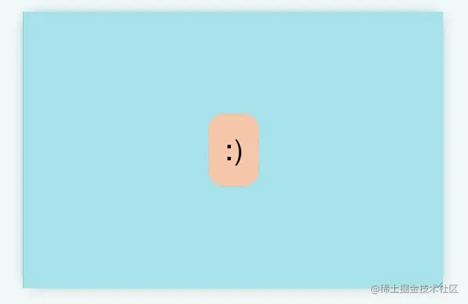
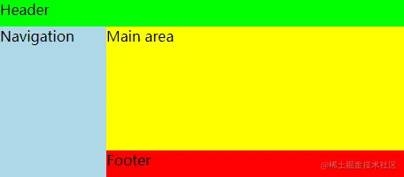
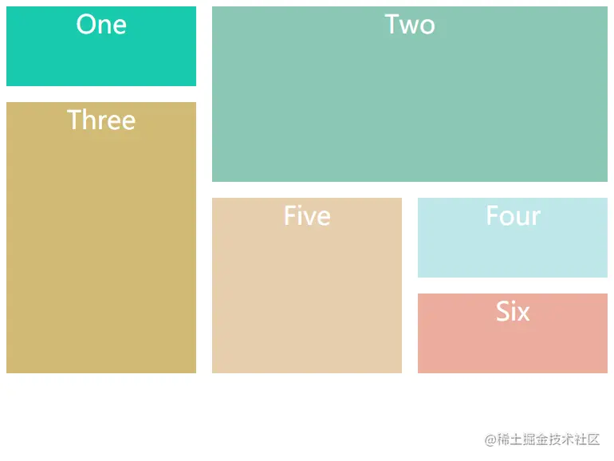
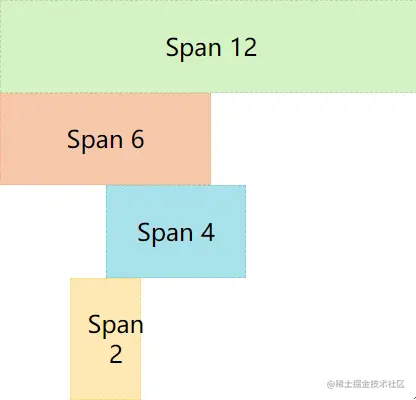

# 使用 grid 轻松实现各种布局

[[toc]]

### 介绍

CSS 网格布局用于将一个页面划分为几个主要区域，以及定义这些区域的大小、位置、层次等关系。

与 table 表格一样，网格布局让我们能够按行或列来对齐元素，但在布局上，网格比表格更容易做到且更简单。

### 与弹性盒

网格布局和 flex 弹性盒布局的主要区别在于弹性盒布局是一维布局（沿横向或纵向的），而网格布局是二维布局（同时沿着横向和纵向）。

### 弹性盒的不足

比如以下一个宽度 500px 的容器内有五个元素区域，我们使用弹性盒来对齐这些区域。在每个子项目上设置 flex: 1 1 150px;，以在 150px 基准上伸缩。flex-wrap 属性为 wrap，从而当容器变得太窄时，元素会换到新的一行。

```html
<div class="wrapper">
  <div>One</div>
  <div>Two</div>
  <div>Three</div>
  <div>Four</div>
  <div>Five</div>
</div>
```

```css
.wrapper {
  width: 500px;
  display: flex;
  flex-wrap: wrap;
}
.wrapper > div {
  flex: 1 1 150px;
}
```

你可以看到有两个元素被换到了新行。这两个元素共享了这行的可用空间，并没有与上一行的元素对齐。这表示当你允许弹性元素换行时，每个新行都变成了一个新的弹性容器。那有没有可以在新行也与上一行保持对齐的方法？答案是网格。

我们用网格更简单地创建同样的布局。只需要给这些子元素设置设置 3 个 1fr 的列，并不需要任何其他属性，它们会自动按顺序填充到网格的单元格中。你可以看到它们按网格规整的排列，行与行、列与列对齐。当有 5 个子元素时，第二行的尾部会留出一个空隙。

```css
.wrapper {
  display: grid;
  grid-template-columns: repeat(3, 1fr);
}
```

fr 关键字为 fraction 的缩写，表示了网格容器中的一段可变长度。repeat() 函数用于在 CSS 中快速编写网格，repeat(3, 1fr) 相当于 1fr 1fr 1fr。

### 如何选择该用网格还是弹性盒？

- 我只需要按行或者列控制布局？那就用弹性盒子。
- 我需要同时按行和列控制布局？那就用网格。

弹性盒关注的是内容，而网格侧重布局。当你使用弹性盒，并发现自己禁用了一些弹性特性，那你可能需要的是 CSS 网格布局。例如，你给一个弹性元素设置百分比宽度来使它和上一行的元素对齐。这种情况下，网格很可能是一个更好的选择。


```css
.parent {
  display: grid;
  place-items: center;
}
```

其中 place-items 属性是一个简写形式。

```css
place-items: <align-items> <justify-items>;
```

align-items 属性控制垂直位置，justify-items 属性控制水平位置。如果未提供第二个值，则第一个值作为第二个值的默认值。所以，place-items: center; 等同于 place-items: center center;。

### 侧边栏布局

一个边栏，一个主栏。


```css
body {
  display: grid;
  grid-template-columns: minmax(150px, 25%) 1fr;
  margin: 0;
}
.sidebar {
  padding: 2rem;
  background: lightpink;
  font-size: 2rem;
  text-align: center;
}
.content {
  padding: 2rem;
}
```

```html
<div class="sidebar">
  Min: 150px
  <br />
  Max: 25%
</div>
<p class="content">
  Lorem ipsum dolor sit amet consectetur adipisicing elit. Omnis nulla
  architecto maxime modi nisi. Quas saepe dolorum, architecto quia fugit nulla!
  Natus, iure eveniet ex iusto tempora animi quibusdam porro?
</p>
```

这里使用 minmax(最小值, 最大值) 函数定义了一个长宽范围的闭区间，表示列宽不会收缩小于 150px 且不会拉伸大于容器宽度的 25%。每个参数分别是 `<length>、<percentage>、<flex>` 的一种，或者是 max-content、min-content、或 auto 之一。如果   最大值  <  最小值，则 最大值 被忽略并返回 最小值。`<flex>` 值作为 最大值 时设置网格轨道的弹性系数；作为 最小值 时无效。auto
作为最大值时，等价于 max-content；作为 最小值 时，它表示轨道中单元格最小长宽（min-width/min-height）的最大值。

### 三明治布局

页面在垂直方向上，分成三部分：页眉、内容区、页脚。这个布局会根据设备宽度，自动适应，并且不管内容区有多少内容，页脚始终在容器底部（粘性页脚）


```html
<div class="container">
  <header>
    <h1>Header.com</h1>
  </header>
  <main></main>
  <footer>Footer Content — Header.com 2020</footer>
</div>
```

```css
body {
  margin: 0;
}

.container {
  display: grid;
  height: 100vh;
  grid-template-rows: auto 1fr auto;
  resize: both;
  overflow: hidden;
}

header {
  background: lightpink;
  padding: 1rem;
}

main {
  background: coral;
}

footer {
  background: wheat;
  padding: 1rem;
  text-align: center;
}

body {
  font-family: system-ui, sans-serif;
}
```

### 经典圣杯布局

最常用的布局，所以被比喻为圣杯。它将页面分成五个部分，除了页眉和页脚，内容区分成左边栏、主栏、右边栏。


```html
<div class="container">
  <header><h1 contenteditable>Header.com</h1></header>
  <div class="left-sidebar" contenteditable>Left Sidebar</div>
  <main contenteditable></main>
  <div class="right-sidebar" contenteditable>Right Sidebar</div>
  <footer contenteditable>Footer Content — Header.com 2020</footer>
</div>
```

```css
body {
  margin: 0;
}

.container {
  resize: both;
  overflow: hidden;
  display: grid;
  height: 100vh;
  grid-template: auto 1fr auto / auto 1fr auto;
}

header {
  background: lightpink;
  padding: 1rem;
  grid-column: 1 / 4;
}

.left-sidebar {
  background: lightblue;
  grid-column: 1 / 2;
}

main {
  background: coral;
  grid-column: 2 / 3;
}

.right-sidebar {
  background: yellow;
  grid-column: 3 / 4;
}

footer {
  background: wheat;
  padding: 1rem;
  text-align: center;
  grid-column: 1 / 4;
}

body {
  font-family: system-ui, sans-serif;
}

.left-sidebar,
.right-sidebar {
  padding: 1rem;
}
```

grid-template 是 grid-template-rows、grid-template-columns 与 grid-template-areas 的简写形式。有三种写法：

1. 关键字，默认 grid-template: none;。
2. grid-template-rows / grid-template-columns，例如本例子中的 grid-template: auto 1fr auto / auto 1fr auto;。
3. grid-template-areas grid-template-rows / grid-template-column，
   例如：

```css
grid-template:
  "a a a" 40px
  "b c c" 40px
  "b c c" 40px / 1fr 1fr 1fr;
```

### 圣杯布局 2

将页面分成四个部分，除了页眉和页脚，内容区分成左边栏、主栏。


```html
<section id="page">
  <header>Header</header>
  <nav>Navigation</nav>
  <main>Main area</main>
  <footer>Footer</footer>
</section>
```

```css
body {
  margin: 0;
}

#page {
  resize: both;
  overflow: hidden;
  display: grid;
  width: 100%;
  height: 100vh;
  grid-template:
    [header-left] "head head" 30px [header-right]
    [main-left] "nav  main" 1fr [main-right]
    [footer-left] "nav  foot" 30px [footer-right]
    / 120px 1fr;
}

header {
  background-color: lime;
  grid-area: head;
}

nav {
  background-color: lightblue;
  grid-area: nav;
}

main {
  background-color: yellow;
  grid-area: main;
}

footer {
  background-color: red;
  grid-area: foot;
}
```

这里自定义了四个 grid-area 标识，并在 grid-template 中引用它们。然后页眉被分配了 30px 固定高度和 100% 的宽度；左边栏被分配了 1fr + 30px 弹性高度和 120px 固定宽度；主栏被分配了 1fr 的弹性高度和 1fr 的弹性宽度；页脚被分配了 30px 的固定高度和 1fr 的弹性宽度。

### 瀑布流布局

表现为参差不齐的多栏布局，以图片为主，大小不一的图片按照一定的规律排列。随着页面滚动条向下滚动，还会不断加载数据块并附加至当前尾部。


```html
<div class="container">
  <div class="one item">One</div>
  <div class="two item">Two</div>
  <div class="three item">Three</div>
  <div class="four item">Four</div>
  <div class="five item">Five</div>
  <div class="six item">Six</div>
</div>
```

```css
.container {
  display: grid;
  grid-template-columns: repeat(3, 1fr);
  grid-gap: 10px;
  grid-auto-rows: minmax(4em, auto);
}
.one {
  grid-column: 1 / 2;
  grid-row: 1;
  background: #19caad;
}
.two {
  grid-column: 2 / 4;
  grid-row: 1 / 3;
  background: #8cc7b5;
}
.three {
  grid-row: 2 / 5;
  grid-column: 1;
  background: #d1ba74;
}
.four {
  grid-column: 3;
  grid-row: 3;
  background: #bee7e9;
}
.five {
  grid-column: 2;
  grid-row: 3/5;
  background: #e6ceac;
}
.six {
  grid-column: 3;
  grid-row: 4;
  background: #ecad9e;
}
.item {
  text-align: center;
  font-size: 200%;
  color: #fff;
}
```

grid-auto-columns 属性和 grid-auto-rows 属性表示浏览器将根据指定值自动设置网格的列宽和行高。它们的写法与 grid-template-columns 和 grid-template-rows 完全相同。如果没有指定这四个属性，浏览器会根据单元格内容的大小，决定网格的列宽和行高。

### 跨网格布局

另一个经典布局：12 网格布局。



```js
<div class="container">
  <div class="span-12">Span 12</div>
  <div class="span-6">Span 6</div>
  <div class="span-4">Span 4</div>
  <div class="span-2">Span 2</div>
</div>
```

```css
body {
  margin: 0;
}

.container {
  resize: both;
  overflow: hidden;
  display: grid;
  grid-template-columns: repeat(12, 1fr);
  grid-auto-rows: 4em;
}

.container > div {
  display: grid;
  place-items: center;
}

.span-12 {
  background: lightpink;
  grid-column: 1 / 13;
}

.span-6 {
  background: lightblue;
  grid-column: 1 / 7;
}

.span-4 {
  background: coral;
  grid-column: 4 / 9;
}

.span-2 {
  background: yellow;
  grid-column: 3 / 5;
}

body {
  font-family: system-ui, sans-serif;
}
```
