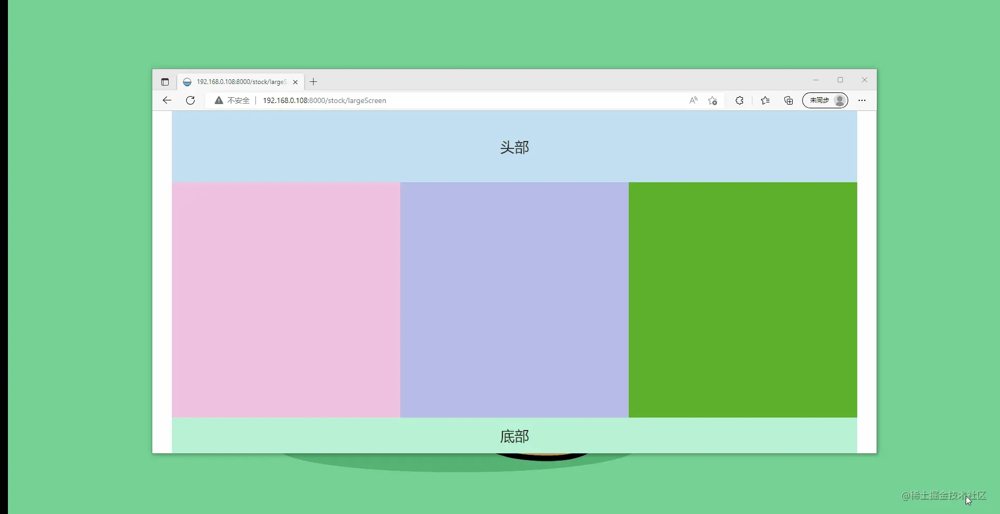

# 大屏适配方案

您是不是有如下疑惑。

开发数据大屏不能完全自适应？

使用 rem 自适应还需要注意单位很麻烦？

有没有那种随便我怎么写都能够完全自适应的？

有没有那种用最少的代码最简单的方法实现完全自适应？最好是不需要我用脑子去思考的那种方法。

有

使用 scale 适配大屏。实现数据大屏在任何分辨率的电脑上均可安然运作。无需特定编写 rem 单位，也不需要考虑单位使用失误导致适配不完全。您即使全部用 position 去定位在其他屏幕上都不会乱。（%和 px 随便用）


### 如果您是一位 React 玩家

```javascript
      /*
      JS部分
      */
       //数据大屏自适应函数
    const handleScreenAuto = () => {
        const designDraftWidth = 1920;//设计稿的宽度
        const designDraftHeight = 960;//设计稿的高度
        //根据屏幕的变化适配的比例
        const scale = document.documentElement.clientWidth / document.documentElement.clientHeight < designDraftWidth / designDraftHeight ?
            (document.documentElement.clientWidth / designDraftWidth) :
            (document.documentElement.clientHeight / designDraftHeight);
        //缩放比例
        (document.querySelector('#screen') as any).style.transform = `scale(${scale}) translate(-50%)`;
    }

    //React的生命周期 如果你是vue可以放到mountd或created中
    useEffect(() => {
        //初始化自适应  ----在刚显示的时候就开始适配一次
        handleScreenAuto();
        //绑定自适应函数   ---防止浏览器栏变化后不再适配
        window.onresize = () => handleScreenAuto();
        //退出大屏后自适应消失   ---这是react的组件销毁生命周期，如果你是vue则写在deleted中。最好在退出大屏的时候接触自适应
        return () => window.onresize = null;
    }, [])
```

```html
/* HTML部分 */
<div className="screen-wrapper">
  <div className="screen" id="screen"></div>
</div>
```

```css
/*
      CSS部分  --除了设计稿的宽高是根据您自己的设计稿决定以外，其他复制粘贴就完事
    */
.screen-root {
  height: 100%;
  width: 100%;
  .screen {
    display: inline-block;
    width: 1920px; //设计稿的宽度
    height: 960px; //设计稿的高度
    transform-origin: 0 0;
    position: absolute;
    left: 50%;
  }
}
```

### 如果您是一位 Vue 玩家

也不必担心，因为我也准备 Vue 版本的。
代码 ↓

```js
    /**
    js部分
    */
    mounted(){
        //初始化自适应  ----在刚显示的时候就开始适配一次
        handleScreenAuto();
        //绑定自适应函数   ---防止浏览器栏变化后不再适配
        window.onresize = () => handleScreenAuto();
    },
    deleted(){
        window.onresize = null;
    },
    methods: {
        //数据大屏自适应函数
        const handleScreenAuto = (): void => {
            const designDraftWidth = 1920;//设计稿的宽度
            const designDraftHeight = 960;//设计稿的高度
            //根据屏幕的变化适配的比例
            const scale = document.documentElement.clientWidth / document.documentElement.clientHeight < designDraftWidth / designDraftHeight ?
                (document.documentElement.clientWidth / designDraftWidth) :
                (document.documentElement.clientHeight / designDraftHeight);
            //缩放比例
            (document.querySelector('#screen') as any).style.transform = `scale(${scale}) translate(-50%)`;
        }
    }
```

```html
/** html部分 */
<template>
  <div className="screen-wrapper">
    <div className="screen" id="screen"></div>
  </div>
</template>
```

```css
/*
     CSS部分  --除了设计稿的宽高是根据您自己的设计稿决定以外，其他复制粘贴就完事
   */
.screen-root {
  height: 100%;
  width: 100%;
  .screen {
    display: inline-block;
    width: 1920px; //设计稿的宽度
    height: 960px; //设计稿的高度
    transform-origin: 0 0;
    position: absolute;
    left: 50%;
  }
}
```

同样。将上述生命周期和 methods 中的代码复制，然后在 id 为 screen 的 div 中编写数据大屏即可。

### 如果您想了解实现原理

用是会用了。有人问这个方法的实现原理咋办？
找不到人讲解这个方法为什么可以实现自适应咋办？
没关系，我来提供答案

问题是:为什么，使用以上方法可以实现自适应。
上代码，先从 handleScreenAuto 开始。

```javascript
 const handleScreenAuto = () => {
        const designDraftWidth = 1920;//设计稿的宽度
        const designDraftHeight = 960;//设计稿的高度
        //根据屏幕的变化适配的比例
        const scale = document.documentElement.clientWidth / document.documentElement.clientHeight < designDraftWidth / designDraftHeight ?
            (document.documentElement.clientWidth / designDraftWidth) :
            (document.documentElement.clientHeight / designDraftHeight);
        //缩放比例
        (document.querySelector('#screen') as any).style.transform = `scale(${scale}) translate(-50%)`;
    }
```

designDraftWidth / designDraftHeight；这两个属性，叫做:设计稿宽高。顾名思义:就是设计师给我们出的那个设计稿是按照什么宽高比例出的设计图。换言之，我们制作视图的时候，得有个固定的宽高值。
比如我用的蓝湖。就有标注，设计师给出的设计稿是按照什么宽高比例绘制的图形。

现在假设宽为 1920 高为 960 的情况下，我开始绘制大屏。
下面就需要解释 scale 属性是干啥的。

scale 英文直译:比例。
对，这个属性就是决定，当我当前的屏幕大小和设计稿大小不符合的时候。我需要进行缩放的比例是多少。
举个例子。如果我们的自己屏幕大小是 1920 _ 960,全用 px(像素单位) 去绘制。那么当我们的大屏出现在 1440 _ 900 的屏幕上的时候，我们的大屏，就无法完全的展示。
比如：我把自适应效果去掉。我们看看结果（以下是在 1440\*900 且无自适应的情况下的大屏，显然，它没有完全显示）

其实很简单，1440 * 900 的像素无法显示 1920*960 的所有像素。
既然 1440 _ 900 的情况下无法显示 1920 _ 960 的像素，那么缩放它，不就可以显示了吗？
如何计算缩放比例，这就是 scale 的用处了。

```javascript
const scale =
  document.documentElement.clientWidth / document.documentElement.clientHeight <
  designDraftWidth / designDraftHeight
    ? document.documentElement.clientWidth / designDraftWidth
    : document.documentElement.clientHeight / designDraftHeight;
```

不难看懂。

scale 就是拿出 当前的电脑屏幕宽度像素（1440）除以当前屏幕高度像素（900） 去和我们的设计稿宽度像素（1920）除以设计稿高度（960）做一个比较。
如果当前屏幕比例<设计稿比例。那么我们需要缩放的比例就是屏幕宽度除以设计稿宽度
如果当前屏幕比例>设计稿比例。那么我们需要缩放的比例就是屏幕高度除以设计稿高度

那么 1440/900 = 1.6 。 1920/960 = 2
因为 1.6 < 2。 （当前屏幕比例小于设计稿比例）

所以我们需要缩放的比例是:屏幕宽度除以设计稿宽度 = 1440/1920 = 0.75。
回到刚才的问题，1920 _ 960 的像素无法在 1440 _ 900 像素中完全显示的原因是 1440 _ 900 无法完全展示超过自身的像素点。那么，我们只需要将当前视图整体 ✖ 我们刚刚算出来的缩放比例（0.75）。就可以让 1440 _ 900 的屏幕去容纳我们的大屏了。

1920 _ 0.75 === 1440；960 _ 0.75 = 720。
经过缩放以后，原本 1920 _ 960 的大屏就可以在 1440 _ 900 中展示。

值得注意的是，在退出大屏的时候，最好执行一下 window.onresize = null。因为这种自适应主要是为数据大屏准备的。它并不适所有场景。如果是项目的其他内容需要自适应（比如表格表单页）。我更建议您使用栅格化系统。

### 您是否需要一个完整的 demo?

demo 效果



```html
<div className="screen-wrapper">
  <div className="screen" id="screen">
    <div className="demo-root">
      <header>头部</header>
      <main>
        <div className="demo-left"></div>
        <div className="demo-center"></div>
        <div className="demo-right"></div>
      </main>
      <footer>底部</footer>
    </div>
  </div>
  <footer className="large-footer"></footer>
</div>
```

```css
/*
css
*/
.screen-wrapper {
  height: 100%;
  width: 100%;
  .screen {
    display: inline-block;
    width: 1920px;
    height: 960px;
    transform-origin: 0 0;
    position: absolute;
    left: 50%;
    .demo-root {
      header {
        width: 1920px;
        height: 200px;
        background: rgba(53, 150, 206, 0.3);
        font-size: 40px;
        text-align: center;
        line-height: 200px;
      }
      main {
        display: flex;
        height: 660px;
        div {
          width: 640px;
          height: 100%;
        }
        .demo-left {
          background: rgba(206, 52, 154, 0.3);
        }
        .demo-center {
          background: rgba(13, 30, 179, 0.3);
        }
        .demo-right {
          background: rgba(64, 163, 6, 0.849);
        }
      }
      footer {
        width: 100%;
        height: 100px;
        font-size: 40px;
        text-align: center;
        line-height: 100px;
        background: rgba(19, 211, 115, 0.3);
      }
    }
  }
}
```

react 部分

```js
    /*
        js  ---react
    */

       //数据大屏自适应函数
    const handleScreenAuto = (): void => {
        const designDraftWidth = 1920;//设计稿的宽度
        const designDraftHeight = 960;//设计稿的高度
        //根据屏幕的变化适配的比例
        const scale = document.documentElement.clientWidth / document.documentElement.clientHeight < designDraftWidth / designDraftHeight ?
            (document.documentElement.clientWidth / designDraftWidth) :
            (document.documentElement.clientHeight / designDraftHeight);
        //缩放比例
        (document.querySelector('#screen') as any).style.transform = `scale(${scale}) translate(-50%)`;
    }

    //React的生命周期 如果你是vue可以放到mountd或created中
    useEffect(() => {
        //初始化自适应  ----在刚显示的时候就开始适配一次
        handleScreenAuto();
        //绑定自适应函数   ---防止浏览器栏变化后不再适配
        window.onresize = () => handleScreenAuto();
        //退出大屏后自适应消失   ---这是react的组件销毁生命周期，如果你是vue则写在deleted中。最好在退出大屏的时候接触自适应
        return () => window.onresize = null;
    }, [])

```

vue 部分

```javascript
     /*
        js  ---vue
    */
      mounted(){
        //初始化自适应  ----在刚显示的时候就开始适配一次
        handleScreenAuto();
        //绑定自适应函数   ---防止浏览器栏变化后不再适配
        window.onresize = () => handleScreenAuto();
    },
    deleted(){
        window.onresize = null;
    },
    methods: {
        //数据大屏自适应函数
        const handleScreenAuto = (): void => {
            const designDraftWidth = 1920;//设计稿的宽度
            const designDraftHeight = 960;//设计稿的高度
            //根据屏幕的变化适配的比例
            const scale = document.documentElement.clientWidth / document.documentElement.clientHeight < designDraftWidth / designDraftHeight ?
                (document.documentElement.clientWidth / designDraftWidth) :
                (document.documentElement.clientHeight / designDraftHeight);
            //缩放比例
            (document.querySelector('#screen') as any).style.transform = `scale(${scale}) translate(-50%)`;
        }
    }
```

### 追加，您是否担心，这其中会不会有什么坑？
我可以很负责任的告诉您:有;

主要存在两个问题

1. 当缩放比例过大时候，字体会有一点点模糊，就一点点。
2. 当缩放比例过大时候，事件热区会偏移。

请不要太担心,第一个问题他只有在缩放真的很极端情况下才会出现那种让人难以接受的模糊。
一般情况下,在画圈这部分的分辨率下都是没什么大问题的。如果是公司内部使用的大屏，对UI真的没有苛刻到一定的程度，这个方法放心大胆用，没有关系的。
第二个问题，他的出现条件甚至比第一个问题还极端一点。仅仅从日常使用的角度来说，是没问题的。
emmmmm...至少到现在为止还没有客户和我反应过这个问题
