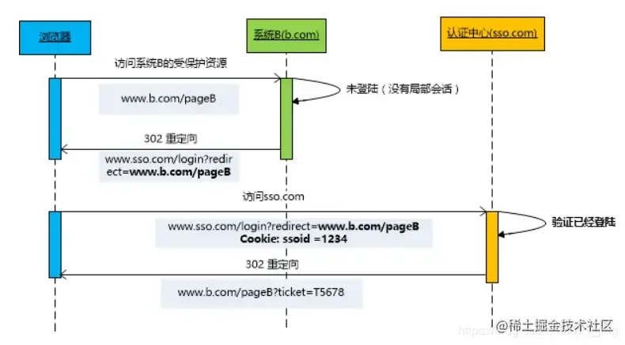

# SSO 单点登录方案思考

[[toc]]

### 什么是单点登录

单点登录（Single Sign On），简称为 SSO，是目前比较流行的企业业务整合的解决方案之一。SSO 的定义是在多个应用系统中，用户只需要登录一次就可以访问所有相互信任的应用系统。
SSO 一般都需要一个独立的认证中心（passport），子系统的登录均得通过 passport，子系统本身将不参与登录操作，当一个系统成功登录以后，passport 将会颁发一个令牌给各个子系统，子系统可以拿着令牌会获取各自的受保护资源，为了减少频繁认证，各个子系统在被 passport 授权以后，会建立一个局部会话，在一定时间内可以无需再次向 passport 发起认证。

::: tip
举个例子，比如淘宝、天猫都属于阿里旗下的产品，当用户登录淘宝后，再打开天猫，系统便自动帮用户登录了天猫，这种现象背后就是用单点登录实现的。再比如百度贴吧和百度地图是百度公司旗下的两个不同的应用系统，如果用户在百度贴吧登录过之后，当他访问百度地图时无需再次登录，那么就说明百度贴吧和百度地图之间实现了单点登录。
:::

### SSO 机制实现流程

用户首次访问时，需要在认证中心登录：

1. 用户访问网站 a.com 下的 pageA 页面。
2. 由于没有登录，则会重定向到认证中心，并带上回调地址 www.sso.com?redirect_uri=a.com/pageA，以便登录后直接进入对应页面。
3. 用户在认证中心输入账号密码，提交登录申请。
4. 认证中心验证账号密码是否有效，通过后创建用户与 sso 认证中心之间的会话，称为全局会话，同时创建授权令牌，sso 认证中心带着令牌跳转会最初的请求地址，即重定向回 a.com?ticket=123，并带上了令牌（授权码） ticket，并将认证中心 sso.com 的登录态写入 Cookie。
5. 在 a.com 服务器中，拿着 令牌 ticket 向认证中心确认令牌 ticket 是否真实有效。
6. 验证成功后，服务器将登录信息写入 Cookie（此时客户端有 2 个 Cookie 分别存有 a.com 和 sso.com 的登录态）。
7. a.com 使用该令牌创建与用户的局部会话，返回受保护资源

### 全局会话和局部会话

用户登录成功之后，会与 sso 认证中心及各个子系统建立会话，用户与 sso 认证中心建立的会话称为全局会话，用户与各个子系统建立的会话称为局部会话，局部会话建立之后，用户访问子系统受保护资源将不再通过 sso 认证中心，全局会话与局部会话有如下约束关系

- 局部会话存在，全局会话一定存在
- 全局会话存在，局部会话不一定存在
- 全局会话销毁，局部会话必须销毁

> 在认证中心登录完成之后，继续访问 a.com 下的其他页面：

这个时候，由于 a.com 存在已登录的 Cookie 信息，所以服务器端直接认证成功。

> 如果认证中心登录完成之后，访问 b.com 下的页面：

这个时候，由于认证中心存在之前登录过的 Cookie，所以也不用再次输入账号密码，直接返回第 4 步，下发 ticket 给 b.com 即可。大概流程就是：

1. 所谓的同平台下的另一个子系统的用户访问 b.com 的受保护资源

2. b.com 发现用户未登录，跳转至 sso 认证中心，并将自己的地址作为参数

3. sso 认证中心发现用户已登录（a.com 已经登录过了），跳转回 b.com 的地址，并附上令牌

4. b.com 拿到令牌，去 sso 认证中心校验令牌是否有效

5. sso 认证中心校验令牌，返回有效，注册 b.com

6. b.com 使用该令牌创建与用户的局部会话，返回受保护资源

### SSO 机制实现方式

单点登录主要有三种实现方式（同域 SSO 不用设置独立的 SSO 服务器，因为业务后台服务器本身就足以承担 SSO 的职能。）：

1. 父域 Cookie，和同域 SSO 不同在于，服务器在返回 cookie 的时候，要把 cookie 的 domain 设置为其父域。
2. 认证中心
3. LocalStorage 跨域

> 一般情况下，用户的登录状态是记录在 Session 中的，要实现共享登录状态，就要先共享 Session，但是由于不同的应用系统有着不同的域名，尽管 Session 共享了，但是由于 SessionId 是往往保存在浏览器 Cookie 中的，因此存在作用域的限制，无法跨域名传递，也就是说当用户在 a.com 中登录后，Session Id 仅在浏览器访问 a.com 时才会自动在请求头中携带，而当浏览器访问 b.com 时，Session Id 是不会被带过去的。实现单点登录的关键在于，如何让 Session Id（或 Token）在多个域中共享。

#### 1. 父域 Cookie

Cookie 的作用域由 domain 属性和 path 属性共同决定。domain 属性的有效值为当前域或其父域的域名/IP 地址，在 Tomcat 中，domain 属性默认为当前域的域名/IP 地址。path 属性的有效值是以“/”开头的路径，在 Tomcat 中，path 属性默认为当前 Web 应用的上下文路径。 
如果将 Cookie 的 domain 属性设置为当前域的父域，那么就认为它是父域 Cookie。Cookie 有一个特点，即父域中的 Cookie 被子域所共享，也就是说，子域会自动继承父域中的 Cookie。 
利用 Cookie 的这个特点，可以将 Session Id（或 Token）保存到父域中就可以了。我们只需要将 Cookie 的 domain 属性设置为父域的域名（主域名），同时将 Cookie 的 path 属性设置为根路径，这样所有的子域应用就都可以访问到这个 Cookie 了。不过这要求应用系统的域名需建立在一个共同的主域名之下，如 tieba.baidu.com 和 map.baidu.com，它们都建立在 baidu.com 这个主域名之下，那么它们就可以通过这种方式来实现单点登录。 
总结：虽然我们可以使用 Cookie + Session 的方式完成了登录验证，但是这种方式也存在一些问题：

1. 这种实现方式比较简单，但不支持跨主域名。
2. 由于服务器端需要对接大量的客户端，也就需要存放大量的 SessionId，这样会导致服务器压力过大。
3. 如果服务器端是一个集群，为了同步登录态，需要将 SessionId 同步到每一台机器上，无形中增加了服务器端维护成本。
4. 由于 SessionId 存放在 Cookie 中，所以无法避免 CSRF 攻击。

#### 2. 认证中心

我们可以部署一个认证中心，认证中心就是一个专门负责处理登录请求的独立的 Web 服务，相当于一个 sso 服务器。 
用户统一在认证中心进行登录，登录成功后，认证中心记录用户的登录状态，并将 Token 写入 Cookie。（注意这个 Cookie 是认证中心的，应用系统是访问不到的） 
应用系统检查当前请求有没有 Token，如果没有，说明用户在当前系统中尚未登录，那么就将页面跳转至认证中心进行登录。由于这个操作会将认证中心的 Cookie 自动带过去，因此，认证中心能够根据 Cookie 知道用户是否已经登录过了。如果认证中心发现用户尚未登录，则返回登录页面，等待用户登录，如果发现用户已经登录过了，就不会让用户再次登录了，而是会跳转回目标 URL ，并在跳转前生成一个 Token，拼接在目标 URL 的后面，回传给目标应用系统。 
应用系统拿到 Token 之后，还需要向认证中心确认下 Token 的合法性，防止用户伪造。确认无误后，应用系统记录用户的登录状态，并将 Token 写入 Cookie，然后给本次访问放行。（这个 Cookie 是当前应用系统的，其他应用系统是访问不到的）当用户再次访问当前应用系统时，就会自动带上这个 Token，应用系统验证 Token 发现用户已登录，于是就不会有认证中心什么事了。
