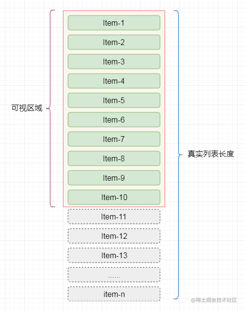
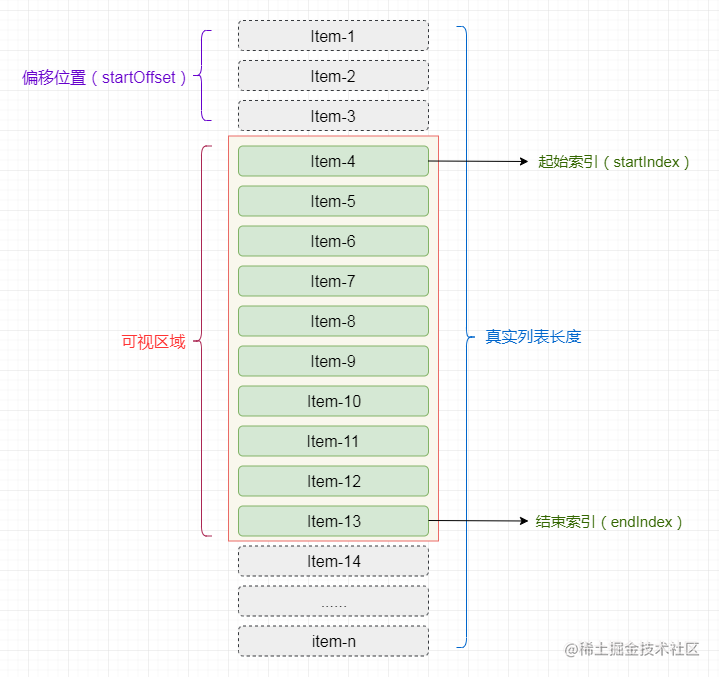
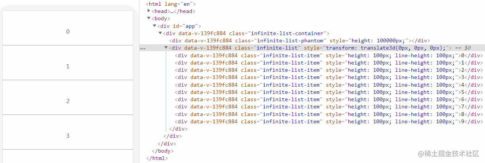
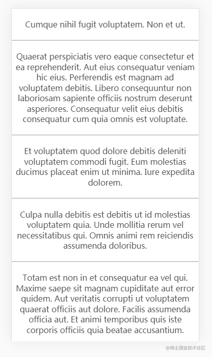
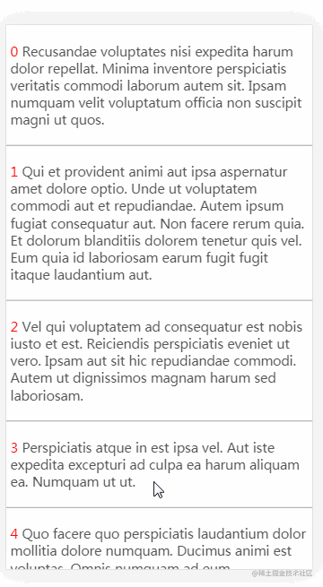
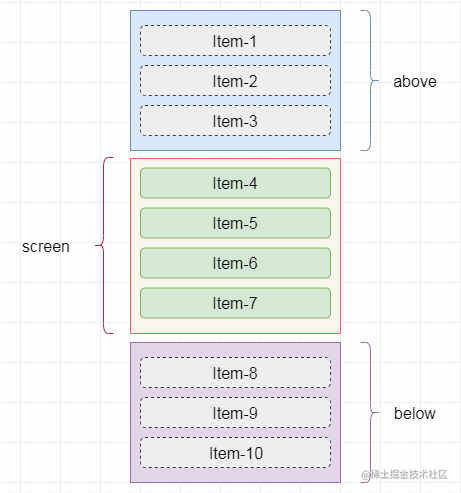

# 高性能渲染十万条数据(虚拟列表)

### 为什么需要使用虚拟列表

假设我们的长列表需要展示 10000 条记录，我们同时将 10000 条记录渲染到页面中，先来看看需要花费多长时间：

```html
<button id="button">button</button><br />
<ul id="container"></ul>
```

```javascript
document.getElementById("button").addEventListener("click", function () {
  // 记录任务开始时间
  let now = Date.now();
  // 插入一万条数据
  const total = 10000;
  // 获取容器
  let ul = document.getElementById("container");
  // 将数据插入容器中
  for (let i = 0; i < total; i++) {
    let li = document.createElement("li");
    li.innerText = ~~(Math.random() * total);
    ul.appendChild(li);
  }
  console.log("JS运行时间：", Date.now() - now);
  setTimeout(() => {
    console.log("总运行时间：", Date.now() - now);
  }, 0);

  // print JS运行时间： 38
  // print 总运行时间： 957
});
```

当我们点击按钮，会同时向页面中加入一万条记录，通过控制台的输出，我们可以粗略的统计到，JS 的运行时间为 38ms,但渲染完成后的总时间为 957ms。
简单说明一下，为何两次 console.log 的结果时间差异巨大，并且是如何简单来统计 JS 运行时间和总渲染时间：

在 JS 的 Event Loop 中，当 JS 引擎所管理的执行栈中的事件以及所有微任务事件全部执行完后，才会触发渲染线程对页面进行渲染
第一个 console.log 的触发时间是在页面进行渲染之前，此时得到的间隔时间为 JS 运行所需要的时间
第二个 console.log 是放到 setTimeout 中的，它的触发时间是在渲染完成，在下一次 Event Loop 中执行的


从 Performance 可以看出，代码从执行到渲染结束，共消耗了 960.8ms,其中的主要时间消耗如下：

- Event(click) : 40.84ms
- Recalculate Style : 105.08ms
- Layout : 731.56ms
- Update Layer Tree : 58.87ms
- Paint : 15.32ms

从这里我们可以看出，我们的代码的执行过程中，消耗时间最多的两个阶段是`Recalculate Style和Layout`。

`Recalculate Style`：样式计算，浏览器根据 css 选择器计算哪些元素应该应用哪些规则，确定每个元素具体的样式。
`Layout`：布局，知道元素应用哪些规则之后，浏览器开始计算它要占据的空间大小及其在屏幕的位置。

在实际的工作中，列表项必然不会像例子中仅仅只由一个 li 标签组成，必然是由复杂 DOM 节点组成的。
那么可以想象的是，当列表项数过多并且列表项结构复杂的时候，同时渲染时，会在`Recalculate Style和Layout`阶段消耗大量的时间。
而虚拟列表就是解决这一问题的一种实现。

### 什么是虚拟列表

虚拟列表其实是按需显示的一种实现，即只对可见区域进行渲染，对非可见区域中的数据不渲染或部分渲染的技术，从而达到极高的渲染性能。
假设有 1 万条记录需要同时渲染，我们屏幕的可见区域的高度为 500px,而列表项的高度为 50px，则此时我们在屏幕中最多只能看到 10 个列表项，那么在首次渲染的时候，我们只需加载 10 条即可。



### 实现

虚拟列表的实现，实际上就是在首屏加载的时候，只加载可视区域内需要的列表项，当滚动发生时，动态通过计算获得可视区域内的列表项，并将非可视区域内存在的列表项删除。

- 计算当前可视区域起始数据索引(startIndex)
- 计算当前可视区域结束数据索引(endIndex)
- 计算当前可视区域的数据，并渲染到页面中
- 计算 startIndex 对应的数据在整个列表中的偏移位置 startOffset 并设置到列表上



```html
<!-- 由于只是对可视区域内的列表项进行渲染，所以为了保持列表容器的高度并可正常的触发滚动，将Html结构设计成如下结构： -->
<div class="infinite-list-container">
  <div class="infinite-list-phantom"></div>
  <div class="infinite-list">
    <!-- item-1 -->
    <!-- item-2 -->
    <!-- ...... -->
    <!-- item-n -->
  </div>
</div>
```

- `infinite-list-container` 为可视区域的容器
- `infinite-list-phantom` 为容器内的占位，高度为总列表高度，用于形成滚动条
- `infinite-list` 为列表项的渲染区域

接着，监听`infinite-list-container的scroll`事件，获取滚动位置 scrollTop

- 假定可视区域高度固定，称之为`screenHeight`
- 假定列表每项高度固定，称之为`itemSize`
- 假定列表数据称之为`listData`
- 假定当前滚动位置称之为`scrollTop`

则可推算出：

- 列表总高度`listHeight = listData.length * itemSize`
- 可显示的列表项数`visibleCount = Math.ceil(screenHeight / itemSize)`
- 数据的起始索引`startIndex = Math.floor(scrollTop / itemSize)`
- 数据的结束索引`endIndex = startIndex + visibleCount`
- 列表显示数据为`visibleData = listData.slice(startIndex,endIndex)`

当滚动后，由于渲染区域相对于可视区域已经发生了偏移，此时我需要获取一个偏移量`startOffset`，通过样式控制将渲染区域偏移至可视区域中。

偏移量`startOffset = scrollTop - (scrollTop % itemSize)`;

最终的简易代码如下：

```vue
<template>
  <div ref="list" class="infinite-list-container" @scroll="scrollEvent($event)">
    <div
      class="infinite-list-phantom"
      :style="{ height: listHeight + 'px' }"
    ></div>
    <div class="infinite-list" :style="{ transform: getTransform }">
      <div
        ref="items"
        class="infinite-list-item"
        v-for="item in visibleData"
        :key="item.id"
        :style="{ height: itemSize + 'px', lineHeight: itemSize + 'px' }"
      >
        {{ item.value }}
      </div>
    </div>
  </div>
</template>
<script>
export default {
  name: "VirtualList",
  props: {
    //所有列表数据
    listData: {
      type: Array,
      default: () => [],
    },
    //每项高度
    itemSize: {
      type: Number,
      default: 200,
    },
  },
  computed: {
    //列表总高度
    listHeight() {
      return this.listData.length * this.itemSize;
    },
    //可显示的列表项数
    visibleCount() {
      return Math.ceil(this.screenHeight / this.itemSize);
    },
    //偏移量对应的style
    getTransform() {
      return `translate3d(0,${this.startOffset}px,0)`;
    },
    //获取真实显示列表数据
    visibleData() {
      return this.listData.slice(
        this.start,
        Math.min(this.end, this.listData.length)
      );
    },
  },
  mounted() {
    this.screenHeight = this.$el.clientHeight;
    this.start = 0;
    this.end = this.start + this.visibleCount;
  },
  data() {
    return {
      //可视区域高度
      screenHeight: 0,
      //偏移量
      startOffset: 0,
      //起始索引
      start: 0,
      //结束索引
      end: null,
    };
  },
  methods: {
    scrollEvent() {
      //当前滚动位置
      let scrollTop = this.$refs.list.scrollTop;
      //此时的开始索引
      this.start = Math.floor(scrollTop / this.itemSize);
      //此时的结束索引
      this.end = this.start + this.visibleCount;
      //此时的偏移量
      this.startOffset = scrollTop - (scrollTop % this.itemSize);
    },
  },
};
</script>
```
最终代码
```vue
<template>
  <div ref="list" class="infinite-list-container" @scroll="scrollEvent($event)">
    <div class="infinite-list-phantom" :style="{ height: listHeight + 'px' }"></div>
    <div class="infinite-list" :style="{ transform: getTransform }">
      <div ref="items"
        class="infinite-list-item" 
        v-for="item in visibleData" 
        :key="item.id"
        :style="{ height: itemSize + 'px',lineHeight: itemSize + 'px' }"
      >{{ item.value }}</div>
    </div>
  </div>
</template>

<script>
export default {
  name:'VirtualList',
  props: {
    //所有列表数据
    listData:{
      type:Array,
      default:()=>[]
    },
    //每项高度
    itemSize: {
      type: Number,
      default:200
    }
  },
  computed:{
    //列表总高度
    listHeight(){
      return this.listData.length * this.itemSize;
    },
    //可显示的列表项数
    visibleCount(){
      return Math.ceil(this.screenHeight / this.itemSize)
    },
    //偏移量对应的style
    getTransform(){
      return `translate3d(0,${this.startOffset}px,0)`;
    },
    //获取真实显示列表数据
    visibleData(){
      return this.listData.slice(this.start, Math.min(this.end,this.listData.length));
    }
  },
  mounted() {
    this.screenHeight = this.$el.clientHeight;
    this.start = 0;
    this.end = this.start + this.visibleCount;
  },
  data() {
    return {
      //可视区域高度
      screenHeight:0,
      //偏移量
      startOffset:0,
      //起始索引
      start:0,
      //结束索引
      end:null,
    };
  },
  methods: {
    scrollEvent() {
      //当前滚动位置
      let scrollTop = this.$refs.list.scrollTop;
      //此时的开始索引
      this.start = Math.floor(scrollTop / this.itemSize);
      //此时的结束索引
      this.end = this.start + this.visibleCount;
      //此时的偏移量
      this.startOffset = scrollTop - (scrollTop % this.itemSize);
    }
  }
};
</script>


<style scoped>
.infinite-list-container {
  height: 100%;
  overflow: auto;
  position: relative;
  -webkit-overflow-scrolling: touch;
}

.infinite-list-phantom {
  position: absolute;
  left: 0;
  top: 0;
  right: 0;
  z-index: -1;
}

.infinite-list {
  left: 0;
  right: 0;
  top: 0;
  position: absolute;
  text-align: center;
}

.infinite-list-item {
  padding: 10px;
  color: #555;
  box-sizing: border-box;
  border-bottom: 1px solid #999;
}
</style>
```

最终效果如下：


### 列表项动态高度
在之前的实现中，列表项的高度是固定的，因为高度固定，所以可以很轻易的获取列表项的整体高度以及滚动时的显示数据与对应的偏移量。而实际应用的时候，当列表中包含文本之类的可变内容，会导致列表项的高度并不相同。

比如这种情况：




在虚拟列表中应用动态高度的解决方案一般有如下三种：

1.对组件属性itemSize进行扩展，支持传递类型为数字、数组、函数


可以是一个固定值，如 100，此时列表项是固高的
可以是一个包含所有列表项高度的数据，如 [50, 20, 100, 80, ...]
可以是一个根据列表项索引返回其高度的函数：(index: number): number

这种方式虽然有比较好的灵活度，但仅适用于可以预先知道或可以通过计算得知列表项高度的情况，依然无法解决列表项高度由内容撑开的情况。

2.将列表项渲染到屏幕外，对其高度进行测量并缓存，然后再将其渲染至可视区域内。

由于预先渲染至屏幕外，再渲染至屏幕内，这导致渲染成本增加一倍，这对于数百万用户在低端移动设备上使用的产品来说是不切实际的。

3.以预估高度先行渲染，然后获取真实高度并缓存。

这是我选择的实现方式，可以避免前两种方案的不足。
接下来，来看如何简易的实现：

定义组件属性estimatedItemSize,用于接收预估高度

```js
props: {
  //预估高度
  estimatedItemSize:{
    type:Number
  }
}
```
定义positions，用于列表项渲染后存储每一项的高度以及位置信息，·
```js
this.positions = [
  // {
  //   top:0,
  //   bottom:100,
  //   height:100
  // }
];
```
并在初始时根据estimatedItemSize对positions进行初始化。
```js
initPositions(){
  this.positions = this.listData.map((item,index)=>{
    return {
      index,
      height:this.estimatedItemSize,
      top:index * this.estimatedItemSize,
      bottom:(index + 1) * this.estimatedItemSize
    }
  })
}
```
由于列表项高度不定，并且我们维护了positions，用于记录每一项的位置，而列表高度实际就等于列表中最后一项的底部距离列表顶部的位置。
```js
//列表总高度
listHeight(){
  return this.positions[this.positions.length - 1].bottom;
}
```
由于需要在渲染完成后，获取列表每项的位置信息并缓存，所以使用钩子函数updated来实现：
```js
updated(){
  let nodes = this.$refs.items;
  nodes.forEach((node)=>{
    let rect = node.getBoundingClientRect();
    let height = rect.height;
    let index = +node.id.slice(1)
    let oldHeight = this.positions[index].height;
    let dValue = oldHeight - height;
    //存在差值
    if(dValue){
      this.positions[index].bottom = this.positions[index].bottom - dValue;
      this.positions[index].height = height;
      for(let k = index + 1;k<this.positions.length; k++){
        this.positions[k].top = this.positions[k-1].bottom;
        this.positions[k].bottom = this.positions[k].bottom - dValue;
      }
    }
  })
}
```
滚动后获取列表开始索引的方法修改为通过缓存获取：
```js
//获取列表起始索引
getStartIndex(scrollTop = 0){
  let item = this.positions.find(i => i && i.bottom > scrollTop);
  return item.index;
}
```
由于我们的缓存数据，本身就是有顺序的，所以获取开始索引的方法可以考虑通过二分查找的方式来降低检索次数：
```js
//获取列表起始索引
getStartIndex(scrollTop = 0){
  //二分法查找
  return this.binarySearch(this.positions,scrollTop)
},
//二分法查找
binarySearch(list,value){
  let start = 0;
  let end = list.length - 1;
  let tempIndex = null;
  while(start <= end){
    let midIndex = parseInt((start + end)/2);
    let midValue = list[midIndex].bottom;
    if(midValue === value){
      return midIndex + 1;
    }else if(midValue < value){
      start = midIndex + 1;
    }else if(midValue > value){
      if(tempIndex === null || tempIndex > midIndex){
        tempIndex = midIndex;
      }
      end = end - 1;
    }
  }
  return tempIndex;
},
```
滚动后将偏移量的获取方式变更：
```js
scrollEvent() {
  //...省略
  if(this.start >= 1){
    this.startOffset = this.positions[this.start - 1].bottom
  }else{
    this.startOffset = 0;
  }
}
通过faker.js 来创建一些随机数据
let data = [];
for (let id = 0; id < 10000; id++) {
  data.push({
    id,
    value: faker.lorem.sentences() // 长文本
  })
}
```

最终效果如下：



从演示效果上看，我们实现了基于文字内容动态撑高列表项情况下的虚拟列表，但是我们可能会发现，当滚动过快时，会出现短暂的白屏现象。
为了使页面平滑滚动，我们还需要在可见区域的上方和下方渲染额外的项目，在滚动时给予一些缓冲，所以将屏幕分为三个区域：

* 可视区域上方：above
* 可视区域：screen
* 可视区域下方：below

```js
// 定义组件属性bufferScale,用于接收缓冲区数据与可视区数据的比例
props: {
  //缓冲区比例
  bufferScale:{
    type:Number,
    default:1
  }
}
// 可视区上方渲染条数aboveCount获取方式如下：
aboveCount(){
  return Math.min(this.start,this.bufferScale * this.visibleCount)
}
// 可视区下方渲染条数belowCount获取方式如下：
belowCount(){
  return Math.min(this.listData.length - this.end,this.bufferScale * this.visibleCount);
}
// 真实渲染数据visibleData获取方式如下：
visibleData(){
  let start = this.start - this.aboveCount;
  let end = this.end + this.belowCount;
  return this._listData.slice(start, end);
}
```

```vue
<template>
  <div ref="list" :style="{height}" class="infinite-list-container" @scroll="scrollEvent($event)">
    <div ref="phantom" class="infinite-list-phantom"></div>
    <div ref="content" class="infinite-list">
      <div class="infinite-list-item" ref="items" :id="item._index" :key="item._index" v-for="item in visibleData">
        <slot ref="slot" :item="item.item"></slot>
      </div>
    </div>
  </div>
</template>


<script>

export default {
  name:'VirtualList',
  props: {
    //所有列表数据
    listData:{
      type:Array,
      default:()=>[]
    },
    //预估高度
    estimatedItemSize:{
      type:Number,
      required: true
    },
    //缓冲区比例
    bufferScale:{
      type:Number, 
      default:1
    },
    //容器高度 100px or 50vh
    height:{
      type:String,
      default:'100%'
    }
  },
  computed:{
    _listData(){
      return this.listData.map((item,index)=>{
        return {
          _index:`_${index}`,
          item
        }
      })
    },
    visibleCount(){
      return Math.ceil(this.screenHeight / this.estimatedItemSize);
    },
    aboveCount(){
      return Math.min(this.start,this.bufferScale * this.visibleCount)
    },
    belowCount(){
      return Math.min(this.listData.length - this.end,this.bufferScale * this.visibleCount);
    },
    visibleData(){
      let start = this.start - this.aboveCount;
      let end = this.end + this.belowCount;
      return this._listData.slice(start, end);
    }
  },
  created(){
    this.initPositions();
    window.vm = this;
  },
  mounted() {
    this.screenHeight = this.$el.clientHeight;
    this.start = 0;
    this.end = this.start + this.visibleCount;
  },
  updated(){
    this.$nextTick(function () {
      if(!this.$refs.items || !this.$refs.items.length){
        return ;
      }
      //获取真实元素大小，修改对应的尺寸缓存
      this.updateItemsSize(); 
      //更新列表总高度
      let height = this.positions[this.positions.length - 1].bottom;
      this.$refs.phantom.style.height = height + 'px'
      //更新真实偏移量
      this.setStartOffset();
    })
  },
  data() {
    return {
      //可视区域高度
      screenHeight:0,
      //起始索引
      start:0,
      //结束索引
      end:0,
    };
  },
  methods: {
    initPositions(){
      this.positions = this.listData.map((d,index)=>({
          index,
          height:this.estimatedItemSize,
          top:index * this.estimatedItemSize,
          bottom:(index+1) * this.estimatedItemSize
        })
      );
    },
    //获取列表起始索引
    getStartIndex(scrollTop = 0){
      //二分法查找
      return this.binarySearch(this.positions,scrollTop)
    },
    binarySearch(list,value){
      let start = 0;
      let end = list.length - 1;
      let tempIndex = null;

      while(start <= end){
        let midIndex = parseInt((start + end)/2);
        let midValue = list[midIndex].bottom;
        if(midValue === value){
          return midIndex + 1;
        }else if(midValue < value){
          start = midIndex + 1;
        }else if(midValue > value){
          if(tempIndex === null || tempIndex > midIndex){
            tempIndex = midIndex;
          }
          end = end - 1;
        }
      }
      return tempIndex;
    },
    //获取列表项的当前尺寸
    updateItemsSize(){
      let nodes = this.$refs.items;
      nodes.forEach((node)=>{
        let rect = node.getBoundingClientRect();
        let height = rect.height;
        let index = +node.id.slice(1)
        let oldHeight = this.positions[index].height;
        let dValue = oldHeight - height;
        //存在差值
        if(dValue){
          this.positions[index].bottom = this.positions[index].bottom - dValue;
          this.positions[index].height = height;
          for(let k = index + 1;k<this.positions.length; k++){
            this.positions[k].top = this.positions[k-1].bottom;
            this.positions[k].bottom = this.positions[k].bottom - dValue;
          }
        }
        
      })
    },
    //获取当前的偏移量
    setStartOffset(){
      let startOffset;
      if(this.start >= 1){
        let size = this.positions[this.start].top - (this.positions[this.start - this.aboveCount] ? this.positions[this.start - this.aboveCount].top : 0);
        startOffset = this.positions[this.start - 1].bottom - size;
      }else{
        startOffset = 0;
      }
      this.$refs.content.style.transform = `translate3d(0,${startOffset}px,0)`
    },
    //滚动事件
    scrollEvent() {
      //当前滚动位置
      let scrollTop = this.$refs.list.scrollTop;
      // let startBottom = this.positions[this.start - ]
      //此时的开始索引
      this.start = this.getStartIndex(scrollTop);
      //此时的结束索引
      this.end = this.start + this.visibleCount;
      //此时的偏移量
      this.setStartOffset();
    }
  }
};
</script>


<style scoped>
.infinite-list-container {
  overflow: auto;
  position: relative;
  -webkit-overflow-scrolling: touch;
}

.infinite-list-phantom {
  position: absolute;
  left: 0;
  top: 0;
  right: 0;
  z-index: -1;
}

.infinite-list {
  left: 0;
  right: 0;
  top: 0;
  position: absolute;
}

.infinite-list-item {
  padding: 5px;
  color: #555;
  box-sizing: border-box;
  border-bottom: 1px solid #999;
  /* height:200px; */
}

</style>
```
最终效果如下：


### 面向未来
在前文中我们使用监听scroll事件的方式来触发可视区域中数据的更新，当滚动发生后，scroll事件会频繁触发，很多时候会造成重复计算的问题，从性能上来说无疑存在浪费的情况。
可以使用IntersectionObserver替换监听scroll事件，IntersectionObserver可以监听目标元素是否出现在可视区域内，在监听的回调事件中执行可视区域数据的更新，并且IntersectionObserver的监听回调是异步触发，不随着目标元素的滚动而触发，性能消耗极低。
### 遗留问题
我们虽然实现了根据列表项动态高度下的虚拟列表，但如果列表项中包含图片，并且列表高度由图片撑开，由于图片会发送网络请求，此时无法保证我们在获取列表项真实高度时图片是否已经加载完成，从而造成计算不准确的情况。
这种情况下，如果我们能监听列表项的大小变化就能获取其真正的高度了。我们可以使用ResizeObserver来监听列表项内容区域的高度改变，从而实时获取每一列表项的高度。
不过遗憾的是，在撰写本文的时候，仅有少数浏览器支持ResizeObserver。
