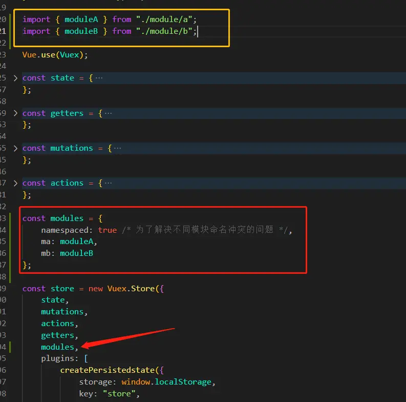

# vuex数据持久化
::: tip
业务需求：<br/>
在基于vue开发SPA项目时，为了解决页面刷新后数据丢失的问题，我们一般都是将数据存储在localstorage或sessionstorage中；当数据需要全局处理统一管理时，我们也会借助于vue官方提供的vuex来进行数据的统一管理。<br/>vuex相比localstorage或sessionstorage来说，存储数据更安全些。与此同时，vuex也存在一些弊端，当页面刷新后，vuex中state存储的数据同时也会被更新，vuex中存储的数据不能持久化，需要监听处理来维持vuex存储的数据状态持久化。<br/>
为解决页面刷新后vuex中存储的数据状态不能持久化的问题，我采取的方案是借助第三方插件工具来实现vuex数据的持久化存储，来解决页面刷新后数据更新的问题。
:::

### 方案一 vuex-persistedstate
安装插件
```js
yarn add vuex-persistedstate
// 或
npm install --save vuex-persistedstate
```
使用方法
```js
import Vuex from "vuex";
// 引入插件
import createPersistedState from "vuex-persistedstate";

Vue.use(Vuex);

const state = {};
const mutations = {};
const actions = {};

const store = new Vuex.Store({
	state,
	mutations,
	actions,
  /* vuex数据持久化配置 */
	plugins: [
		createPersistedState({
      // 存储方式：localStorage、sessionStorage、cookies
			storage: window.sessionStorage,
      // 存储的 key 的key值
			key: "store",
			render(state) {
        // 要存储的数据：本项目采用es6扩展运算符的方式存储了state中所有的数据
				return { ...state };
			}
		})
	]
});

export default store;
```

### vuex中module数据的持久化存储
```js
/* module.js */
export const dataStore = {
  state: {
    data: []
  }
}
 
/* store.js */
import { dataStore } from './module'
 
const dataState = createPersistedState({
  paths: ['data']
});
 
export new Vuex.Store({
  modules: {
    dataStore
  },
  plugins: [dataState]
});
```
### 模块化


###### 注意事项：

storage为存储方式，可选值为localStorage、sessionStorage和cookies；<br/>
localStorage和sessionStorage两种存储方式可以采用上述代码中的写法，若想采用cookies坐位数据存储方式，则需要另外一种写法；<br/>
render接收一个函数，返回值为一个对象；返回的对象中的键值对既是要持久化存储的数据；<br/>
若想持久化存储部分数据，请在return的对象中采用key：value键值对的方式进行数据存储，render函数中的参数既为state对象。<br/>

### 方案2 vuex-persist
```js
yarn add vuex-persist
// 或
npm install --save vuex-persist
```

使用方法
```js
import Vuex from "vuex";
// 引入插件
import VuexPersistence from "vuex-persist";

Vue.use(Vuex);
//  初始化
const state = {
	userName:'admin'
};
const mutations = {};
const actions = {};
// 创建实例
const vuexPersisted = new VuexPersistence({
	storage: window.sessionStorage,
  render:state=>({
  	userName:state.userName
    // 或
    ...state
  })
});

const store = new Vuex.Store({
  state,
  actions,
  mutations,
  // 数据持久化设置
  plugins:[vuexPersisted.plugins]
});

export default store;

```