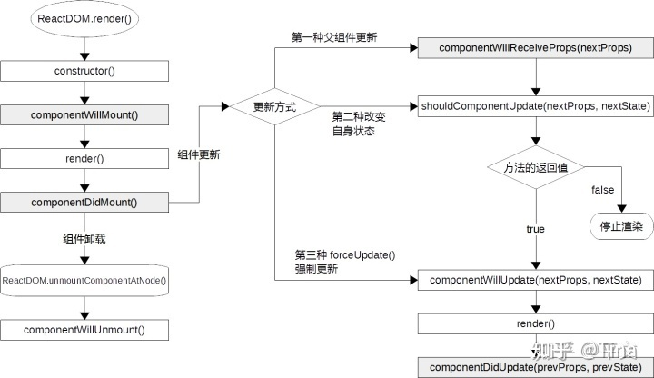

# react 生命周期图
[[toc]]

### React 组件的生命周期
React 组件拥有丰富的生命周期钩子函数，遍布它的各个阶段。

其生命周期可被分为3 个阶段：

挂载`（Mounting）、更新（Updating）和卸载（UnMounting）`。

### 一、挂载阶段
这是 React 组件生命周期的第一个阶段，也可以称为组件出生阶段，这个阶段组件被初始化，获得初始的 props 并定义将会用到的 state。

此阶段结束时，组件及其子元素都会在 UI 中被渲染（DOM，UIview 等），我们还可以对渲染后的组件进行进一步的加工。

挂载阶段，组件会完成它的首次渲染，先执行初始化，再被挂载到真实的 DOM 中，其中依次调用的方法有` constructor()、componentWillMount()、render() 和componentDidMount()`。除了 render()，其他三个方法都只会运行一次。

`getDefaultPropos`：只调用一次，实力之间共享引用。 
`getInitialState`：初始化每个实例特有的状态。 
`componentWillMount`：render 之前最后一次修改状态的机会。 
`render`：只能访问 this.props 和 this.state，只有一个顶层组件，不允许修改状态和 DOM 输出。 
`componentDidMount`：成功 render 并渲染完成真实 DOM 后触发，可以修改 DOM。 
#### 1. constructor()

在生命周期中，类的构造函数 constructor() 会率先被执行，用于初始化组件的状态、接收外部传递进来的数据、绑定成员方法的 this 指向等工作。（只执行一次）

#### 2. componentWillMount()

componentWillMount()：会运行在 render() 之前，它是渲染之前的回调函数。不过，由于在这个方法中执行的任务都能提前到 constructor() 中，因此实际项目中很少会用到它。（只执行一次）

#### 3. render()

render()：是在定义组件时必须声明的方法，它是一个无副作用的纯函数，可根据组件的 props和 state 得到一个React 元素、null 或 false 等返回值，并且在 render() 方法中不能调用改变组件状态的 this.setState() 方法。注意，将元素渲染到页面 DOM 中的工作都由 React 负责，而不是 render() 方法。

#### 4. componentDidMount()

componentDidMount()：会运行在 render() 之后，它是渲染之后的回调函数。此时组件已被挂载到页面中，可以执行 DOM 相关的操作，例如异步读取服务器中的数据并填充到组件中、调用 jQuery 代码等。（只执行一次）

###  二、更新阶段
引起组件更新（即重新渲染）的方式有三种：

第一种：由父组件向下传递 props（即调用父组件的 render() 方法）引起的更新，依次会调用五个方法：

`componentWillReceiveProps()` 
`shouldComponentUpdate()` 
`componentWillUpdate()` 
`render()` 
`componentDidUpdate()` 
第二种：通过改变自身 state（即调用this.setState()方法）引起的更新，会忽略componentWillReceiveProps() 方法，只执行四个回调函数。

第三种：通过组件的 forceUpdate() 方法强制更新，只有后三个回调函数会被执行。

#### 1. componentWillReceiveProps()

`componentWillReceiveProps()`：常用于执行 props 更新后的逻辑，只有第一种更新方式才会调用它。

该方法能接收一个名为 nextProps 的参数，表示父组件传递进来的新的props。

当需要通过 this.setState() 方法将 nextProps 中的数据同步到内部状态时，要先比较 nextProps 和this.props 中的值是否相同，再决定是否执行同步。

由于在 componentWillReceiveProps() 中能调用 this.setState() 方法，因此为了避免进入一个死循环，在调用 this.setState() 方法更新组件时就不会触发它。

#### 2. shouldComponentUpdate()

`shouldComponentUpdate()`：用于决定是否继续组件的更新。

它能接收2个参数：nextProps 和 nextState，分别表示新的 props 和 state。

通过比较 nextProps、nextState 和组件当前的 this.props、this.state 能得出一个布尔类型的返回结果。

当返回结果为 false 时，组件会停止更新，后续的 componentWillUpdate()、render() 和 componentDidUpdate() 也不会被执行。

将这个方法使用恰当的话，能减少冗余的渲染，优化组件的性能。

#### 3. componentWillUpdate()

componentWillUpdate()：运行在 render() 之前，接收2个参数，提供更新之后的 props 和 state。

#### 4. componentDidUpdate()

componentDidUpdate()：运行在 render() 之后，接收2个参数，提供更新之前的 props 和 state。

注意，在 componentWillUpdate() 中，不能调用 this.setState() 方法，以免发生不必要的死循环。

### 三、卸载阶段
当组件在从 DOM 中被卸载之前，会触发一个无参数的 componentWillUnmount() 方法。在该方法内适合做些清理的工作，例如清除定时器、移除多余的DOM元素等。

componentWillUnmount()

### 过时和新增的回调方法

1、过时

从 React v16.3 开始，有 3 个生命周期方法被标记为过时：`componentWillMount()、componentWillReceiveProps() 和 componentWillUpdate()`。

目前它们仍然有效，但不建议在新代码中使用，官方为它们新增了一个以“UNSAFE_”作为前缀的别名。

2、新增

React v16 新增了两个生命周期方法，如下所列。

【1】`static getDerivedStateFromProps(nextProps, prevState)`

静态方法 `getDerivedStateFromProps() 用来替代 componentWillReceiveProps()`。

它在 render() 方法之前触发，包含两个参数：nextProps 和 prevState，分别表示新的 props 和旧的 state。

如果返回一个对象，那么更新 state；如果返回 null，那么就不更新 state。

【2】`getSnapshotBeforeUpdate(prevProps, prevState)`

`getSnapshotBeforeUpdate() 方法用来替代componentWillUpdate()`。

它在最近一次渲染输出（即更新DOM）之前触发，包含两个参数：prevProps 和 prevState，分别表示旧的 props和旧的 state，返回值会成为 componentDidUpdate() 的第三个参数。

