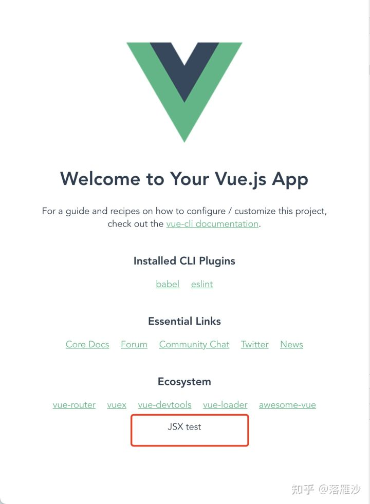
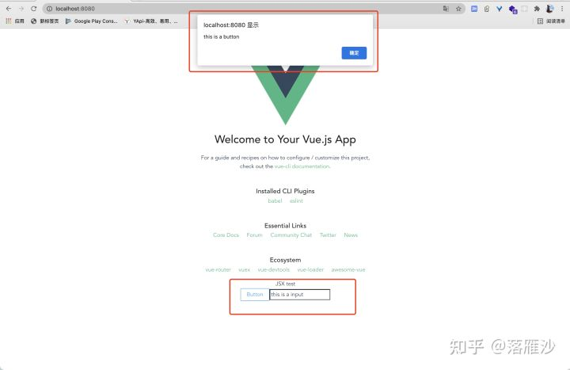
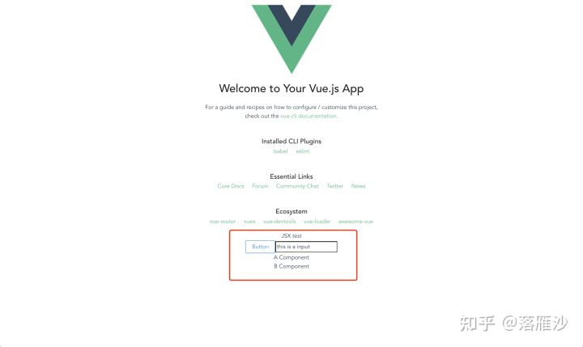

# vue3 jsx

### 前置知识

​ 在 vue3 中使用 jsx 需要安装@vitejs/plugin-vue-jsx（webpack 版本的不了解，有需要者执行搜索）https://www.npmjs.com/package/@vitejs/plugin-vue-jsx

，根据文档配置一下就行了，官方提供了文档供参考，提供了相关示例
jsx-next,https://github.com/vuejs/babel-plugin-jsx

有 react 基础的同学可以先看官方文档，在开发过程中出现问题再看本文

### 指令

### v-model

JSX for vue 是支持 v-model 语法的，这一点比 react 的 setState,体验感确实要好
// 正常写法

```html
<input v-model="value" /> // vue <input v-model="{value}" /> // jsx //
指定值写法 <input v-model:modelValue="value" /> // vue <input
v-model={[value,'modelValue']} /> // jsx // 修饰符写法
<input v-model:modelValue.trim="value" /> // vue <input
v-model={[value,'modelValue',['trim']]} /> // jsx
```

### v-show

这个 api 与在 vue 中的表现形式一致

```js
<div v-show="isShow"></div> // vue
<div v-show={isShow}></div> // jsx
```

### v-bind

```js
// vue
<a-modal
  :width="'400px'"
  :title="'设置组件名称'"
 >
	// ....
</a-modal>
// jsx
<a-modal
  width={"400px"}
  title={"设置组件名称"}
 >
	// ....
</a-modal>
```

### v-if

在 jsx for vue 中没有这个 api，我们需要用 jsx 风格来实现 v-if 的效果
可以简单理解为 jsx 直接将 if 搬到 html 中

```js
<div v-if="isShow"> ... </div>; // vue
{
  isShow && <div> ... </div>;
} // jsx
```

### 事件

事件语法
jsx for vue，所有的事件都按照 react 风格来

所有事件有 on 开头
所有事件名称首字母大写

- 例如：@click => onClick @change => onChange @drop => onDrop
- 事件修饰符
- 这里没有找到权威的资料，有小伙伴知道也请告知一下，目前建议大家通过原生 JavaScript 来实现 vue 事件修饰符的效果
- .stop ： 阻止事件冒泡，在 JSX 中使用 event.stopPropagation()来代替
- .prevent：阻止默认行为，在 JSX 中使用 event.preventDefault() 来代替
  API

### ref 与 reactive

vue3 的 template 会自动解析 ref 的.value,在 jsx 中 ref 的.value 是不会被自动解析的
//声明变量 let type = ref(1)

```js
<p>{{ type }}</p> // vue
<p>{type.value}</p> // jsx
```

### props

在 jsx for vue 中，props 的语法使用的就是 setup 的语法，实际表现形式完全一致

```js
export default defineComponent({
  props: ["title"],
  setup(props) {
    onMounted(() => {
      console.log(props.title);
    });
    return () => <div>{props.title}</div>;
  },
});
```

### emit

同样与 vue3 的 setup 语法保持一致，注意子父防范需要符合 react 规范
emit('changeVisible', false) // 子组件

```js
<xxx onChangeVisible={(params) => xxxFun(params)}></xxx> // 父组件
```

### solt 如何写插槽

这里以 antd for vue 的 Popover 气泡卡片，为例子
Vue3 语法

```js
<a-popover title="Title">
  <template #content>
  	<span>Content</span>
  </template>
	<a-button type="primary">Hover me</a-button>
</a-popover>
```

### jsx for vue 语法

```js
<a-popover
  title="Title"
  content={
    <>
      <span>Content</span>
    </>
  }
>
  <a-button type="primary">Hover me</a-button>
</a-popover>
```

### 基础模板

```js
import { defineComponent, onMounted, ref } from "vue";
export default defineComponent({
  // props: ['xx'],
  setup(props, { emit }) {
    onMounted(() => {
      // ...
    });
    return () => <div></div>;
  },
});
```

### 1.前言

听说 vue3 支持了 jsx 的语法，所以想试试看，好用不好用，跟 react 的写法有何区别。

### 2.template 与 jsx

Vue 的主流做法是基于 template 的，通过对模板的渲染，达到页面的展示效果。react 是用 jsx 的写法。传统的服务端渲染，有很多基于模板引擎的方案，比如 jade，这种都是预选把值处理好，在渲染的时候填充进模板。而 jsx 是直接同步输出的。

### 3.环境

@vue/cli:4.5.0
vue:3.0.0
ant-design-vue:2.2.8

### 4.创建工程

我们基于 vue-cli 创建一个工程，然后可以看到启动后的默认页面，基于当前环境，写一个 jsx 的组件
TestJsx

```jsx
import { defineComponent } from "vue";

const TestJsx = defineComponent({
  setup() {
    return () => (
      <>
        <div>JSX test</div>
      </>
    );
  },
});
export default TestJsx;
```

在 HelloWorld 组件中引入

```js
import TestJsx from "./TestJsx";
export default {
  name: "HelloWorld",
  props: {
    msg: String,
  },
  components: {
    TestJsx,
  },
};
```

可以看到组件被正常渲染


### 5.jsx 组件中，引入组件库中的组件

这里以 ant-design-vue 为例，按需加载的配置就不赘述了。可以参考 https://www.ithere.net/article/431

```jsx
import { defineComponent, ref } from "vue";
import { Button } from "ant-design-vue";
import { Input } from "ant-design-vue/es";

const TestJsx = defineComponent({
  setup() {
    const val = ref("this is a input");
    const handleInputChange = (e) => {
      val.value = e.target.value;
    };
    const handleClick = () => {
      alert("this is a button");
    };

    return () => (
      <>
        <div>JSX test</div>
        <Button type="primary" ghost onClick={handleClick}>
          Button
        </Button>
        <Input value={val} onChange={handleInputChange} />
      </>
    );
  },
});
export default TestJsx;
```

jsx 的写法基本就与 react 很类似了。


结果可以看到，组件被正常引用，并且，事件可以触发。

### 6.jsx 中引入工程中的 template 的组件和 jsx 的组件

A.jsx

```js
import { defineComponent } from "vue";

const A = defineComponent(() => {
  return () => <div>A Component</div>;
});
export default A;
```

B.vue

```js
<template>
  <div>
    B Component
  </div>
</template>

<script>
export default {}
</script>

<style scoped>
</style>
```

```js
TestJsx.jsx;
import { defineComponent, ref } from "vue";
import A from "./A";
import B from "./B";
import { Button } from "ant-design-vue";
import { Input } from "ant-design-vue/es";

const TestJsx = defineComponent({
  components: {
    B,
  },
  setup() {
    const val = ref("this is a input");
    const handleInputChange = (e) => {
      val.value = e.target.value;
    };
    const handleClick = () => {
      alert("this is a button");
    };

    return () => (
      <>
        <div>JSX test</div>
        <Button type="primary" ghost onClick={handleClick}>
          Button
        </Button>
        <Input value={val} onChange={handleInputChange} />
        <A />
        <B />
      </>
    );
  },
});
export default TestJsx;
```

运行效果如下


通过demo可以看出，在vue3下，我们可以自由的选择templet或者jsx的方式去进行开发，并且可以根据情况进行混合开发。

这种可以方便react的前端兄弟，在开发vue的时候不会感觉别扭。不过从工程角度看既然vue一直是template模式，那么如果没有特殊需要，倒也不需要特地去改变。

最大的好处，大概就是在按需加载的时候，不需要一个个的去单独注册组件了。
